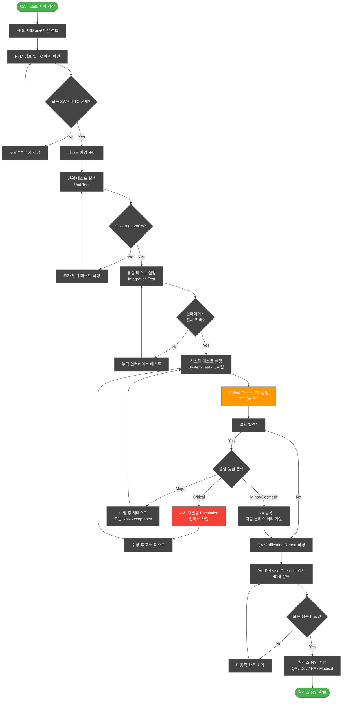
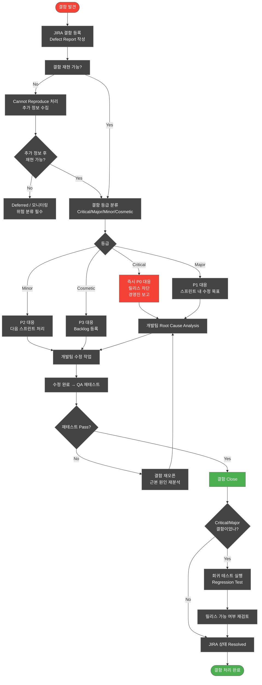
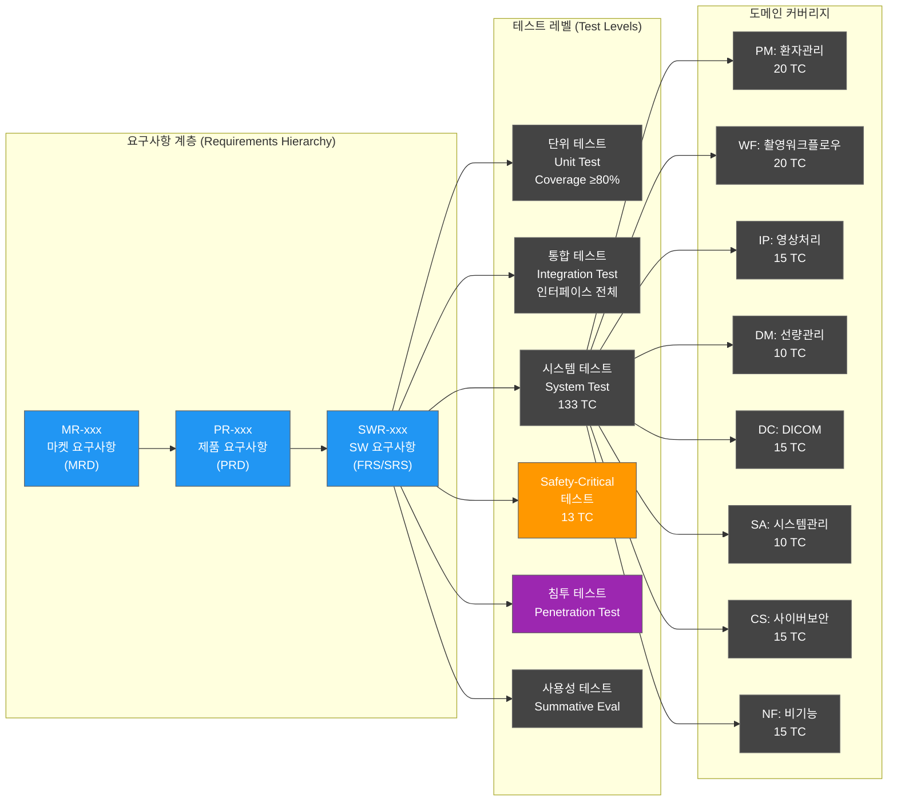
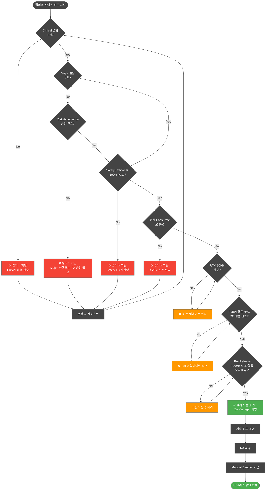

# QA 테스트 케이스 계획서 / QA Verification Report / QA Checklist
## HnVue Console SW

---

| 항목 | 내용 |
|------|------|
| **문서 ID** | QTP-XRAY-GUI-001 |
| **버전** | v1.0 |
| **작성일** | 2026-03-16 |
| **작성자** | QA Team |
| **승인자** | QA Manager / Regulatory Affairs |
| **상태** | Draft |
| **기준 규격** | IEC 62304, ISO 14971, ISO 13485, FDA 21 CFR 820.30, FDA Section 524B, EU MDR 2017/745 |
| **대상 제품** | HnVue Console SW |
| **SW Safety Class** | IEC 62304 Class B |
| **인허가 대상** | FDA 510(k), CE MDR, KFDA (식약처) |

---

## 개정 이력 (Revision History)

| 버전 | 날짜 | 작성자 | 변경 내용 |
|------|------|--------|----------|
| v1.0 | 2026-03-16 | QA Team | 최초 작성 |

---

## 관련 문서 (Related Documents)

| 문서 ID | 문서명 |
|---------|--------|
| PRD-XRAY-GUI-001 | Product Requirements Document (PRD) |
| FRS-XRAY-GUI-001 | Software Requirements Specification (FRS/SRS) |
| SAD-XRAY-GUI-001 | Software Architecture Document (SAD) |
| RMP-XRAY-GUI-001 | Risk Management Plan (위험 관리 계획서) |
| FMEA-XRAY-GUI-001 | FMEA / Risk Assessment |
| RTM-XRAY-GUI-001 | Requirements Traceability Matrix (RTM) |
| SBOM-XRAY-GUI-001 | Software Bill of Materials (SBOM) |

---

## 목차 (Table of Contents)

1. [Part 1: QA 테스트 케이스 계획서 (QA Test Case Plan)](#part-1)
   - 1.1 목적 및 범위
   - 1.2 테스트 환경
   - 1.3 테스트 케이스 ID 체계
   - 1.4 도메인별 테스트 케이스
     - TC-QA-PM: 환자 관리 (20개)
     - TC-QA-WF: 촬영 워크플로우 (20개)
     - TC-QA-IP: 영상 처리 (15개)
     - TC-QA-DM: 선량 관리 (10개)
     - TC-QA-DC: DICOM (15개)
     - TC-QA-SA: 시스템 관리 (10개)
     - TC-QA-CS: 사이버보안 (15개)
     - TC-QA-NF: 비기능 요구사항 (15개)
   - 1.5 Safety-Critical 테스트 케이스 (별도 섹션)
2. [Part 2: QA Verification Report 양식](#part-2)
3. [Part 3: QA Checklist (릴리스 전 체크리스트)](#part-3)
4. [Mermaid 차트](#charts)

---

<a name="part-1"></a>
# Part 1: QA 테스트 케이스 계획서 (QA Test Case Plan)

## 1.1 목적 (Purpose)

본 문서는 HnVue Console SW의 Phase 1 릴리스에 대해 QA 팀이 수행할 테스트 케이스를 정의한다. FRS(Functional Requirements Specification) / PRD(Product Requirements Document)에 기반하여 체계적인 QA 검증을 수행하고, 제품이 설계 입력(Design Input) 요구사항을 충족함을 확인하는 것을 목적으로 한다.

**적용 규격**:
- IEC 62304:2006+AMD1:2015 §5.6 소프트웨어 통합 및 통합 테스트
- IEC 62304:2006+AMD1:2015 §5.7 소프트웨어 시스템 테스트
- FDA 21 CFR 820.30(f) Design Verification
- ISO 13485:2016 §7.3.6 Design Verification

## 1.2 적용 범위 (Scope)

- **대상**: Phase 1 (M1–M12) 전체 PR/SWR
- **테스트 레벨**: 시스템 테스트 (System Test) — QA 팀 주관
- **제외 범위**: Phase 2 (AI, Cloud) 기능 — 별도 QA Plan 수립 예정
- **테스트 유형**:
  - 기능 테스트 (Functional Test)
  - 안전 테스트 (Safety Test)
  - 사이버보안 테스트 (Cybersecurity Test)
  - 비기능 테스트 (Non-Functional Test): 성능, 신뢰성, 사용성

## 1.3 테스트 환경 (Test Environment)

| 항목 | 내용 |
|------|------|
| OS | Windows 10/11 (64-bit) |
| HW | 테스트용 X-Ray Detector 시뮬레이터 또는 실장비 |
| 네트워크 | DICOM 서버 (Orthanc), PACS, RIS 시뮬레이터 |
| DICOM SCU/SCP | Horos / OsiriX / DCM4CHEE |
| 사용자 계정 | Admin, Radiologist, Technologist, Viewer |
| 테스트 도구 | JIRA (결함 관리), Zephyr Scale (TC 관리), Wireshark (네트워크 분석) |
| 기준 FRS 버전 | FRS-XRAY-GUI-001 v1.0 |

## 1.4 테스트 케이스 ID 체계 (Test Case ID Convention)

| 접두어 | 도메인 | 예시 |
|--------|--------|------|
| TC-QA-PM-xxx | 환자 관리 (Patient Management) | TC-QA-PM-001 |
| TC-QA-WF-xxx | 촬영 워크플로우 (Acquisition Workflow) | TC-QA-WF-001 |
| TC-QA-IP-xxx | 영상 처리 (Image Processing & Display) | TC-QA-IP-001 |
| TC-QA-DM-xxx | 선량 관리 (Dose Management) | TC-QA-DM-001 |
| TC-QA-DC-xxx | DICOM/통신 (DICOM/Communication) | TC-QA-DC-001 |
| TC-QA-SA-xxx | 시스템 관리 (System Administration) | TC-QA-SA-001 |
| TC-QA-CS-xxx | 사이버보안 (Cybersecurity) | TC-QA-CS-001 |
| TC-QA-NF-xxx | 비기능 요구사항 (Non-Functional) | TC-QA-NF-001 |
| TC-QA-SC-xxx | Safety-Critical | TC-QA-SC-001 |

---

## 1.5 도메인별 테스트 케이스 (Test Cases by Domain)

### ▶ 도메인 1: 환자 관리 (Patient Management) — TC-QA-PM

> **관련 SWR**: SWR-PM-001 ~ SWR-PM-020 | **관련 MR**: MR-001 ~ MR-006

| TC ID | 출처 SWR | 테스트명 | 사전 조건 | 테스트 단계 | 예상 결과 | 실제 결과 | Pass/Fail | 비고 |
|-------|----------|----------|-----------|-------------|-----------|-----------|-----------|------|
| TC-QA-PM-001 | SWR-PM-001 | 신규 환자 수동 등록 | 시스템 정상 기동, 로그인 완료 (Technologist 권한) | 1. [환자 관리] 메뉴 클릭<br>2. [신규 환자 등록] 버튼 클릭<br>3. 환자 ID, 성명, 생년월일, 성별 입력<br>4. [저장] 버튼 클릭 | 환자 정보가 로컬 DB에 저장되고, 환자 목록에 즉시 표시됨. 저장 성공 메시지 표시 | | | DICOM PS3.3 Patient Module 준수 확인 |
| TC-QA-PM-002 | SWR-PM-001 | 필수 항목 미입력 시 저장 거부 | 신규 환자 등록 화면 진입 | 1. 환자 성명 미입력<br>2. [저장] 버튼 클릭 | 오류 메시지 표시 ("환자 성명은 필수 항목입니다"). 저장 불가. 입력 필드 포커스 이동 | | | 유효성 검사 (Validation) 확인 |
| TC-QA-PM-003 | SWR-PM-002 | 환자 ID 중복 등록 방지 | DB에 환자 ID "P-10001"이 이미 존재 | 1. 동일 환자 ID "P-10001"로 신규 환자 등록 시도<br>2. [저장] 클릭 | 중복 ID 오류 메시지 표시. 등록 차단 | | | Wrong Patient Prevention |
| TC-QA-PM-004 | SWR-PM-003 | 환자 정보 검색 — 성명 검색 | 환자 10명 이상 등록된 상태 | 1. 검색창에 환자 성명 일부 입력 ("김")<br>2. 검색 실행 | "김"이 포함된 모든 환자 목록 표시. 검색 결과 응답 시간 ≤2초 | | | 부분 문자열 검색 지원 |
| TC-QA-PM-005 | SWR-PM-003 | 환자 정보 검색 — 환자 ID 검색 | 환자 등록 완료 | 1. 검색창에 환자 ID 입력<br>2. 검색 실행 | 해당 환자 단건 조회 결과 표시 | | | |
| TC-QA-PM-006 | SWR-PM-004 | 환자 정보 수정 | 기존 환자 등록 완료 | 1. 환자 목록에서 환자 선택<br>2. [정보 수정] 클릭<br>3. 전화번호 변경<br>4. [저장] | 변경 사항이 DB에 반영되고, 수정 이력(Audit Trail)에 기록됨 | | | IEC 62304 §5.8 Audit Trail |
| TC-QA-PM-007 | SWR-PM-005 | 환자 정보 삭제 (논리 삭제) | 기존 환자 등록 완료, Admin 권한 로그인 | 1. 환자 선택<br>2. [삭제] 클릭<br>3. 확인 대화상자에서 [확인] 클릭 | 환자가 목록에서 숨겨짐 (논리 삭제). 실제 DB에서 물리 삭제 안 됨. Audit Trail에 삭제 기록 | | | Technologist 권한으로는 삭제 불가 확인 |
| TC-QA-PM-008 | SWR-PM-006 | MWL (Modality Worklist) 조회 | RIS/PACS 시뮬레이터 연결, DICOM C-FIND 설정 완료 | 1. [워크리스트 조회] 클릭<br>2. 오늘 날짜 필터 적용<br>3. 조회 실행 | RIS에서 등록된 오늘 검사 예약 목록 조회. DICOM MWL C-FIND 성공 응답 확인 | | | DICOM PS3.4 MWL SOP 준수 |
| TC-QA-PM-009 | SWR-PM-006 | MWL 환자 선택 후 자동 정보 입력 | MWL 조회 완료 | 1. MWL 목록에서 환자 선택<br>2. [선택] 버튼 클릭 | 환자 ID, 성명, 검사 정보가 촬영 화면에 자동 입력됨. 수동 입력 오류 방지 | | | Wrong Patient 방지 핵심 기능 |
| TC-QA-PM-010 | SWR-PM-007 | RIS 연결 끊김 시 수동 입력 Fallback | RIS 서버 연결 차단 (네트워크 비활성화) | 1. [워크리스트 조회] 클릭 | 연결 실패 메시지 표시. 수동 환자 등록 모드로 전환 가능. 오프라인 운영 가능 | | | Graceful Degradation |
| TC-QA-PM-011 | SWR-PM-008 | 환자 정보 — 검사 이력 조회 | 환자에 기존 검사 3건 존재 | 1. 환자 선택<br>2. [검사 이력] 탭 클릭 | 해당 환자의 이전 검사 목록 (날짜, 검사 부위, 영상 썸네일) 표시 | | | |
| TC-QA-PM-012 | SWR-PM-009 | 환자 인구통계 — 특수문자 입력 처리 | 신규 환자 등록 화면 | 1. 환자 성명에 SQL Injection 시도: `'; DROP TABLE--`<br>2. [저장] 클릭 | 입력값 Sanitize 처리. DB 오류 없음. 오류 메시지 표시 | | | 보안 (Input Validation) |
| TC-QA-PM-013 | SWR-PM-010 | 환자 나이 자동 계산 | 생년월일 입력 | 1. 생년월일 필드에 "1985-07-20" 입력 | 현재 날짜 기준 나이 자동 계산하여 표시 | | | |
| TC-QA-PM-014 | SWR-PM-011 | 환자 목록 정렬 — 이름순 | 환자 10명 이상 등록 | 1. 환자 목록에서 [이름] 컬럼 헤더 클릭 | 이름 오름차순 정렬. 재클릭 시 내림차순 전환 | | | |
| TC-QA-PM-015 | SWR-PM-012 | 환자 목록 페이지네이션 | 환자 100명 이상 등록 | 1. 환자 목록 화면 진입<br>2. 페이지 이동 버튼 클릭 | 페이지당 20건 표시 (설정 가능). 페이지 이동 정상 동작 | | | |
| TC-QA-PM-016 | SWR-PM-013 | 활성 환자 세션 — 타임아웃 | 환자 선택 후 검사 대기 상태 | 1. 검사 시작 없이 15분 대기 | 세션 타임아웃 경고 표시. 추가 입력 없으면 세션 초기화 | | | 의도치 않은 환자 혼동 방지 |
| TC-QA-PM-017 | SWR-PM-014 | 환자 데이터 내보내기 (Export) | Admin 권한, 환자 선택 | 1. [내보내기] 클릭<br>2. 형식 선택 (CSV/XML) | 환자 정보 파일 다운로드. 파일 구조 올바름. 개인정보 암호화 여부 확인 | | | GDPR/개인정보 보호 |
| TC-QA-PM-018 | SWR-PM-015 | 검사 취소 — 환자 정보 보존 | 촬영 워크플로우 진행 중 | 1. 검사 진행 중 [검사 취소] 클릭<br>2. 확인 | 검사 중단. 환자 정보는 시스템에 보존됨. 부분 촬영 영상 처리 정책 확인 | | | |
| TC-QA-PM-019 | SWR-PM-016 | 환자 병합 (Duplicate Merge) | 동일 환자가 다른 ID로 등록된 경우, Admin 권한 | 1. 중복 환자 감지 후 [병합] 기능 실행<br>2. Master 환자 선택<br>3. 병합 확인 | 검사 이력이 Master 환자로 통합. 중복 계정 비활성화. Audit Trail 기록 | | | |
| TC-QA-PM-020 | SWR-PM-017 | 권한별 환자 정보 접근 제어 | Viewer 권한 계정 로그인 | 1. 환자 목록 접근<br>2. [정보 수정] 버튼 클릭 시도 | Viewer는 조회만 가능. 수정/삭제 버튼 비활성화 또는 접근 거부 메시지 | | | RBAC (Role-Based Access Control) |

---

### ▶ 도메인 2: 촬영 워크플로우 (Acquisition Workflow) — TC-QA-WF

> **관련 SWR**: SWR-WF-001 ~ SWR-WF-020 | **관련 MR**: MR-010 ~ MR-018

| TC ID | 출처 SWR | 테스트명 | 사전 조건 | 테스트 단계 | 예상 결과 | 실제 결과 | Pass/Fail | 비고 |
|-------|----------|----------|-----------|-------------|-----------|-----------|-----------|------|
| TC-QA-WF-001 | SWR-WF-001 | 검사 부위 프로토콜 선택 | 환자 등록 완료, 장비 Ready 상태 | 1. 촬영 화면 진입<br>2. [검사 부위] 드롭다운에서 "흉부 정면 (PA)" 선택 | 해당 부위의 기본 촬영 파라미터 (kVp, mAs, SID) 자동 로드 | | | AEC 프리셋 연동 |
| TC-QA-WF-002 | SWR-WF-002 | 촬영 파라미터 수동 조정 | 프로토콜 선택 완료 | 1. kVp 값을 80에서 90으로 변경<br>2. mAs 값을 10에서 12로 변경 | 변경된 파라미터 화면에 반영. 선량 추정치 재계산 표시 | | | 실시간 선량 예측 |
| TC-QA-WF-003 | SWR-WF-003 | kVp 상한값 초과 방지 | 촬영 파라미터 설정 화면 | 1. kVp 값에 최대값+1 입력 (예: 151 kVp, 최대 150 kVp인 경우) | 입력 거부 또는 최대값으로 자동 제한. 경고 메시지 표시 | | | **Safety-Critical**: 방사선 과다 조사 방지 |
| TC-QA-WF-004 | SWR-WF-003 | mAs 하한값 이하 방지 | 촬영 파라미터 설정 화면 | 1. mAs 값에 0 또는 음수 입력 | 입력 거부. 유효 범위 안내 메시지 표시 | | | **Safety-Critical** |
| TC-QA-WF-005 | SWR-WF-004 | 촬영 준비 (Ready) 상태 확인 | 환자 등록, 파라미터 설정 완료 | 1. [촬영 준비] 버튼 클릭 | 장비 Ready 신호 전송. 상태 표시등 "Ready" 변경. 촬영 버튼 활성화 | | | |
| TC-QA-WF-006 | SWR-WF-005 | 촬영 실행 (Exposure) | 장비 Ready 상태 | 1. [촬영 실행] 버튼 클릭 (또는 발판 스위치) | 촬영 실행 신호 전송. 촬영 중 상태 표시. 완료 후 영상 수신 대기 | | | |
| TC-QA-WF-007 | SWR-WF-006 | 영상 수신 및 미리보기 표시 | 촬영 완료 | 1. 촬영 완료 후 3초 대기 | 원시 영상(Raw Image) 수신 완료. 뷰어에 미리보기 자동 표시. 수신 시간 ≤5초 | | | 성능 요구사항 |
| TC-QA-WF-008 | SWR-WF-007 | 영상 재촬영 (Retake) | 영상 미리보기 표시 상태 | 1. [재촬영] 버튼 클릭<br>2. 재촬영 사유 선택<br>3. 확인 | 기존 영상 삭제 (또는 보관 정책에 따라 보관). 촬영 준비 상태로 복귀. Audit Trail 기록 | | | |
| TC-QA-WF-009 | SWR-WF-008 | 영상 승인 (Accept) | 영상 미리보기 표시 상태 | 1. 영상 검토 후 [승인] 버튼 클릭 | 영상이 검토 완료 상태로 전환. DICOM 전송 큐에 자동 추가 | | | |
| TC-QA-WF-010 | SWR-WF-009 | 다중 촬영 (Multi-Exposure) — 연속 촬영 | 검사 프로토콜: 흉부 2방향 (PA + Lateral) | 1. 첫 번째 촬영 (PA) 실행 및 승인<br>2. 두 번째 촬영 (Lateral) 자동 안내<br>3. Lateral 촬영 실행 | 각 촬영 결과 독립적으로 저장. 시리즈 그룹화 (DICOM Series). 전체 2건 완료 후 전송 | | | |
| TC-QA-WF-011 | SWR-WF-010 | AEC (Automatic Exposure Control) 모드 활성화 | AEC 지원 장비 연결 | 1. AEC 모드 선택<br>2. 촬영 실행 | AEC 센서로부터 최적 노출값 자동 결정. 실제 사용된 mAs 값 화면 표시 | | | |
| TC-QA-WF-012 | SWR-WF-011 | 촬영 중 긴급 중단 (Emergency Stop) | 촬영 준비 상태 | 1. 촬영 신호 전송 중 [긴급 중단] 버튼 클릭 | 즉시 촬영 중단 신호 전송. 경고음 발생. 시스템 안전 상태로 복귀. 이벤트 로그 기록 | | | **Safety-Critical** |
| TC-QA-WF-013 | SWR-WF-012 | 장비 통신 오류 처리 | 촬영 장비 네트워크 차단 후 촬영 시도 | 1. [촬영 실행] 클릭 | 장비 통신 오류 메시지 표시. 촬영 미수행. 재연결 안내 제공 | | | Graceful Error Handling |
| TC-QA-WF-014 | SWR-WF-013 | 촬영 후 환자 혼동 방지 확인 | 환자 A 선택, 촬영 중 | 1. 촬영 완료 전 다른 환자 B 조회 시도 | 활성 촬영 세션 유지 중 다른 환자 선택 불가. 경고 메시지 표시 | | | **Safety-Critical**: Wrong Patient |
| TC-QA-WF-015 | SWR-WF-014 | 소아 모드 (Pediatric Mode) 자동 파라미터 적용 | 환자 나이 5세 (소아) | 1. MWL에서 소아 환자 선택<br>2. 촬영 부위 선택 | 소아 최적화 파라미터 (감소된 kVp, mAs) 자동 적용. 소아 모드 표시 | | | ALARA 원칙 |
| TC-QA-WF-016 | SWR-WF-015 | 촬영 일시정지 및 재개 | 촬영 준비 상태 | 1. 환자 준비 미완료 시 [대기] 버튼 클릭<br>2. 환자 준비 완료 후 [재개] 클릭 | 파라미터 및 환자 정보 유지된 채로 대기. 재개 시 정상 촬영 진행 | | | |
| TC-QA-WF-017 | SWR-WF-016 | 검사 완료 — 검사 상태 업데이트 | 모든 촬영 완료, 영상 승인 완료 | 1. [검사 완료] 버튼 클릭 | 검사 상태 "Completed"로 변경. MPPS (Modality Performed Procedure Step) DICOM N-SET 전송 | | | IHE RAD TF |
| TC-QA-WF-018 | SWR-WF-017 | 촬영 프로토콜 사용자 정의 추가 | Admin 권한 로그인 | 1. [프로토콜 관리] 진입<br>2. 신규 프로토콜 입력 (부위명, 기본 파라미터)<br>3. [저장] | 신규 프로토콜이 검사 부위 목록에 추가됨. 이후 촬영 시 선택 가능 | | | |
| TC-QA-WF-019 | SWR-WF-018 | 동시 사용자 — 촬영 세션 충돌 방지 | 두 사용자가 동시에 동일 장비 접속 시도 | 1. 사용자 A가 촬영 세션 점유<br>2. 사용자 B가 동시 촬영 시도 | 사용자 B에게 "장비 사용 중" 메시지 표시. 촬영 불가. 세션 충돌 없음 | | | 멀티 워크스테이션 환경 |
| TC-QA-WF-020 | SWR-WF-019 | 전체 촬영 워크플로우 End-to-End | 전체 시스템 준비 완료 | 1. MWL 조회 → 환자 선택 → 프로토콜 선택 → 파라미터 설정 → 촬영 → 영상 승인 → DICOM 전송 → 검사 완료 | 전체 워크플로우 오류 없이 완료. 영상이 PACS에 정상 도달 확인 | | | E2E Integration Test |

---

### ▶ 도메인 3: 영상 처리 (Image Display & Processing) — TC-QA-IP

> **관련 SWR**: SWR-IP-001 ~ SWR-IP-015 | **관련 MR**: MR-020 ~ MR-037

| TC ID | 출처 SWR | 테스트명 | 사전 조건 | 테스트 단계 | 예상 결과 | 실제 결과 | Pass/Fail | 비고 |
|-------|----------|----------|-----------|-------------|-----------|-----------|-----------|------|
| TC-QA-IP-001 | SWR-IP-001 | DICOM 영상 로드 및 표시 | DICOM 파일 준비 (CT, CR, DX 각 1건) | 1. DICOM 파일 열기<br>2. 뷰어에 드래그&드롭 | 영상이 정확한 방향과 비율로 표시됨. DICOM 헤더 정보 (환자 ID, 검사일) 오버레이 표시 | | | DICOM PS3.14 GSDF 준수 |
| TC-QA-IP-002 | SWR-IP-002 | 윈도우 레벨/폭 조정 (Windowing) | 영상 로드 완료 | 1. 영상 위에서 마우스 좌클릭+드래그 (상하: Level, 좌우: Width)<br>2. 다양한 윈도우 프리셋 적용 | WL/WW 실시간 조정. 화면 좌측 상단에 현재 WL/WW 값 표시. 프리셋 (폐창, 뼈창, 복부창) 즉시 적용 | | | |
| TC-QA-IP-003 | SWR-IP-003 | 영상 확대/축소 (Zoom) | 영상 로드 완료 | 1. 마우스 휠 스크롤로 확대/축소<br>2. 확대율 입력창에 직접 입력 | 최대 확대 1600%, 최소 10%까지 지원. 확대율 표시. 품질 저하 없는 확대 | | | |
| TC-QA-IP-004 | SWR-IP-004 | 영상 이동 (Pan) | 영상 확대 상태 | 1. 마우스 우클릭+드래그 또는 Pan 도구 선택 후 드래그 | 영상이 드래그 방향으로 이동. 뷰포트 범위 내 자연스러운 이동 | | | |
| TC-QA-IP-005 | SWR-IP-005 | 영상 회전 (Rotation) | 영상 로드 완료 | 1. [회전] 버튼 (90°, 180°, 270°) 클릭<br>2. 자유 회전 슬라이더 조작 | 지정 각도로 영상 회전. 원본 데이터 보존 (비파괴) | | | |
| TC-QA-IP-006 | SWR-IP-006 | 영상 반전 (Flip) | 영상 로드 완료 | 1. [좌우 반전], [상하 반전] 버튼 클릭 | 영상 반전 표시. 원본 DICOM 데이터 비파괴 | | | |
| TC-QA-IP-007 | SWR-IP-007 | 측정 도구 — 선 길이 측정 | 영상 로드 완료 | 1. [측정] 도구 선택<br>2. 측정 시작점과 끝점 클릭 | 두 점 사이 거리 mm 단위로 표시. DICOM Pixel Spacing 메타데이터 기반 정확한 계산 | | | Pixel Spacing 기반 |
| TC-QA-IP-008 | SWR-IP-008 | 측정 도구 — 각도 측정 | 영상 로드 완료 | 1. [각도 측정] 도구 선택<br>2. 3개 점 클릭으로 각도 설정 | 각도 값 (도, °) 표시. 측정선 영상 위 오버레이 표시 | | | |
| TC-QA-IP-009 | SWR-IP-009 | 주석 (Annotation) 추가 | 영상 로드 완료, Radiologist 권한 | 1. [주석] 도구 선택<br>2. 영상 위 클릭 후 텍스트 입력 | 주석이 영상 위에 표시됨. DICOM SR 또는 DICOM PR로 저장 가능 | | | |
| TC-QA-IP-010 | SWR-IP-010 | 영상 인쇄 (Print) | 영상 로드, 프린터 연결 | 1. [인쇄] 버튼 클릭<br>2. 인쇄 옵션 설정 (크기, 매수)<br>3. 인쇄 실행 | DICOM Print 또는 로컬 프린터로 영상 출력. 출력 영상에 환자 정보, 촬영일 포함 | | | DICOM Print SOP |
| TC-QA-IP-011 | SWR-IP-011 | 다중 영상 비교 뷰 (Multi-Up) | 동일 환자 영상 4건 | 1. 2×2 레이아웃 선택<br>2. 4개 영상 각 뷰포트에 드래그 | 4개 영상 동시 표시. 각 뷰포트 독립적 WL/WW 조작 가능 | | | |
| TC-QA-IP-012 | SWR-IP-012 | 영상 내보내기 (Export) — JPEG/PNG | 영상 로드 완료 | 1. [내보내기] 선택<br>2. JPEG 형식 선택<br>3. 저장 경로 지정 | JPEG 파일 저장. 환자 정보 포함 여부 설정 옵션 (익명화/비익명화) | | | PHI 포함 여부 확인 |
| TC-QA-IP-013 | SWR-IP-013 | 영상 처리 — 노이즈 감소 필터 적용 | 저화질 영상 로드 | 1. [필터] 메뉴에서 노이즈 감소 선택<br>2. 강도 조절 후 적용 | 필터 적용 영상 표시. 원본 영상 비파괴 (비교 뷰 제공). 처리 시간 ≤3초 | | | |
| TC-QA-IP-014 | SWR-IP-014 | 영상 처리 — 엣지 강화 필터 | 영상 로드 완료 | 1. [엣지 강화] 필터 적용 | 뼈/조직 경계 강조. 원본 대비 비교 가능. 비파괴 처리 | | | |
| TC-QA-IP-015 | SWR-IP-015 | 영상 초기화 (Reset) | 영상 조작 후 (WL/WW, 회전, 확대 변경) | 1. [초기화] 버튼 클릭 | 모든 영상 조작이 초기 상태로 복원. 원본 표시 | | | |

---

### ▶ 도메인 4: 선량 관리 (Dose Management) — TC-QA-DM

> **관련 SWR**: SWR-DM-040 ~ SWR-DM-055 | **관련 MR**: MR-040 ~ MR-046

| TC ID | 출처 SWR | 테스트명 | 사전 조건 | 테스트 단계 | 예상 결과 | 실제 결과 | Pass/Fail | 비고 |
|-------|----------|----------|-----------|-------------|-----------|-----------|-----------|------|
| TC-QA-DM-001 | SWR-DM-040 | 촬영 후 선량 값 표시 (DAP/ESD) | 촬영 완료 | 1. 촬영 완료 후 선량 정보 영역 확인 | DAP (Dose Area Product) 및 ESD (Entrance Surface Dose) 값이 화면에 표시됨. 단위 (mGy·cm², mGy) 명시 | | | IEC 60601-2-54 |
| TC-QA-DM-002 | SWR-DM-050 | 선량 참고 수준 (DRL) 초과 경고 | DRL 기준값 설정 완료 | 1. DRL 초과 선량으로 촬영 파라미터 설정<br>2. 촬영 실행 | DRL 초과 경고 메시지 표시. 촬영은 가능하나 경고 팝업 및 로그 기록 필수 | | | **Safety-Critical**: ALARA |
| TC-QA-DM-003 | SWR-DM-041 | 누적 선량 추적 — 환자별 | 환자 3회 이상 촬영 이력 | 1. 환자 선택 → [선량 이력] 탭 클릭 | 날짜별 촬영 선량 목록 표시. 누적 선량 합산 값 표시 | | | |
| TC-QA-DM-004 | SWR-DM-044 | DICOM RDSR 전송 | RDSR 수신 서버 설정 완료 | 1. 촬영 완료 후 RDSR 자동 생성<br>2. 지정 서버로 전송 | Radiation Dose Structured Report (RDSR) 생성 및 전송 성공. DICOM C-STORE 확인 | | | DICOM PS3.17 RDSR |
| TC-QA-DM-005 | SWR-DM-047 | 선량 최적화 제안 | 파라미터 입력 후 | 1. 고선량 파라미터 설정 시 | 더 낮은 선량으로 동등한 영상 품질을 달성할 수 있는 파라미터 제안 팝업 (선택적) | | | ALARA 원칙 |
| TC-QA-DM-006 | SWR-DM-043 | Dose Interlock — 최대 선량 초과 차단 | 장비 최대 허용 선량값 설정 | 1. 최대 선량 초과 가능한 파라미터 조합 입력<br>2. 촬영 시도 | 촬영 차단. "허용 선량 초과" 오류 메시지. 파라미터 수정 요청 | | | **Safety-Critical** |
| TC-QA-DM-007 | SWR-DM-048 | 소아 선량 가이드 표시 | 소아 환자 선택 (나이 <15세) | 1. 촬영 파라미터 화면 | 소아 적정 선량 가이드 값 표시. 성인 기준 초과 시 강조 경고 | | | 소아 방사선 보호 |
| TC-QA-DM-008 | SWR-DM-052 | 선량 보고서 생성 | 환자 선량 이력 3건 이상 | 1. [선량 보고서] 생성 버튼 클릭<br>2. 기간 선택 (1개월)<br>3. PDF 생성 | 환자별/기간별 선량 통계 포함 PDF 보고서 생성. 다운로드 가능 | | | |
| TC-QA-DM-009 | SWR-DM-051 | 선량 데이터 영구 보존 | 선량 기록 존재 | 1. 선량 데이터 삭제 시도 (Technologist 권한) | Technologist는 선량 데이터 삭제 불가. Admin도 7년 보존 기간 내 삭제 불가 (규제 요구사항) | | | FDA 21 CFR 820 |
| TC-QA-DM-010 | SWR-DM-054 | 선량 알림 — 주간 통계 요약 | 7일 이상 촬영 기록 | 1. Admin 로그인<br>2. [선량 통계] 대시보드 확인 | 검사 건수, 평균 선량, 최대 선량 통계 요약 표시. DRL 초과 건수 강조 표시 | | | |

---

### ▶ 도메인 5: DICOM/통신 (DICOM/Communication) — TC-QA-DC

> **관련 SWR**: SWR-DC-001 ~ SWR-DC-015 | **관련 MR**: MR-050 ~ MR-056

| TC ID | 출처 SWR | 테스트명 | 사전 조건 | 테스트 단계 | 예상 결과 | 실제 결과 | Pass/Fail | 비고 |
|-------|----------|----------|-----------|-------------|-----------|-----------|-----------|------|
| TC-QA-DC-001 | SWR-DC-001 | DICOM C-STORE (영상 전송) | PACS 서버 설정 완료, 영상 촬영 완료 | 1. 영상 승인 후 [PACS 전송] 클릭<br>2. 또는 자동 전송 설정 활성화 | DICOM C-STORE SCU 동작. PACS로 영상 전송 성공. 전송 완료 상태 표시 | | | DICOM PS3.4 |
| TC-QA-DC-002 | SWR-DC-002 | DICOM C-FIND (영상 조회) | PACS 연결 완료 | 1. [원격 조회] 기능 실행<br>2. 환자 ID 입력 후 조회 | C-FIND SCU로 PACS에서 해당 환자 영상 목록 조회. 결과 표시 | | | |
| TC-QA-DC-003 | SWR-DC-003 | DICOM C-MOVE (영상 가져오기) | PACS 연결, C-FIND 조회 완료 | 1. 조회된 영상 선택<br>2. [다운로드] 클릭 | C-MOVE SCU 실행. 영상이 로컬 뷰어로 다운로드 완료 | | | |
| TC-QA-DC-004 | SWR-DC-004 | DICOM MWL C-FIND (워크리스트 조회) | RIS 연결, MWL SCP 설정 완료 | 1. [워크리스트 조회] 실행 | 오늘 날짜 검사 예약 목록 조회 성공. Scheduled Procedure Step 정보 표시 | | | IHE RAD Scheduled Workflow |
| TC-QA-DC-005 | SWR-DC-005 | DICOM MPPS (검사 상태 업데이트) | 검사 시작 및 완료 | 1. 검사 시작 시 MPPS N-CREATE<br>2. 검사 완료 시 MPPS N-SET | N-CREATE: Performed Procedure Step 생성. N-SET: 완료 상태 업데이트. RIS에 반영 확인 | | | |
| TC-QA-DC-006 | SWR-DC-006 | DICOM 전송 실패 — 재전송 | PACS 서버 일시 차단 후 전송 시도 | 1. 전송 실패 이벤트 발생<br>2. PACS 서버 재연결<br>3. 자동 재전송 또는 수동 재전송 실행 | 실패 영상 전송 큐에 보관. 연결 복구 후 자동 재전송. 전송 성공 확인 | | | |
| TC-QA-DC-007 | SWR-DC-007 | DICOM TLS 암호화 전송 | TLS 인증서 설정 완료 | 1. TLS 활성화 상태에서 영상 전송<br>2. Wireshark로 트래픽 분석 | 전송 패킷이 암호화됨. 평문 DICOM 데이터 노출 없음 | | | **보안 필수** FDA Section 524B |
| TC-QA-DC-008 | SWR-DC-008 | DICOM UID 고유성 검증 | 촬영 영상 10건 생성 | 1. 각 영상의 SOPInstanceUID 추출<br>2. 중복 여부 확인 | 모든 SOPInstanceUID 고유값. 중복 없음 (UID 생성 알고리즘 검증) | | | DICOM PS3.5 |
| TC-QA-DC-009 | SWR-DC-009 | DICOM 헤더 필수 태그 검증 | 영상 촬영 후 | 1. DICOM 영상 헤더 덤프<br>2. 필수 태그 존재 여부 확인 | Patient ID (0010,0020), Patient Name (0010,0010), Study Date (0008,0020), Modality (0008,0060) 등 필수 태그 모두 존재 | | | DICOM Conformance |
| TC-QA-DC-010 | SWR-DC-010 | DICOM Worklist — 한국어 (Hangul) 인코딩 | 한국어 환자 성명 포함 MWL 데이터 | 1. MWL 조회<br>2. 한국어 환자 성명 표시 확인 | 한국어 성명이 깨지지 않고 정확히 표시됨. Specific Character Set: ISO_IR 149 | | | DICOM 국제화 |
| TC-QA-DC-011 | SWR-DC-011 | 다중 PACS 전송 — 동시 전송 | PACS 서버 2개 설정 | 1. 영상 촬영 완료<br>2. 두 PACS 서버로 동시 전송 설정 | 두 서버 모두 영상 전송 성공. 하나 실패 시 해당 서버만 재전송 큐 등록 | | | |
| TC-QA-DC-012 | SWR-DC-012 | DICOM SR (Structured Report) 생성 | 선량 정보 존재 | 1. [RDSR 생성] 기능 실행 | RDSR 생성 후 선량 서버로 전송. Dose Observer 수신 확인 | | | |
| TC-QA-DC-013 | SWR-DC-013 | DICOM 익명화 (Anonymization) | 영상 촬영 완료 | 1. [익명화] 기능 선택<br>2. 환자 정보 마스킹 옵션 설정 후 내보내기 | 내보낸 DICOM에서 PHI (Patient ID, Name, DOB) 제거/대체됨. Pixel Data 보존 | | | GDPR/HIPAA 준수 |
| TC-QA-DC-014 | SWR-DC-014 | DICOM 수신 (SCP 모드) | 소프트웨어 SCP 모드 설정 | 1. 외부 장비에서 본 시스템으로 C-STORE 전송 | SCP로 영상 수신. 로컬 DB 저장. 뷰어에서 즉시 열기 가능 | | | |
| TC-QA-DC-015 | SWR-DC-015 | DICOM 네트워크 설정 — AE Title 변경 | Admin 권한 | 1. [DICOM 설정] 진입<br>2. AE Title, Port 변경<br>3. 저장 후 재연결 | 새 AE Title로 DICOM 연결 성공. 기존 연결 설정은 이전 AE Title 업데이트 필요 안내 | | | |

---

### ▶ 도메인 6: 시스템 관리 (System Administration) — TC-QA-SA

> **관련 SWR**: SWR-SA-001 ~ SWR-SA-010 | **관련 MR**: MR-060 ~ MR-067

| TC ID | 출처 SWR | 테스트명 | 사전 조건 | 테스트 단계 | 예상 결과 | 실제 결과 | Pass/Fail | 비고 |
|-------|----------|----------|-----------|-------------|-----------|-----------|-----------|------|
| TC-QA-SA-001 | SWR-SA-001 | 시스템 부팅 — 정상 기동 | 하드웨어 전원 ON | 1. 시스템 전원 켜기 | 소프트웨어 자동 시작. 장비 자가 진단 (Self-Test) 완료. 로그인 화면 표시. 부팅 시간 ≤60초 | | | IEC 62304 §5.7 |
| TC-QA-SA-002 | SWR-SA-002 | 사용자 계정 생성 | Admin 권한 로그인 | 1. [사용자 관리] 진입<br>2. 신규 사용자 정보 입력 (ID, 비밀번호, 역할)<br>3. [저장] | 신규 계정 생성 성공. 최초 로그인 시 비밀번호 변경 강제 | | | |
| TC-QA-SA-003 | SWR-SA-003 | 역할 기반 접근 제어 (RBAC) 검증 | 각 역할 계정 준비 (Admin, Radiologist, Technologist, Viewer) | 1. 각 계정으로 로그인<br>2. 역할별 허용/제한 메뉴 접근 시도 | 각 역할에 따라 메뉴 접근 권한 정확히 제한됨 | | | RBAC Matrix 참조 |
| TC-QA-SA-004 | SWR-SA-004 | 시스템 로그 조회 | Admin 권한 | 1. [시스템 로그] 메뉴 진입<br>2. 날짜/사용자/이벤트 유형 필터 적용 | 로그 정상 조회. 로그인/로그아웃, 촬영, 오류 이벤트 기록 확인. 로그 변조 불가 | | | Audit Trail IEC 62304 |
| TC-QA-SA-005 | SWR-SA-005 | 소프트웨어 업데이트 (OTA/Manual) | 신규 버전 설치 파일 준비 | 1. [소프트웨어 업데이트] 메뉴 진입<br>2. 업데이트 파일 선택<br>3. 설치 실행 | 업데이트 설치 완료. 버전 정보 변경 확인. 기존 데이터 보존. 설치 무결성 체크섬 검증 | | | FDA Section 524B |
| TC-QA-SA-006 | SWR-SA-006 | 백업 및 복원 — DB 백업 | Admin 권한 | 1. [백업] 기능 실행<br>2. 백업 파일 생성 확인<br>3. 데이터 삭제 시뮬레이션<br>4. [복원] 실행 | 백업 파일에서 데이터 완전 복원 성공. 환자 정보, 영상, 설정 값 모두 복원 | | | |
| TC-QA-SA-007 | SWR-SA-007 | 디스크 용량 경고 | 디스크 사용량 80% 도달 시뮬레이션 | 1. 디스크 용량 80% 임박 | 경고 메시지 표시. Admin에게 알림. 자동 정리 정책 (Auto-Archive) 안내 | | | |
| TC-QA-SA-008 | SWR-SA-008 | 장비 연결 상태 모니터링 | X-Ray 장비 연결 | 1. [장비 상태] 패널 확인<br>2. 장비 케이블 일시 분리 | 연결 상태 실시간 표시. 분리 즉시 "연결 끊김" 경고. 재연결 시 자동 복구 | | | |
| TC-QA-SA-009 | SWR-SA-009 | 시스템 언어/지역 설정 | Admin 권한 | 1. [설정] → [언어] → 영문으로 변경<br>2. 저장 후 재시작 | UI 전체 영문으로 전환. 날짜/시간 형식 변경 | | | 다국어 지원 |
| TC-QA-SA-010 | SWR-SA-010 | 라이선스 관리 | 라이선스 만료 1일 전 | 1. [라이선스 정보] 확인<br>2. 라이선스 만료 시 시스템 동작 확인 | 만료 7일 전부터 경고 표시. 만료 후 진단 기능 잠금 (긴급 모드는 유지) | | | |

---

### ▶ 도메인 7: 사이버보안 (Cybersecurity) — TC-QA-CS

> **관련 SWR**: SWR-CS-001 ~ SWR-CS-015 | **관련 MR**: MR-070 ~ MR-076

| TC ID | 출처 SWR | 테스트명 | 사전 조건 | 테스트 단계 | 예상 결과 | 실제 결과 | Pass/Fail | 비고 |
|-------|----------|----------|-----------|-------------|-----------|-----------|-----------|------|
| TC-QA-CS-001 | SWR-CS-001 | 로그인 — 올바른 자격증명 | 사용자 계정 존재 | 1. 유효한 ID/PW 입력<br>2. [로그인] 클릭 | 로그인 성공. 역할에 맞는 메인 화면 표시 | | | |
| TC-QA-CS-002 | SWR-CS-001 | 로그인 — 잘못된 비밀번호 연속 시도 | 사용자 계정 존재 | 1. 잘못된 비밀번호로 5회 연속 로그인 시도 | 5회 실패 후 계정 잠금. 잠금 해제는 Admin 또는 정해진 시간 경과 필요 | | | Brute Force 방지 |
| TC-QA-CS-003 | SWR-CS-002 | 세션 타임아웃 — 자동 로그아웃 | 로그인 완료 | 1. 일정 시간(기본 15분) 무조작 대기 | 자동 로그아웃. 로그인 화면으로 복귀. 세션 데이터 초기화 | | | |
| TC-QA-CS-004 | SWR-CS-003 | 비밀번호 복잡도 정책 검증 | 신규 비밀번호 설정 화면 | 1. 단순 비밀번호 입력 ("1234", "password") | 복잡도 불만족 오류 (최소 8자, 대소문자, 숫자, 특수문자 포함 필요) | | | NIST SP 800-63B |
| TC-QA-CS-005 | SWR-CS-004 | 데이터 전송 암호화 — DICOM TLS | TLS 설정 활성화 | 1. 영상 전송 중 네트워크 캡처 (Wireshark) | 모든 DICOM 트래픽이 TLS 1.2 이상으로 암호화됨. 평문 노출 없음 | | | TLS 1.2/1.3 필수 |
| TC-QA-CS-006 | SWR-CS-005 | 저장 데이터 암호화 (Data at Rest) | 로컬 DB 파일 접근 | 1. 로컬 스토리지에서 DB 파일 직접 열기 시도 | DB 파일이 암호화되어 직접 열기 불가. AES-256 암호화 적용 | | | FDA Section 524B |
| TC-QA-CS-007 | SWR-CS-006 | SQL Injection 방어 | 로그인 화면 | 1. ID 입력란에 `' OR '1'='1`<br>2. [로그인] 시도 | 로그인 실패. SQL 오류 미노출. DB 쿼리 Parameterized Query 적용 확인 | | | OWASP Top 10 |
| TC-QA-CS-008 | SWR-CS-007 | XSS (Cross-Site Scripting) 방어 | 환자 정보 입력 화면 | 1. 환자 성명에 `<script>alert(1)</script>` 입력 | 스크립트 실행 안 됨. HTML Encoding 처리. 저장 후 조회 시에도 스크립트 미실행 | | | |
| TC-QA-CS-009 | SWR-CS-008 | 소프트웨어 무결성 검증 (Code Signing) | 업데이트 파일 준비 | 1. 변조된 (서명 미포함) 업데이트 파일 설치 시도 | 무결성 검사 실패. 설치 차단. 변조 감지 경고 표시 | | | FDA Section 524B |
| TC-QA-CS-010 | SWR-CS-009 | 불필요한 네트워크 포트 차단 | 방화벽 설정 검토 | 1. 포트 스캔 도구 (nmap)로 열린 포트 확인 | 필요 포트 (DICOM: 104, 11112, HTTPS: 443)만 오픈. 불필요 포트 차단 | | | 최소 권한 원칙 |
| TC-QA-CS-011 | SWR-CS-010 | Audit Log 변조 방지 | Admin 권한 | 1. 로그 파일 직접 수정 시도<br>2. 시스템 내 로그 삭제 시도 | 로그 파일 직접 수정 불가 (읽기 전용). 시스템 내 삭제 기능 없음 (Admin도 불가) | | | 비거부성 (Non-repudiation) |
| TC-QA-CS-012 | SWR-CS-011 | 외부 미디어 — 악성 파일 차단 | USB 드라이브에 EICAR 테스트 파일 준비 | 1. USB 연결<br>2. EICAR 파일 접근/실행 시도 | 악성 파일 감지 또는 차단. 보안 경고 표시. 실행 불가 | | | 안티바이러스/EDR |
| TC-QA-CS-013 | SWR-CS-012 | 원격 접속 — VPN/보안 채널 강제 | 원격 관리 기능 | 1. VPN 미연결 상태에서 원격 접속 시도 | VPN 없이 원격 접속 불가. VPN 연결 요구 안내 | | | |
| TC-QA-CS-014 | SWR-CS-013 | 비밀번호 해시 저장 검증 | DB 파일 접근 | 1. 사용자 DB에서 비밀번호 컬럼 확인 | 평문 비밀번호 저장 안 됨. bcrypt/SHA-256 이상 해시로 저장 | | | |
| TC-QA-CS-015 | SWR-CS-014 | 사이버보안 사고 대응 — 의심 이벤트 알림 | 보안 모니터링 활성화 | 1. 비정상적 로그인 패턴 시뮬레이션 (다른 IP에서 반복 실패)<br>2. 보안 이벤트 확인 | 보안 이벤트 로그 기록. Admin에게 알림 발생. 이상 접근 차단 | | | FDA Section 524B SIEM |

---

### ▶ 도메인 8: 비기능 요구사항 (Non-Functional Requirements) — TC-QA-NF

> **관련 SWR**: SWR-NF-PF-001~008, SWR-NF-RL-010~015, SWR-NF-UX-020~026, SWR-NF-CP-030~035, SWR-NF-SC-040~045, SWR-NF-MT-050~054, SWR-NF-RG-060~065 | **관련 PR**: PR-NF-PF/RL/UX/CP/SC/MT/RG

| TC ID | 출처 SWR | 테스트명 | 사전 조건 | 테스트 단계 | 예상 결과 | 실제 결과 | Pass/Fail | 비고 |
|-------|----------|----------|-----------|-------------|-----------|-----------|-----------|------|
| TC-QA-NF-001 | SWR-NF-PF-001 | 영상 표시 응답 시간 | 100MB DICOM 파일 준비 | 1. DICOM 파일 열기 (더블클릭) | 영상 표시 ≤3초. 응답 시간 5회 측정 후 평균 계산 | | | 성능 요구사항 |
| TC-QA-NF-002 | SWR-NF-PF-001 | 촬영 → 영상 수신 응답 시간 | X-Ray 장비 연결 | 1. 촬영 실행<br>2. 영상 뷰어 표시까지 시간 측정 | 촬영 완료 후 영상 뷰어 표시 ≤5초 | | | |
| TC-QA-NF-003 | SWR-NF-PF-006 | 동시 사용자 성능 테스트 | 4개 워크스테이션 동시 운영 | 1. 4명 동시 로그인<br>2. 각각 영상 조회 및 촬영 작업 수행 | 모든 워크스테이션에서 응답 시간 기준 충족 (≤3초). 크래시/프리즈 없음 | | | |
| TC-QA-NF-004 | SWR-NF-RL-015 | 72시간 연속 운영 안정성 | 시스템 정상 운영 | 1. 72시간 연속 자동화 테스트 스크립트 실행 (촬영 반복) | 72시간 동안 크래시 0건. 메모리 누수 없음. 응답 시간 기준 유지 | | | IEC 62304 신뢰성 |
| TC-QA-NF-005 | SWR-NF-RL-015 | 메모리 사용량 — 장기 운영 | 8시간 운영 시뮬레이션 | 1. 8시간 동안 영상 열기/닫기 반복 | 메모리 사용량이 기준치 이하 유지. 메모리 누수 (Memory Leak) 없음 | | | |
| TC-QA-NF-006 | SWR-NF-RL-013 | 소프트웨어 크래시 복구 | 강제 프로세스 종료 | 1. Task Manager에서 프로세스 강제 종료<br>2. 소프트웨어 재시작 | 재시작 후 마지막 안정 상태로 복구. 데이터 손실 없음. 부팅 ≤60초 | | | |
| TC-QA-NF-007 | SWR-NF-CP-034 | 화면 해상도 — 다양한 해상도 지원 | 해상도 변경 가능 환경 | 1. 1920×1080, 2560×1440, 3840×2160 각각 설정<br>2. UI 레이아웃 확인 | 모든 해상도에서 UI 요소 비율 유지. 글자/버튼 잘림 없음. 4K 지원 | | | |
| TC-QA-NF-008 | SWR-NF-UX-022 | 접근성 — 고대비 모드 | OS 고대비 모드 활성화 | 1. Windows 고대비 모드 활성화<br>2. 소프트웨어 UI 확인 | 주요 UI 요소 가시성 유지. 텍스트 가독성 확보 | | | IEC 62366 사용성 |
| TC-QA-NF-009 | SWR-NF-UX-025 | 오류 처리 — 예외 상황 메시지 품질 | 다양한 오류 상황 유도 | 1. 각 오류 상황 발생 (DB 연결 실패, 파일 없음 등) | 각 오류에 대해 사용자 친화적 메시지 표시. 오류 코드, 조치 방법 포함. 기술적 스택 미노출 | | | |
| TC-QA-NF-010 | SWR-NF-CP-030 | 설치/제거 — 클린 설치 | Windows 클린 환경 | 1. 설치 파일 실행<br>2. 설치 완료 후 소프트웨어 실행 | 설치 완료 ≤5분. 필요 의존성 자동 설치. 실행 정상 | | | |
| TC-QA-NF-011 | SWR-NF-CP-030 | 설치/제거 — 제거 후 잔류 파일 | 소프트웨어 설치 완료 | 1. 소프트웨어 제거 실행<br>2. 설치 디렉토리 및 레지스트리 확인 | 제거 후 프로그램 파일 완전 삭제. 사용자 데이터는 선택적 보존. 레지스트리 잔류 최소화 | | | |
| TC-QA-NF-012 | SWR-NF-UX-023 | 국제화 (i18n) — 날짜 형식 | 다국어 설정 환경 | 1. 한국어 설정: 날짜 형식 확인<br>2. 영문 설정: 날짜 형식 확인 | 한국어: YYYY.MM.DD, 영문: MM/DD/YYYY 형식 표시 | | | |
| TC-QA-NF-013 | SWR-NF-PF-002 | 데이터 저장 용량 — 대용량 처리 | 10,000건 환자 데이터 사전 등록 | 1. 환자 목록 조회<br>2. 검색 실행 | 10,000건 DB에서 검색 응답 ≤2초. UI 프리즈 없음 | | | |
| TC-QA-NF-014 | SWR-NF-RG-062 | 도움말 — 온라인 도움말 연동 | 인터넷 연결 또는 로컬 도움말 | 1. F1 키 또는 [도움말] 버튼 클릭 | 현재 화면에 맥락에 맞는 도움말 표시. IFU (사용설명서) 내용 포함 | | | IEC 62366 |
| TC-QA-NF-015 | SWR-NF-RG-060 | 라이선스 준수 — SOUP (Third-party Libraries) | SBOM 문서 | 1. SBOM 목록의 각 SOUP 라이브러리 라이선스 확인 | GPL/LGPL 라이브러리 사용 시 공개 의무 준수. 상용 라이선스 유효성 확인. 라이선스 위반 없음 | | | IEC 62304 §8 SOUP |

---

## 1.6 Safety-Critical 테스트 케이스 (Safety-Critical Test Cases) — TC-QA-SC

> **참조 규격**: ISO 14971:2019, IEC 62304 Class B, FMEA 연계

### 1.6.1 방사선 안전 (Radiation Safety)

| TC ID | HAZ ID | 테스트명 | 안전 요구사항 | 테스트 단계 | 합격 기준 | 실제 결과 | Pass/Fail |
|-------|--------|----------|-------------|-------------|-----------|-----------|-----------|
| TC-QA-SC-001 | HAZ-001 | Dose Interlock — kVp 상한 초과 차단 | SWR-WF-003: kVp 최대값 150 kVp | 1. kVp 151 입력<br>2. 촬영 시도 | 촬영 차단. 오류 메시지. 장비 방사선 조사 없음 | | | |
| TC-QA-SC-002 | HAZ-001 | Dose Interlock — mAs 상한 초과 차단 | SWR-WF-003: mAs 최대값 초과 | 1. 최대 mAs 초과값 입력<br>2. 촬영 시도 | 촬영 차단. 파라미터 재설정 요구 | | | |
| TC-QA-SC-003 | HAZ-002 | DRL 초과 — 경고 후 확인 필수 | SWR-DM-002: DRL 초과 시 확인 요구 | 1. DRL 2배 초과 파라미터 설정<br>2. 촬영 버튼 클릭 | 확인 대화상자 표시 ("DRL 기준 초과 - 계속 진행하시겠습니까?"). 미확인 시 촬영 불가 | | | |
| TC-QA-SC-004 | HAZ-003 | 소아 환자 — 성인 파라미터 적용 경고 | SWR-WF-015: 소아 파라미터 가이드 | 1. 소아 환자 선택<br>2. 성인 기준 고선량 파라미터 입력 | "소아 환자: 선량 초과 경고" 팝업. 소아 권장 파라미터 제안 | | | |
| TC-QA-SC-005 | HAZ-004 | 촬영 중 긴급 중단 (Emergency Stop) | SWR-WF-012: 즉시 중단 기능 | 1. 촬영 신호 전송 후 0.5초 내 긴급 중단 클릭 | 즉각 중단. 방사선 중단 명령 전송. 이벤트 로그 기록 | | | |

### 1.6.2 데이터 무결성 (Data Integrity / Wrong Patient Prevention)

| TC ID | HAZ ID | 테스트명 | 안전 요구사항 | 테스트 단계 | 합격 기준 | 실제 결과 | Pass/Fail |
|-------|--------|----------|-------------|-------------|-----------|-----------|-----------|
| TC-QA-SC-006 | HAZ-005 | Wrong Patient — 촬영 중 환자 변경 방지 | SWR-WF-014: 활성 세션 잠금 | 1. 환자 A로 촬영 세션 활성화<br>2. 다른 사용자가 환자 B 선택 시도 | 세션 충돌 방지. 환자 B 선택 불가. 경고 메시지 | | | |
| TC-QA-SC-007 | HAZ-005 | MWL 자동 입력 — 수동 변경 방지 | SWR-PM-009: MWL 기반 환자 정보 | 1. MWL로 환자 자동 입력<br>2. 촬영 직전 환자 ID 수동 변경 시도 | 촬영 직전 환자 정보 변경 불가. 확인 대화상자 필수 표시 | | | |
| TC-QA-SC-008 | HAZ-006 | 영상-환자 연결 무결성 검증 | SWR-DC-009: DICOM 태그 필수 | 1. 촬영 완료 후 DICOM 파일의 Patient ID 태그 확인 | DICOM Patient ID가 시스템 환자 ID와 100% 일치 | | | |
| TC-QA-SC-009 | HAZ-007 | 선량 데이터 무결성 — 변조 방지 | SWR-DM-009: 선량 데이터 보존 | 1. 선량 기록 직접 수정 시도 (DB 레벨)<br>2. 시스템 내 수정 시도 | 선량 기록 변조 불가. 수정 시 오류. 원본 데이터 보존 | | | |

### 1.6.3 보안 안전 (Security Safety)

| TC ID | HAZ ID | 테스트명 | 안전 요구사항 | 테스트 단계 | 합격 기준 | 실제 결과 | Pass/Fail |
|-------|--------|----------|-------------|-------------|-----------|-----------|-----------|
| TC-QA-SC-010 | HAZ-008 | 인증 우회 방지 — URL 직접 접근 | SWR-CS-001: 인증 필수 | 1. 로그인 없이 URL 직접 입력으로 내부 화면 접근 시도 | 인증되지 않은 접근 차단. 로그인 화면으로 리디렉션 | | | |
| TC-QA-SC-011 | HAZ-008 | 권한 상승 방지 (Privilege Escalation) | SWR-CS-003: 역할 기반 제어 | 1. Technologist 계정으로 Admin 기능 접근 시도 | 접근 거부. 권한 없음 오류 메시지. Audit Trail 기록 | | | |
| TC-QA-SC-012 | HAZ-009 | PHI 노출 방지 — 오류 메시지 | SWR-CS-006: PHI 보호 | 1. DB 연결 오류 발생<br>2. 오류 메시지 내용 확인 | 오류 메시지에 환자 정보 (PHI) 포함 안 됨. 기술적 오류 코드만 표시 | | | |
| TC-QA-SC-013 | HAZ-010 | 무결성 — 소프트웨어 변조 탐지 | SWR-CS-009: 코드 서명 | 1. 실행 파일 변조 후 시작 시도 | 무결성 체크 실패. 소프트웨어 실행 차단. 경고 로그 기록 | | | |

---

<a name="part-2"></a>
# Part 2: QA Verification Report 양식 (QA Verification Report Template)

---

## QA Verification Report (QA 검증 보고서)

| 항목 | 내용 |
|------|------|
| **보고서 ID** | QVR-XRAY-GUI-[YY][MM]-[NNN] |
| **제품명** | HnVue Console SW |
| **SW 버전** | v[X.Y.Z] |
| **테스트 기간** | YYYY-MM-DD ~ YYYY-MM-DD |
| **테스트 환경** | [환경 명세 기재] |
| **QA 담당자** | [성명] |
| **보고서 작성일** | YYYY-MM-DD |
| **보고서 상태** | Draft / Final |

---

### 2.1 테스트 실행 요약 (Test Execution Summary)

| 항목 | 수치 |
|------|------|
| 총 테스트 케이스 수 | |
| 실행 완료 | |
| 미실행 (N/A) | |
| Pass | |
| Fail | |
| **Pass Rate (%)** | |
| Safety-Critical TC 실행 수 | |
| Safety-Critical Pass | |
| Safety-Critical Fail | |

#### 도메인별 실행 현황

| 도메인 | 총 TC | 실행 | Pass | Fail | Pass Rate |
|--------|-------|------|------|------|-----------|
| TC-QA-PM (환자 관리) | 20 | | | | |
| TC-QA-WF (촬영 워크플로우) | 20 | | | | |
| TC-QA-IP (영상 처리) | 15 | | | | |
| TC-QA-DM (선량 관리) | 10 | | | | |
| TC-QA-DC (DICOM) | 15 | | | | |
| TC-QA-SA (시스템 관리) | 10 | | | | |
| TC-QA-CS (사이버보안) | 15 | | | | |
| TC-QA-NF (비기능) | 15 | | | | |
| TC-QA-SC (Safety-Critical) | 13 | | | | |
| **합계** | **133** | | | | |

---

### 2.2 Pass/Fail 통계 (Pass/Fail Statistics)

```
[시각화: 원형 차트 / 막대 그래프 — 첨부]

도메인별 Pass Rate:
PM:  [____%]
WF:  [____%]
IP:  [____%]
DM:  [____%]
DC:  [____%]
SA:  [____%]
CS:  [____%]
NF:  [____%]
SC:  [____%]
```

---

### 2.3 결함 요약 (Defect Summary)

#### 결함 분류 기준 (Defect Classification)

| 등급 | 정의 | 예시 |
|------|------|------|
| **Critical** | 환자 안전에 직접적 영향. 방사선 과다 조사, Wrong Patient, 진단 오류 가능 | Dose Interlock 미작동, Wrong Patient 방지 기능 실패 |
| **Major** | 핵심 기능 동작 불가. 환자 안전 간접 영향 또는 인허가 요구사항 불충족 | DICOM 전송 불가, 영상 로드 실패, 로그인 불가 |
| **Minor** | 기능은 동작하나 일부 비정상적 동작. 사용성 저하 | 검색 결과 지연, UI 레이아웃 깨짐 |
| **Cosmetic** | 외관/표시 이슈. 기능 영향 없음 | 오타, 색상 불일치, 아이콘 위치 |

#### 결함 목록 (Defect List)

| 결함 ID | TC ID | 등급 | 제목 | 발견일 | 담당자 | 상태 | 해결일 | 비고 |
|---------|-------|------|------|--------|--------|------|--------|------|
| DEF-001 | | Critical | | | | Open/Resolved | | |
| DEF-002 | | Major | | | | | | |
| DEF-003 | | Minor | | | | | | |
| DEF-004 | | Cosmetic | | | | | | |

#### 결함 집계

| 등급 | 발견 건수 | 해결 건수 | 미해결 건수 |
|------|----------|----------|------------|
| Critical | | | |
| Major | | | |
| Minor | | | |
| Cosmetic | | | |
| **합계** | | | |

---

### 2.4 미해결 결함 위험 평가 (Open Defect Risk Assessment)

| 결함 ID | 등급 | 잔존 위험 (Residual Risk) | 허용 여부 | 근거 |
|---------|------|--------------------------|-----------|------|
| | | | Acceptable / Not Acceptable | |

---

### 2.5 테스트 환경 편차 (Test Environment Deviations)

| 항목 | 계획된 환경 | 실제 환경 | 영향 평가 |
|------|-----------|----------|----------|
| | | | |

---

### 2.6 릴리스 권고 의견 (Release Recommendation)

#### 릴리스 조건

| # | 조건 | 충족 여부 |
|---|------|----------|
| 1 | Critical 결함 0건 | ☐ Yes / ☐ No |
| 2 | Major 결함 0건 (또는 Risk Acceptance 완료) | ☐ Yes / ☐ No |
| 3 | Safety-Critical TC 100% Pass | ☐ Yes / ☐ No |
| 4 | 전체 TC Pass Rate ≥ 95% | ☐ Yes / ☐ No |
| 5 | RTM 완성도 100% | ☐ Yes / ☐ No |
| 6 | 모든 FMEA HAZ에 RC 검증 완료 | ☐ Yes / ☐ No |

#### 권고 의견

```
[ ] 릴리스 승인 권고 (Release Approved)
    근거: 모든 릴리스 조건 충족

[ ] 조건부 릴리스 권고 (Conditional Release)
    조건: [조건 기재]

[ ] 릴리스 보류 (Release Hold)
    이유: [이유 기재]
```

#### 서명

| 역할 | 성명 | 서명 | 날짜 |
|------|------|------|------|
| QA Manager | | | |
| SW Development Lead | | | |
| Regulatory Affairs | | | |
| Medical Director (Clinical) | | | |

---

<a name="part-3"></a>
# Part 3: QA Checklist — 릴리스 전 체크리스트 (Pre-Release QA Checklist)

> **문서 ID**: QTP-XRAY-GUI-001 Part 3  
> **버전**: v1.0  
> **작성일**: 2026-03-16  
> **용도**: Phase 1 릴리스 전 QA 완료 기준 검증

---

## 3.1 Phase Gate Checklist — 요구사항 및 추적성 (Requirements & Traceability)

| # | 항목 | 확인 방법 | 담당자 | 결과 |
|---|------|----------|--------|------|
| 1 | [ ] 모든 PR에 대한 SWR이 FRS에 정의됨 | RTM 검토 | QA | ☐ Pass ☐ Fail |
| 2 | [ ] 모든 SWR에 대한 TC가 QA Plan에 존재 | RTM-QA 대조 | QA | ☐ Pass ☐ Fail |
| 3 | [ ] Safety-Critical SWR 100% TC 커버리지 확인 | Safety TC 목록 검토 | QA + RA | ☐ Pass ☐ Fail |
| 4 | [ ] RTM 완성도 100% (MR→PR→SWR→TC→V&V 연결) | RTM 문서 검토 | QA | ☐ Pass ☐ Fail |
| 5 | [ ] 변경된 SWR에 대한 영향 분석 (Impact Analysis) 완료 | 변경 이력 및 IA 문서 | Dev + QA | ☐ Pass ☐ Fail |

---

## 3.2 Phase Gate Checklist — 소프트웨어 테스트 (Software Testing)

| # | 항목 | 확인 방법 | 담당자 | 결과 |
|---|------|----------|--------|------|
| 6 | [ ] 단위 테스트 (Unit Test) Statement Coverage ≥80% | 커버리지 리포트 (예: Istanbul/JaCoCo) | Dev | ☐ Pass ☐ Fail |
| 7 | [ ] 단위 테스트 Branch Coverage ≥70% | 커버리지 리포트 | Dev | ☐ Pass ☐ Fail |
| 8 | [ ] 통합 테스트 (Integration Test) 모든 SW 인터페이스 커버 | 통합 테스트 결과서 | Dev + QA | ☐ Pass ☐ Fail |
| 9 | [ ] 시스템 테스트 전체 TC 실행 완료 (133건) | QA 실행 보고서 | QA | ☐ Pass ☐ Fail |
| 10 | [ ] 회귀 테스트 (Regression Test) 완료 (버그 수정 후) | Regression TC 실행 결과 | QA | ☐ Pass ☐ Fail |
| 11 | [ ] 성능 테스트 완료 (응답 시간, 동시 사용자) | 성능 테스트 결과서 | QA | ☐ Pass ☐ Fail |
| 12 | [ ] 72시간 내구성 테스트 완료 | 내구성 테스트 결과 | QA | ☐ Pass ☐ Fail |
| 13 | [ ] 사이버보안 침투 테스트 (Penetration Test) 완료 | 침투 테스트 보고서 | Security | ☐ Pass ☐ Fail |
| 14 | [ ] 사용성 테스트 Summative Evaluation 완료 | 사용성 테스트 보고서 | UX + RA | ☐ Pass ☐ Fail |

---

## 3.3 Phase Gate Checklist — 결함 기준 (Defect Criteria)

| # | 항목 | 확인 방법 | 담당자 | 결과 |
|---|------|----------|--------|------|
| 15 | [ ] Critical 결함 미해결 건수 = 0 | JIRA 결함 현황 | QA Manager | ☐ Pass ☐ Fail |
| 16 | [ ] Major 결함 미해결 건수 = 0 (또는 Risk Acceptance 승인 완료) | JIRA + Risk Acceptance Form | QA + RA | ☐ Pass ☐ Fail |
| 17 | [ ] 전체 TC Pass Rate ≥ 95% | QA 실행 보고서 | QA | ☐ Pass ☐ Fail |
| 18 | [ ] Safety-Critical TC (TC-QA-SC) 100% Pass | Safety TC 결과 | QA + RA | ☐ Pass ☐ Fail |
| 19 | [ ] 재현 불가 결함 (Cannot Reproduce) 위험 분류 완료 | JIRA + 위험 평가 | QA | ☐ Pass ☐ Fail |

---

## 3.4 Phase Gate Checklist — 위험 관리 (Risk Management)

| # | 항목 | 확인 방법 | 담당자 | 결과 |
|---|------|----------|--------|------|
| 20 | [ ] FMEA 모든 HAZ에 대한 RC 검증 완료 | FMEA + RC 검증 기록 | QA + RA | ☐ Pass ☐ Fail |
| 21 | [ ] 잔존 위험 (Residual Risk) 허용 수준 이하 확인 | Risk Management Report | RA | ☐ Pass ☐ Fail |
| 22 | [ ] 새로운 위험 (New Hazard) 식별 여부 확인 및 처리 | FMEA 업데이트 이력 | RA | ☐ Pass ☐ Fail |
| 23 | [ ] Benefit-Risk 분석 완료 및 승인 | Risk Management Report | Medical + RA | ☐ Pass ☐ Fail |

---

## 3.5 Phase Gate Checklist — SOUP 및 SBOM

| # | 항목 | 확인 방법 | 담당자 | 결과 |
|---|------|----------|--------|------|
| 24 | [ ] SOUP (Software of Unknown Provenance) 목록 최신화 | SBOM 문서 검토 | Dev + QA | ☐ Pass ☐ Fail |
| 25 | [ ] SOUP 적격성 검증 완료 (버전, 라이선스, 알려진 결함) | SOUP 검증 기록 | Dev + QA | ☐ Pass ☐ Fail |
| 26 | [ ] SBOM 최신화 및 서명 완료 | SBOM-XRAY-GUI-001 | Dev | ☐ Pass ☐ Fail |
| 27 | [ ] SOUP 라이선스 위반 없음 확인 | 라이선스 스캔 보고서 | Legal + Dev | ☐ Pass ☐ Fail |
| 28 | [ ] 알려진 취약점 (CVE) 스캔 완료 및 조치 | CVE 스캔 보고서 | Security | ☐ Pass ☐ Fail |

---

## 3.6 Phase Gate Checklist — 문서 및 승인 (Documentation & Approval)

| # | 항목 | 확인 방법 | 담당자 | 결과 |
|---|------|----------|--------|------|
| 29 | [ ] 소프트웨어 개발 계획서 (SDP) 최종 승인 완료 | 문서 관리 시스템 | QA + RA | ☐ Pass ☐ Fail |
| 30 | [ ] FRS/SRS 최종 승인 완료 | 문서 관리 시스템 | QA + RA | ☐ Pass ☐ Fail |
| 31 | [ ] SAD (Software Architecture Document) 최종 승인 | 문서 관리 시스템 | Dev Lead | ☐ Pass ☐ Fail |
| 32 | [ ] Risk Management Report 최종 승인 | 문서 관리 시스템 | RA + Medical | ☐ Pass ☐ Fail |
| 33 | [ ] QA Verification Report 최종 승인 | 본 문서 (QVR) | QA Manager | ☐ Pass ☐ Fail |
| 34 | [ ] IFU (Instructions for Use / 사용설명서) 검토 완료 | IFU 문서 | RA + UX | ☐ Pass ☐ Fail |
| 35 | [ ] 사이버보안 문서 (SPDF) 승인 완료 | SPDF 문서 | Security + RA | ☐ Pass ☐ Fail |

---

## 3.7 Phase Gate Checklist — 인허가 준비 (Regulatory Readiness)

| # | 항목 | 확인 방법 | 담당자 | 결과 |
|---|------|----------|--------|------|
| 36 | [ ] Design History File (DHF) 완성 확인 | DHF 검토 | RA | ☐ Pass ☐ Fail |
| 37 | [ ] DICOM Conformance Statement 작성 완료 | DICOM CS 문서 | Dev + RA | ☐ Pass ☐ Fail |
| 38 | [ ] IHE Integration Statement 작성 완료 (해당 시) | IHE IS 문서 | Dev + RA | ☐ Pass ☐ Fail |
| 39 | [ ] FDA 510(k) 제출 준비 검토 완료 | 510(k) Checklist | RA | ☐ Pass ☐ Fail |
| 40 | [ ] CE MDR Technical Documentation 준비 완료 | TD 문서 | RA | ☐ Pass ☐ Fail |

---

## 3.8 최종 릴리스 게이트 서명 (Final Release Gate Sign-Off)

| 역할 | 성명 | 서명 | 날짜 | 비고 |
|------|------|------|------|------|
| QA Manager | | | | |
| SW Development Lead | | | | |
| Regulatory Affairs | | | | |
| Medical Director | | | | |
| CISO (보안) | | | | |
| General Manager | | | | |

> **릴리스 승인 조건**: 위 40개 체크리스트 항목 모두 Pass AND Critical/Major 결함 0건  
> **예외 처리**: Major 이하 결함 잔존 시 Risk Acceptance Form + RA 승인 필수

---

<a name="charts"></a>
# Mermaid 차트 (Charts)

## 차트 1: QA 프로세스 흐름도 (QA Process Flow)



---

## 차트 2: 결함 처리 흐름도 (Defect Handling Flow)



---

## 차트 3: 테스트 커버리지 개요 (Test Coverage Overview)



---

## 차트 4: 릴리스 게이트 의사결정 트리 (Release Gate Decision Tree)



---

## 부록 A: 테스트 케이스 현황 요약 (TC Summary)

| 도메인 | TC ID 범위 | TC 수 | Safety-Critical 포함 |
|--------|-----------|-------|----------------------|
| 환자 관리 (Patient Management) | TC-QA-PM-001~020 | 20 | PM-002, PM-007, PM-013 |
| 촬영 워크플로우 (Acquisition Workflow) | TC-QA-WF-001~020 | 20 | WF-003, WF-004, WF-012, WF-014 |
| 영상 처리 (Image Processing) | TC-QA-IP-001~015 | 15 | - |
| 선량 관리 (Dose Management) | TC-QA-DM-001~010 | 10 | DM-002, DM-006 |
| DICOM/통신 (DICOM) | TC-QA-DC-001~015 | 15 | DC-007 |
| 시스템 관리 (System Admin) | TC-QA-SA-001~010 | 10 | - |
| 사이버보안 (Cybersecurity) | TC-QA-CS-001~015 | 15 | CS-005, CS-006, CS-009 |
| 비기능 (Non-Functional) | TC-QA-NF-001~015 | 15 | - |
| Safety-Critical (전용) | TC-QA-SC-001~013 | 13 | 전체 13건 |
| **합계** | | **133** | **25건 이상** |

---

## 부록 B: 적용 규격 참조 (Applicable Standards Reference)

| 규격 | 적용 조항 | QA 적용 내용 |
|------|----------|-------------|
| IEC 62304:2006+AMD1:2015 | §5.6, §5.7, §5.8 | SW 통합 테스트, 시스템 테스트, 문제 해결 |
| ISO 14971:2019 | §7, §8, §9 | 위험 통제 검증, 잔존 위험 평가 |
| ISO 13485:2016 | §7.3.6, §8.2.6 | 설계 검증, 소프트웨어 검증 |
| FDA 21 CFR 820.30(f) | 820.30(f) | Design Verification |
| FDA Section 524B | 전체 | 사이버보안 테스트, SBOM |
| IEC 62366-1:2015+AMD1:2020 | §5.9 | Summative Usability Evaluation |
| EU MDR 2017/745 | Annex I §17 | 소프트웨어 안전성 요구사항 |
| DICOM PS3.x | PS3.3, PS3.4, PS3.7 | DICOM 적합성 테스트 |

---

*문서 끝 (End of Document)*  
*QTP-XRAY-GUI-001 v1.0 | 2026-03-16 | HnVue Console SW*
