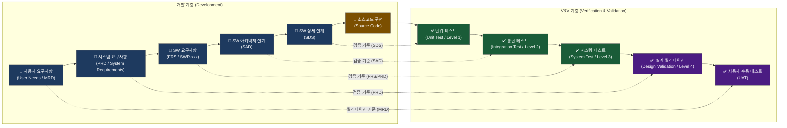
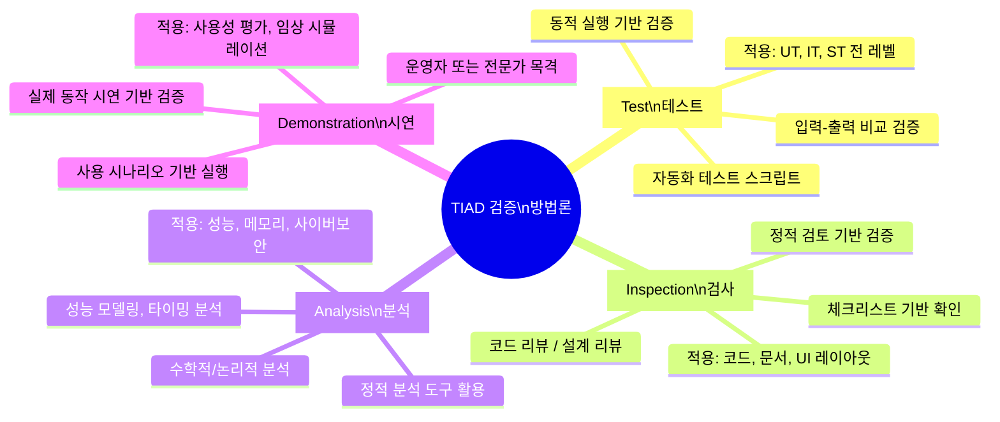
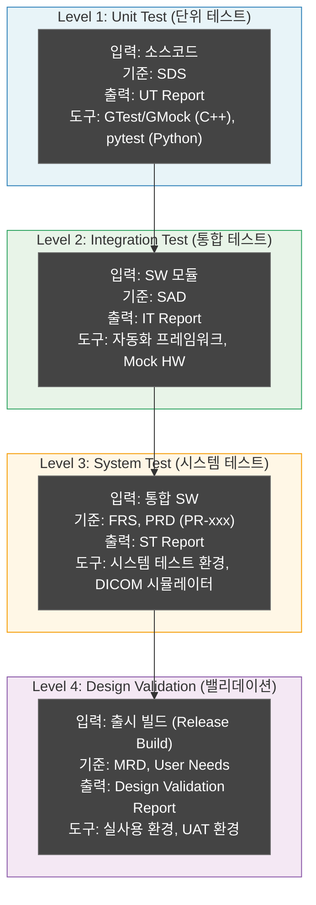
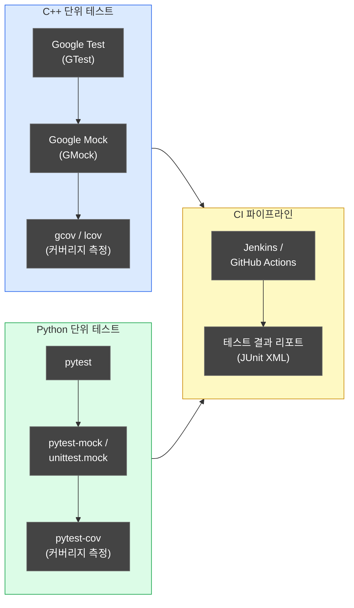
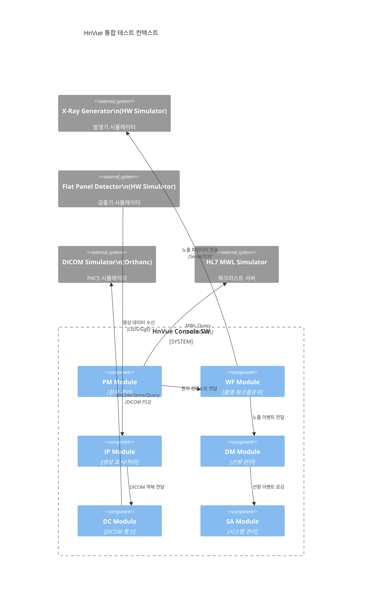
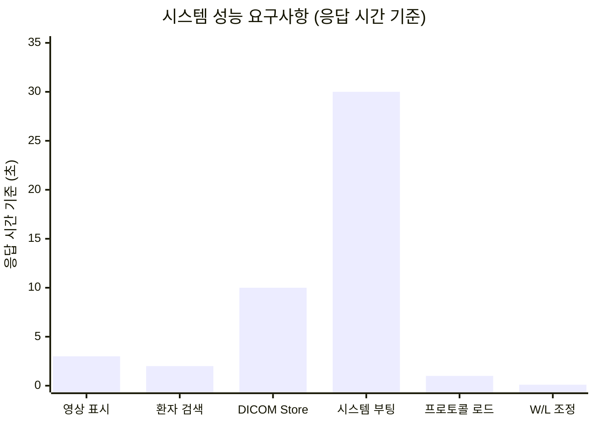
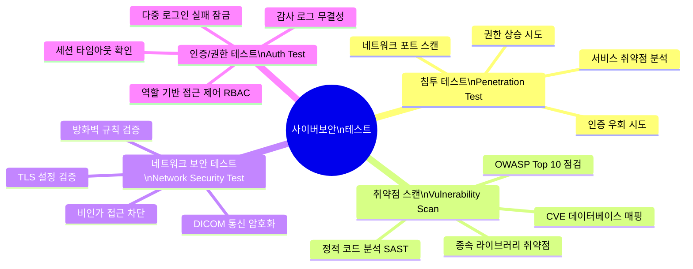
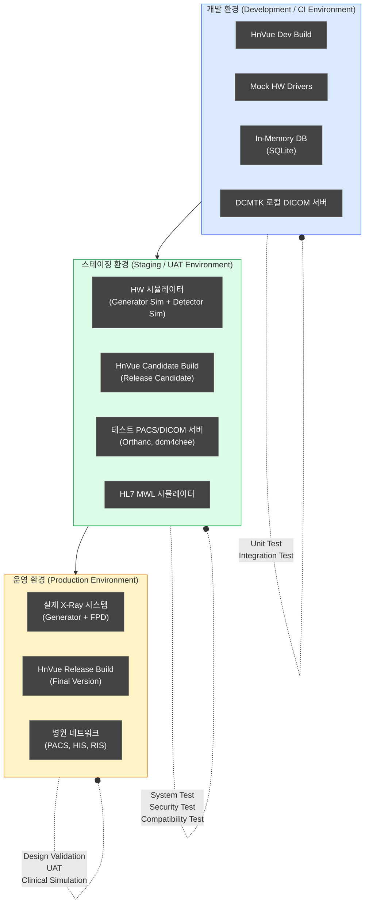
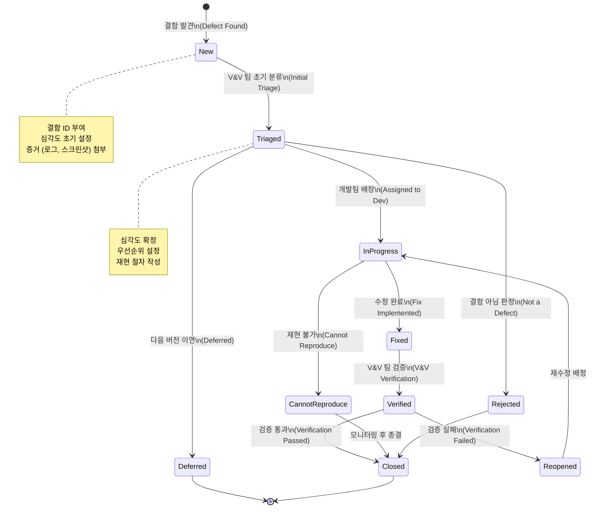
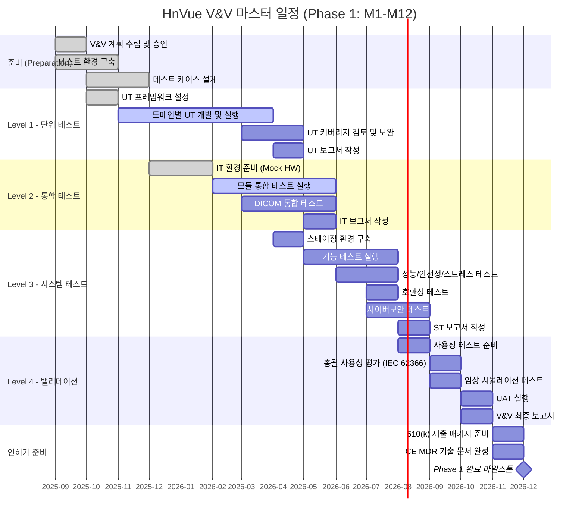

# V&V 마스터 플랜 (Verification & Validation Master Plan)
## HnVue Console SW

---

## 문서 메타데이터 (Document Metadata)

| 항목 | 내용 |
|------|------|
| **문서 ID (Document ID)** | VVP-XRAY-GUI-001 |
| **버전 (Version)** | v1.0 |
| **제품명 (Product Name)** | HnVue Console SW |
| **작성일 (Date)** | 2026-03-16 |
| **작성자 (Author)** | SW V&V Team |
| **검토자 (Reviewer)** | SW Quality Assurance Lead |
| **승인자 (Approver)** | Director of Software Engineering |
| **상태 (Status)** | 승인됨 (Approved) |
| **기준 규격 (Applicable Standards)** | IEC 62304, FDA 21 CFR 820.30, IEC 62366-1, ISO 14971 |

---

## 개정 이력 (Revision History)

| 버전 | 날짜 | 작성자 | 변경 내용 |
|------|------|--------|-----------|
| v0.1 | 2025-09-01 | SW V&V Team | 초안 작성 (Draft) |
| v0.9 | 2025-11-15 | SW V&V Team | 내부 검토 반영 (Internal Review) |
| v1.0 | 2026-03-16 | SW V&V Team | 최초 승인 릴리스 (Initial Approved Release) |

---

## 목차 (Table of Contents)

1. 목적 및 범위 (Purpose and Scope)
2. 참조 문서 및 규격 (Reference Documents and Standards)
3. V&V 전략 개요 (V&V Strategy Overview)
4. 검증 레벨 정의 (Verification Level Definition)
5. 단위 테스트 계획 (Unit Test Plan)
6. 통합 테스트 계획 (Integration Test Plan)
7. 시스템 테스트 계획 (System Test Plan)
8. 밸리데이션 계획 (Design Validation Plan)
9. 사이버보안 테스트 계획 (Cybersecurity Test Plan)
10. 테스트 환경 (Test Environment)
11. 결함 관리 (Defect Management)
12. V&V 보고서 구조 (V&V Report Structure)
13. 일정 및 마일스톤 (Schedule and Milestones)

부록 A: 테스트 케이스 ID 체계 (Test Case ID Scheme)  
부록 B: Pass/Fail 판정 기준 상세 (Pass/Fail Criteria Detail)  
부록 C: 테스트 도구 목록 (Test Tool List)

---

## 1. 목적 및 범위 (Purpose and Scope)

### 1.1 목적 (Purpose)

본 V&V 마스터 플랜 (Verification & Validation Master Plan)은 의료용 진단 X-Ray 촬영장치의 GUI Console Software인 **HnVue Console SW**에 대한 검증 (Verification) 및 밸리데이션 (Validation) 활동의 전략, 방법론, 일정, 책임 및 합격 기준을 정의한다.

본 문서는 다음 두 가지 핵심 활동을 포괄한다:

- **설계 검증 (Design Verification)**: "소프트웨어를 올바르게 구축했는가?" — 소프트웨어가 설계 요구사항 (FRS, SDS, SAD)을 충족함을 객관적 증거로 확인하는 활동. FDA 21 CFR 820.30(f) 요건.
- **설계 밸리데이션 (Design Validation)**: "올바른 소프트웨어를 구축했는가?" — 최종 출시 소프트웨어가 의도된 사용 목적 및 사용자 요구사항 (MRD, User Needs)을 충족함을 실사용 조건 또는 시뮬레이션 환경에서 확인하는 활동. FDA 21 CFR 820.30(g) 요건.

본 계획의 수립 목적은 다음과 같다:

1. IEC 62304:2006+AMD1:2015 §8 소프트웨어 검증 프로세스 요건 준수
2. FDA 21 CFR 820.30 설계 관리 (Design Controls) 규정 준수
3. FDA 510(k), CE MDR (EU MDR 2017/745), KFDA 인허가를 위한 V&V 증거 (Objective Evidence) 체계적 생성
4. 소프트웨어 안전 위험 (Software Safety Risk)의 효과적 통제 확인
5. 추적성 체인 (MR → PR → SWR → SAD/SDS → TC → V&V) 완결성 확보

### 1.2 범위 (Scope)

**적용 대상**: HnVue Console SW **Phase 1** (M1~M12 핵심 기능)

Phase 1 범위 내 소프트웨어 도메인:

| 도메인 코드 | 도메인명 | 주요 기능 |
|------------|---------|-----------|
| PM | Patient Management (환자 관리) | 환자 등록, 검색, 정보 편집, 워크리스트 |
| WF | Acquisition Workflow (촬영 워크플로우) | 프로토콜 선택, 촬영 시퀀스, 노출 제어 |
| IP | Image Display & Processing (영상 표시/처리) | 영상 뷰어, 윈도우 레벨, 노이즈 필터 |
| DM | Dose Management (선량 관리) | DRL 모니터링, 선량 경보, 누적 선량 |
| DC | DICOM/Communication (DICOM/통신) | DICOM Store/Query/Retrieve, HL7 MWL |
| SA | System Administration (시스템 관리) | 사용자 관리, 시스템 설정, 로그 |
| CS | Cybersecurity (사이버보안) | 인증, 암호화, 감사 로그 |

**제외 범위 (Out of Scope)**:
- Phase 2 기능: AI Integration, Cloud 연동 (M13~M24)
- 하드웨어 X-Ray Generator 및 Detector 자체 검증 (별도 HW 검증 계획 적용)
- PACS/HIS 서버 소프트웨어 자체 검증

### 1.3 SW 안전 등급 (SW Safety Classification)

HnVue Console SW는 **IEC 62304 Class B** (소프트웨어 고장이 심각한 부상 (SERIOUS INJURY)을 유발할 수 있으나 사망을 유발할 가능성이 낮음)로 분류되어 있으며, 이에 따른 검증 요건이 적용된다.

---

## 2. 참조 문서 및 규격 (Reference Documents and Standards)

### 2.1 내부 참조 문서 (Internal Reference Documents)

| 문서 ID | 문서명 | 버전 |
|---------|--------|------|
| MRD-XRAY-001 | 시장 요구사항 문서 (Market Requirements Document) | v2.0 |
| PRD-XRAY-001 | 제품 요구사항 문서 (Product Requirements Document) | v3.0 |
| FRS-XRAY-GUI-001 | 기능 요구사항 명세서 (Functional Requirements Specification) | v1.0 |
| SAD-XRAY-001 | 소프트웨어 아키텍처 설계서 (Software Architecture Design) | v1.5 |
| SDS-XRAY-001 | 소프트웨어 상세 설계서 (Software Detailed Design Specification) | v1.3 |
| RMP-XRAY-001 | 위험 관리 계획서 (Risk Management Plan) | v1.2 |
| RMRPT-XRAY-001 | 위험 관리 보고서 (Risk Management Report) | v1.0 |
| SCP-XRAY-001 | 소프트웨어 구성 관리 계획 (Software Configuration Management Plan) | v1.1 |
| IFU-XRAY-001 | 사용 설명서 (Instructions for Use) | v1.0 |

### 2.2 외부 규격 및 표준 (External Standards and Regulations)

| 규격 번호 | 제목 | 적용 요건 |
|-----------|------|-----------|
| **IEC 62304:2006+AMD1:2015** | Medical device software – Software life cycle processes | §5.7 소프트웨어 통합 테스트, §5.8 소프트웨어 시스템 테스트, §8 소프트웨어 검증 |
| **FDA 21 CFR 820.30(f)** | Design Controls – Design Verification | 설계가 설계 출력 (Design Output)을 충족함을 확인 |
| **FDA 21 CFR 820.30(g)** | Design Controls – Design Validation | 장치가 의도된 사용자 요구사항을 충족함을 확인 |
| **IEC 62366-1:2015+AMD1:2020** | Medical devices – Usability Engineering | Summative Usability Evaluation 요건 |
| **ISO 14971:2019** | Medical devices – Risk Management | 위험 통제 효과성 검증 요건 (§9) |
| **ISO 13485:2016** | Quality Management Systems | §7.3.6 설계 검증, §7.3.7 설계 밸리데이션 |
| **EU MDR 2017/745** | EU Medical Device Regulation | Annex IX/X 임상 평가 요건 |
| **FDA Section 524B** | Cybersecurity Guidance | 의료기기 사이버보안 검증 요건 |
| **DICOM PS3.x** | Digital Imaging and Communications in Medicine | DICOM 적합성 시험 요건 |
| **IHE Radiology TF** | IHE Radiology Technical Framework | IHE 프로파일 적합성 |
| **FDA Guidance (2002)** | General Principles of Software Validation | 소프트웨어 밸리데이션 원칙 |

---

## 3. V&V 전략 개요 (V&V Strategy Overview)

### 3.1 V-Model 기반 V&V 전략

HnVue V&V는 IEC 62304 및 FDA 권장 방법론에 따라 **V-Model** 기반 전략을 채택한다. 개발 계층 (좌측)과 검증/밸리데이션 계층 (우측)이 1:1 대응 관계를 형성한다.



### 3.2 검증 (Verification) vs. 밸리데이션 (Validation) 정의

| 구분 | 검증 (Verification) | 밸리데이션 (Validation) |
|------|--------------------|-----------------------|
| **핵심 질문** | "소프트웨어를 올바르게 만들었는가?" | "올바른 소프트웨어를 만들었는가?" |
| **입력 기준** | 설계 명세 (FRS, SDS, SAD) | 사용자 요구 (MRD, User Needs) |
| **수행 시점** | 개발 주기 전반 (Unit ~ System) | 최종 출시 빌드 기준 |
| **환경** | 개발/스테이징 환경 | 실사용 조건 또는 시뮬레이션 |
| **수행자** | SW V&V 엔지니어 | SW V&V 엔지니어 + 임상 전문가 |
| **규제 근거** | FDA 21 CFR 820.30(f), IEC 62304 §5.7, §5.8 | FDA 21 CFR 820.30(g), IEC 62366 |
| **출력 문서** | UT Report, IT Report, ST Report | Design Validation Report |

### 3.3 TIAD 검증 방법론 (TIAD Verification Methodology)

HnVue V&V는 다음 4가지 검증 방법 (TIAD)을 조합하여 적용한다:



각 요구사항 (SWR-xxx)에 대해 적용되는 TIAD 방법은 요구사항 추적성 매트릭스 (RTM)에 명시한다.

---

## 4. 검증 레벨 정의 (Verification Level Definition)

### 4.1 4단계 검증 레벨 구조



### 4.2 검증 레벨 상세 정의표

| 레벨 | 활동 | 입력 (Input) | 기준 문서 | 출력 (Output) | 도구 (Tool) | IEC 62304 조항 |
|------|------|-------------|-----------|--------------|------------|----------------|
| **Level 1** | 단위 테스트 (Unit Test) | 소스코드 (Source Code) | SDS (소프트웨어 상세 설계) | UT Report | GTest, GMock, pytest, gcov | §5.7 |
| **Level 2** | 통합 테스트 (Integration Test) | SW 모듈 (Software Modules) | SAD (소프트웨어 아키텍처) | IT Report | Robot Framework, 자동화 프레임워크, HW 시뮬레이터 | §5.7 |
| **Level 3** | 시스템 테스트 (System Test) | 통합 SW (Integrated SW) | FRS, PRD | ST Report | 시스템 테스트 환경, DICOM 시뮬레이터 (DCMTK), Orthanc | §5.8 |
| **Level 4** | 밸리데이션 (Design Validation) | 출시 빌드 (Release Build) | MRD, User Needs | V&V Report | 실사용 환경, UAT 환경, 임상 시뮬레이터 | FDA 820.30(g) |

### 4.3 IEC 62304 Class B 최소 요건 매핑

| IEC 62304 조항 | 요건 | 적용 레벨 | Class B 요건 |
|---------------|------|-----------|--------------|
| §5.5.3 | SW 단위 검증 (Unit Verification) | Level 1 | Required |
| §5.6.1 | SW 통합 테스트 (Integration Testing) | Level 2 | Required |
| §5.7.1 | SW 시스템 테스트 (System Testing) | Level 3 | Required |
| §5.7.2 | 회귀 테스트 (Regression Testing) | Level 1~3 | Required |
| §8 | SW 검증 계획 (Verification Plan) | All Levels | Required |

---

## 5. 단위 테스트 계획 (Unit Test Plan)

### 5.1 목적 및 커버리지 목표 (Purpose and Coverage Target)

단위 테스트 (Unit Test)는 소프트웨어 최소 단위 (함수, 클래스, 모듈)가 SDS에 명시된 설계 명세를 올바르게 구현함을 확인하는 활동이다.

**커버리지 목표 (Coverage Target)**:

| 커버리지 종류 | 목표 | 근거 |
|------------|------|------|
| Statement Coverage (구문 커버리지) | **≥ 80%** | IEC 62304 Class B 권장 수준 |
| Branch Coverage (분기 커버리지) | **≥ 70%** | 안전 관련 코드 |
| Function Coverage (함수 커버리지) | **≥ 90%** | 전체 공개 API |
| Modified Condition/Decision Coverage (MC/DC) | **Safety-Critical 경로** | 선량 Interlock, 오류 처리 코드 |

> **참고**: IEC 62304 Class C의 경우 100% Statement Coverage가 요구되나, Class B에서는 80% 이상이 최소 요건이다. 안전 관련 소프트웨어 단위 (Dose Interlock, Error State Machine)는 100% Branch Coverage를 목표로 한다.

### 5.2 테스트 프레임워크 (Test Framework)



### 5.3 Mocking / Stubbing 전략 (Mocking and Stubbing Strategy)

외부 의존성이 높은 컴포넌트의 단위 테스트 격리를 위해 다음 전략을 적용한다:

| 대상 컴포넌트 | Mock/Stub 대상 | 도구 | 전략 |
|------------|--------------|------|------|
| DICOM 통신 모듈 | DICOM 네트워크 스택 | GMock, DCMTK Stub | Interface Injection으로 Mock 주입 |
| Generator 제어 모듈 | 하드웨어 드라이버 | GMock Hardware Abstraction Layer | HAL (Hardware Abstraction Layer) 인터페이스 모킹 |
| 데이터베이스 계층 | SQLite/PostgreSQL | pytest-mock, SQLite In-Memory | In-memory DB 또는 Mock Repository |
| 파일 시스템 | OS 파일 I/O | Temp Directory Fixture | pytest tmp_path Fixture |
| 시스템 시간 | OS clock | Clock Interface Mock | Dependency Injection |

### 5.4 단위 테스트 범위 (Unit Test Scope)

도메인별 단위 테스트 대상 모듈:

| 도메인 | 테스트 대상 모듈 | 언어 | 우선순위 |
|--------|--------------|------|---------|
| WF | 촬영 프로토콜 엔진 (Acquisition Protocol Engine) | C++ | 높음 |
| WF | 노출 파라미터 계산기 (Exposure Parameter Calculator) | C++ | 높음 |
| DM | 선량 계산 모듈 (Dose Calculation Module) | C++ | 높음 (Safety-Critical) |
| DM | 선량 경보 로직 (Dose Alert Logic) | C++ | 높음 (Safety-Critical) |
| IP | 영상 처리 필터 (Image Processing Filter) | C++ | 중간 |
| DC | DICOM 메시지 파서 (DICOM Message Parser) | C++ | 중간 |
| PM | 환자 데이터 검증기 (Patient Data Validator) | Python | 중간 |
| CS | 인증/권한 모듈 (Auth/Authorization Module) | Python | 높음 |

### 5.5 단위 테스트 합격 기준 (Unit Test Pass Criteria)

- 모든 테스트 케이스 Pass (실패 0건)
- Statement Coverage ≥ 80% (전체 코드베이스)
- Safety-Critical 모듈 Branch Coverage = 100%
- 빌드 경고 (Build Warning) 0건 (Warning-as-Error 설정)

---

## 6. 통합 테스트 계획 (Integration Test Plan)

### 6.1 목적 (Purpose)

통합 테스트 (Integration Test)는 개별 소프트웨어 모듈이 SAD (소프트웨어 아키텍처 설계)에 정의된 인터페이스 명세에 따라 올바르게 상호 작동함을 검증한다. IEC 62304 §5.7 요건에 따라 인터페이스 오류, 데이터 전달 오류, 시퀀스 오류를 중점 확인한다.

### 6.2 모듈 간 인터페이스 테스트 (Module Interface Test)



### 6.3 DICOM 통신 통합 테스트 (DICOM Communication Integration Test)

| TC ID | 테스트 항목 | DICOM 서비스 | 테스트 방법 | 합격 기준 |
|-------|-----------|------------|-----------|---------|
| TC-IT-DC-001 | DICOM C-STORE 전송 | C-STORE SCU | 영상 전송 후 PACS 수신 확인 | Success Status (0000H) |
| TC-IT-DC-002 | DICOM C-FIND 워크리스트 조회 | C-FIND SCU (MWL) | 환자 조회 요청 응답 확인 | 정확한 환자 리스트 반환 |
| TC-IT-DC-003 | DICOM Q/R Retrieve | C-MOVE SCU | 기존 영상 조회 및 수신 | 영상 무결성 (체크섬 일치) |
| TC-IT-DC-004 | DICOM TLS 암호화 연결 | Association 수립 | TLS 1.2+ 핸드쉐이크 확인 | 암호화 연결 수립 성공 |
| TC-IT-DC-005 | DICOM 연결 오류 처리 | Association Release | 네트워크 중단 시뮬레이션 | 적절한 오류 메시지 표시, 재연결 시도 |
| TC-IT-DC-006 | DICOM 적합성 (Conformance) | 전체 DICOM SOP | DICOM Conformance Statement 검증 | DICOM PS3 표준 준수 |

### 6.4 Generator / Detector 하드웨어 시뮬레이션 테스트 (HW Simulation Test)

실제 하드웨어 없이 소프트웨어 통합을 검증하기 위해 Hardware-in-the-Loop (HIL) 시뮬레이터를 활용한다:

| TC ID | 테스트 항목 | 시뮬레이터 | 테스트 방법 | 합격 기준 |
|-------|-----------|----------|-----------|---------|
| TC-IT-WF-001 | 노출 파라미터 전달 (kVp, mAs) | Generator Simulator | 파라미터 전송 후 에코 확인 | 파라미터 정확도 ±1% |
| TC-IT-WF-002 | 노출 준비 신호 (X-Ray Ready) | Generator Simulator | READY 상태 천이 확인 | 상태 전이 < 500ms |
| TC-IT-WF-003 | 비상 정지 (Emergency Stop) | Generator Simulator | E-STOP 명령 전달 확인 | 즉각 노출 중단 (< 100ms) |
| TC-IT-IP-001 | 영상 데이터 수신 및 표시 | Detector Simulator | 테스트 패턴 수신 및 렌더링 | 픽셀 무결성 검증 |
| TC-IT-IP-002 | 영상 수신 타임아웃 처리 | Detector Simulator | 영상 지연 시뮬레이션 | 30초 타임아웃 후 오류 처리 |
| TC-IT-DM-001 | 선량 데이터 수신 (DAP 값) | Generator Simulator | 선량 보고 수신 확인 | 선량 값 정확도 ±5% |

### 6.5 통합 테스트 합격 기준

- 모든 인터페이스 테스트 케이스 Pass
- DICOM 연결 성공률 100% (정상 조건)
- 오류 주입 (Fault Injection) 테스트: 모든 오류 시나리오에서 소프트웨어 충돌 (Crash) 없음
- 회귀 테스트 (Regression Test) Pass (이전 통과 테스트 재실행)

---

## 7. 시스템 테스트 계획 (System Test Plan)

### 7.1 목적 (Purpose)

시스템 테스트 (System Test)는 완전히 통합된 HnVue SW가 FRS 및 PRD (PR-xxx)에 정의된 모든 기능 및 비기능 요구사항을 충족함을 검증한다. IEC 62304 §5.8 요건에 따라 수행되며, 실제 사용 환경과 유사한 스테이징 환경에서 실시한다.

### 7.2 기능 테스트 (Functional Test)

도메인별 기능 테스트 범위:

| 도메인 | 테스트 항목 | 관련 PRD 요구사항 | TC 수 |
|--------|-----------|----------------|------|
| PM | 환자 등록, 검색, 편집, 삭제, 워크리스트 조회 | PR-001~010 | 25 |
| WF | 촬영 프로토콜 선택, 노출 실행, 재촬영 | PR-011~025 | 30 |
| IP | 영상 표시, W/L 조정, 노이즈 필터, 확대/축소 | PR-026~040 | 35 |
| DM | 선량 표시, DRL 경보, 누적 선량 보고서 | PR-041~050 | 20 |
| DC | DICOM 전송/조회, HL7 연동, 프린트 | PR-051~060 | 25 |
| SA | 사용자 관리, 로그 조회, 설정, 업데이트 | PR-061~075 | 30 |
| CS | 로그인, 권한 제어, 감사 로그 | PR-076~085 | 20 |
| **합계** | | | **185** |

### 7.3 성능 테스트 (Performance Test)



성능 테스트 항목 및 합격 기준:

| TC ID | 성능 테스트 항목 | 측정 지표 | 합격 기준 | 도구 |
|-------|-------------|---------|---------|------|
| TC-ST-PERF-001 | 영상 표시 응답 시간 | 수신 ~ 화면 표시 | ≤ 3초 (2048×2048 영상) | 자동화 타이머 |
| TC-ST-PERF-002 | 환자 검색 응답 시간 | 검색 요청 ~ 결과 표시 | ≤ 2초 (1,000명 DB) | 자동화 타이머 |
| TC-ST-PERF-003 | DICOM C-STORE 처리 시간 | 전송 시작 ~ 완료 | ≤ 10초 (50MB 영상) | 네트워크 타이머 |
| TC-ST-PERF-004 | 시스템 부팅 시간 | BIOS POST ~ 촬영 준비 | ≤ 30초 | 스톱워치 |
| TC-ST-PERF-005 | W/L 조정 응답 | 슬라이더 조작 ~ 화면 갱신 | ≤ 100ms (60fps 유지) | 프레임 분석기 |
| TC-ST-PERF-006 | 동시 DICOM 연결 수 | 동시 Association 수 | ≥ 5 동시 연결 | 부하 발생기 |

### 7.4 안전성 테스트 (Safety Test)

안전 관련 기능의 검증은 ISO 14971 위험 통제 (Risk Control) 효과성 검증과 직접 연계된다:

| TC ID | 안전성 테스트 항목 | 관련 HAZ/RC | 테스트 방법 | 합격 기준 |
|-------|---------------|-----------|-----------|---------|
| TC-ST-SAF-001 | 선량 Interlock (Dose Interlock) | HAZ-DM-001, RC-DM-001 | DRL 초과값 입력 시 촬영 차단 확인 | 차단 성공, 경보 표시 |
| TC-ST-SAF-002 | 최대 선량 경보 (Max Dose Alert) | HAZ-DM-002, RC-DM-002 | 누적 선량 임계값 초과 시 경보 확인 | 화면 경보 + 오디오 경보 |
| TC-ST-SAF-003 | 오류 상태 복구 (Error Recovery) | HAZ-WF-001, RC-WF-001 | 통신 오류 주입 후 복구 확인 | 안전 상태 전환, 재시도 |
| TC-ST-SAF-004 | 소프트웨어 예외 처리 (Exception Handling) | HAZ-SW-001 | 의도적 예외 발생, 충돌 없음 확인 | SW 비정상 종료 없음 |
| TC-ST-SAF-005 | 전원 차단 후 데이터 무결성 | HAZ-DM-003 | 전원 차단 시뮬레이션 | 데이터 손실 없음, 재시작 후 복구 |
| TC-ST-SAF-006 | 비상 정지 GUI 응답 | HAZ-WF-002, RC-WF-002 | E-STOP 버튼 클릭 응답 확인 | ≤ 100ms 내 노출 중단 명령 |

### 7.5 스트레스 / 부하 테스트 (Stress and Load Test)

| TC ID | 테스트 항목 | 조건 | 합격 기준 |
|-------|-----------|------|---------|
| TC-ST-STR-001 | 연속 촬영 내구성 | 8시간 연속 촬영 100회 | 성능 저하 없음, 메모리 누수 없음 |
| TC-ST-STR-002 | 영상 버퍼 과부하 | 동시 10개 영상 처리 | 큐 처리 완료, 영상 손실 없음 |
| TC-ST-STR-003 | DB 대용량 부하 | 환자 10,000명 데이터 | 검색 응답 ≤ 5초 |
| TC-ST-STR-004 | 네트워크 대역폭 포화 | 1Gbps 포화 시뮬레이션 | DICOM 전송 재시도 성공 |
| TC-ST-STR-005 | 메모리 소비 한도 | 24시간 연속 가동 | 메모리 사용량 증가 < 5% |

### 7.6 호환성 테스트 (Compatibility Test)

| TC ID | 테스트 항목 | 테스트 환경 | 합격 기준 |
|-------|-----------|----------|---------|
| TC-ST-COMP-001 | Windows 10 LTSC 호환성 | Windows 10 LTSC 2021 | 모든 기능 정상 동작 |
| TC-ST-COMP-002 | Windows 11 호환성 | Windows 11 22H2 | 모든 기능 정상 동작 |
| TC-ST-COMP-003 | FHD 디스플레이 (1920×1080) | 24인치 FHD 모니터 | 레이아웃 정상, 텍스트 가독성 확인 |
| TC-ST-COMP-004 | WQHD 디스플레이 (2560×1440) | 27인치 QHD 모니터 | 레이아웃 정상, 스케일링 확인 |
| TC-ST-COMP-005 | 4K 디스플레이 (3840×2160) | 32인치 UHD 모니터 | 레이아웃 정상, HiDPI 지원 확인 |
| TC-ST-COMP-006 | 듀얼 모니터 설정 | 기본 + 보조 디스플레이 | 영상 뷰어 확장 표시 정상 |
| TC-ST-COMP-007 | DICOM 호환성 (주요 PACS) | Orthanc, dcm4chee | DICOM 전송/조회 성공 |

---

## 8. 밸리데이션 계획 (Design Validation Plan)

### 8.1 목적 (Purpose)

설계 밸리데이션 (Design Validation)은 FDA 21 CFR 820.30(g) 요건에 따라 최종 출시 빌드의 HnVue SW가 의도된 사용자 및 사용 환경에서 사용자 요구사항 (MRD)을 충족함을 확인한다. 실제 사용자 대표 집단 (Representative Users)이 참여하는 테스트를 포함한다.

### 8.2 사용성 테스트 – 총괄 평가 (Usability Test: Summative Evaluation)

IEC 62366-1:2015 §5.9에 따른 총괄 사용성 평가 (Summative Usability Evaluation)를 수행한다:

**참가자 구성 (Participants)**:

| 사용자 그룹 | 인원 | 요건 |
|----------|------|------|
| 방사선사 (Radiologic Technologist) | 6명 | 임상 경력 1년 이상 |
| 영상의학과 전문의 (Radiologist) | 3명 | 판독 경험 보유 |
| 의료기기 관리자 (Biomedical Engineer) | 3명 | 유사 장비 관리 경험 |
| **합계** | **12명** | |

**Critical Task 목록 (Critical Tasks)**:

| CT-ID | Critical Task | 위험 연관성 | 합격 기준 |
|-------|-------------|-----------|---------|
| CT-001 | 환자 선택 후 올바른 프로토콜로 촬영 실행 | 오인한 프로토콜로 과다 선량 위험 | 100% 성공률 |
| CT-002 | 선량 경보 인식 및 촬영 중단 | 경보 무시 시 과다 선량 | 100% 성공률 |
| CT-003 | 영상 윈도우 레벨 (W/L) 최적화 | 진단 오류 위험 | ≥ 90% 성공률 |
| CT-004 | DICOM 전송 실패 시 재전송 | 영상 손실 위험 | 100% 성공률 |
| CT-005 | 비상 시 촬영 중단 (E-STOP) | 환자 안전 | 100% 성공률 |

### 8.3 임상 시뮬레이션 테스트 (Clinical Simulation Test)

실제 임상 시나리오를 반영한 End-to-End 시뮬레이션 테스트:

| 시나리오 ID | 시나리오 | 참가자 | 합격 기준 |
|-----------|--------|-------|---------|
| SIM-001 | 응급 흉부 PA 촬영 워크플로우 (전체) | 방사선사 | 5분 이내 완료, 오류 없음 |
| SIM-002 | 외래 복부 촬영 + DICOM 전송 | 방사선사 | 10분 이내 완료, 전송 성공 |
| SIM-003 | 선량 경보 발생 시 임상 대응 | 방사선사 | 경보 인식, 올바른 대응 100% |
| SIM-004 | 이전 영상 비교 판독 | 영상의학과 전문의 | 영상 로드 2회, 비교 기능 활용 |
| SIM-005 | 시스템 오류 후 복구 및 재시작 | 방사선사 + 관리자 | 데이터 손실 없음, 15분 이내 복구 |

### 8.4 사용자 수용 테스트 (User Acceptance Test: UAT)

UAT는 최종 출시 결정 전 고객 대표 (Customer Representative) 및 임상 이해관계자가 수행하는 최종 수용 테스트이다:

**UAT 합격 기준**:
- Critical Task 성공률 100% (CT-001, CT-002, CT-005)
- 비 Critical Task 성공률 ≥ 90%
- 사용성 척도 (System Usability Scale, SUS) ≥ 70점
- 사용자 불만족 (Difficulty Rating ≥ 4/5) 없음
- 안전 관련 사용 오류 (Use Error) 없음

---

## 9. 사이버보안 테스트 계획 (Cybersecurity Test Plan)

### 9.1 목적 및 근거 (Purpose and Rationale)

FDA Section 524B (Cybersecurity Guidance) 및 FDA 21 CFR 820.30에 따라 HnVue SW의 사이버보안 위험을 검증한다. AAMI TIR57 및 IEC 81001-5-1 프레임워크를 참조한다.

### 9.2 사이버보안 테스트 범위 (Cybersecurity Test Scope)



### 9.3 침투 테스트 계획 (Penetration Test Plan)

| PT-ID | 테스트 항목 | 방법 | 도구 | 합격 기준 |
|-------|-----------|------|------|---------|
| PT-001 | 네트워크 서비스 열거 | 포트 스캔 | nmap | 허가된 포트 외 오픈 포트 없음 |
| PT-002 | 인증 우회 시도 | 브루트 포스, 딕셔너리 공격 | Hydra | 5회 실패 후 계정 잠금 확인 |
| PT-003 | SQL Injection 시도 | 입력값 조작 | sqlmap | 공격 성공 없음 |
| PT-004 | 권한 상승 (Privilege Escalation) | 역할 우회 시도 | 수동 테스트 | 역할 경계 유지 확인 |
| PT-005 | 세션 하이재킹 | 세션 토큰 분석 | Burp Suite | 세션 고정 취약점 없음 |
| PT-006 | DICOM 통신 도청 | 패킷 캡처 분석 | Wireshark | 환자 데이터 평문 노출 없음 |

### 9.4 OWASP 기반 취약점 스캔 (OWASP-based Vulnerability Scan)

OWASP Top 10 (2021) 기반 점검 항목:

| OWASP ID | 취약점 카테고리 | 점검 방법 | 합격 기준 |
|----------|------------|---------|---------|
| A01:2021 | 접근 제어 취약점 (Broken Access Control) | 역할별 기능 접근 테스트 | 미인가 기능 접근 불가 |
| A02:2021 | 암호화 실패 (Cryptographic Failures) | TLS 설정 감사, 저장 데이터 암호화 확인 | TLS 1.2+ 사용, 평문 저장 없음 |
| A03:2021 | 인젝션 (Injection) | SQL/Command Injection 테스트 | 인젝션 성공 없음 |
| A05:2021 | 보안 설정 오류 (Security Misconfiguration) | 기본 계정, 불필요 서비스 점검 | 기본 자격증명 없음, 최소 서비스 |
| A06:2021 | 취약한 구성요소 (Vulnerable Components) | SCA (Software Composition Analysis) | Critical/High CVE 없음 |
| A07:2021 | 인증 및 세션 관리 실패 | 세션 관리 테스트 | 안전한 세션 관리 확인 |
| A09:2021 | 보안 로깅 실패 (Security Logging Failures) | 감사 로그 무결성 테스트 | 모든 보안 이벤트 로깅 |

### 9.5 네트워크 보안 테스트 (Network Security Test)

| TC-ID | 테스트 항목 | 합격 기준 |
|-------|-----------|---------|
| TC-CS-NET-001 | DICOM TLS 1.2 이상 연결 | TLS 1.2+ 강제 사용, TLS 1.0/1.1 차단 |
| TC-CS-NET-002 | 방화벽 화이트리스트 | 허가된 IP/포트 외 접근 차단 |
| TC-CS-NET-003 | 네트워크 분리 (Network Segmentation) | 의료 네트워크 / 관리 네트워크 분리 확인 |
| TC-CS-NET-004 | 환자 데이터 전송 암호화 | 네트워크 패킷에 평문 PHI 노출 없음 |

---

## 10. 테스트 환경 (Test Environment)

### 10.1 테스트 환경 계층 구조



### 10.2 하드웨어 환경 (Hardware Environment)

| 환경 | 구성 요소 | 사양 |
|------|---------|-----|
| **개발 (Dev)** | 워크스테이션 PC | Intel Core i9, 32GB RAM, SSD 1TB, Windows 10 LTSC |
| **개발 (Dev)** | 모니터 | FHD 24인치 (기본) |
| **스테이징 (Staging)** | 전용 테스트 PC | Intel Xeon W, 64GB RAM, NVMe 2TB, Windows 10 LTSC |
| **스테이징 (Staging)** | Generator 시뮬레이터 | 커스텀 HW 시뮬레이터 보드 (RS-232/TCP) |
| **스테이징 (Staging)** | Detector 시뮬레이터 | FPD 시뮬레이터 (GigE Vision 인터페이스) |
| **스테이징 (Staging)** | 멀티 모니터 | FHD/QHD/4K 3종 |
| **운영 (Production)** | 실제 X-Ray 시스템 | OEM 공급 Generator + FPD |

### 10.3 소프트웨어 환경 (Software Environment)

| 구성 요소 | 제품/버전 | 목적 |
|---------|---------|-----|
| OS | Windows 10 LTSC 2021 (21H2) | 기본 지원 OS |
| OS (호환성) | Windows 11 22H2 | 호환성 테스트 |
| 컴파일러 | MSVC 2022 (C++17), Python 3.11 | 빌드 |
| 단위 테스트 | Google Test 1.14, pytest 7.x | UT 프레임워크 |
| 커버리지 | gcov/lcov, pytest-cov | 커버리지 측정 |
| 통합 테스트 | Robot Framework 6.x | IT 자동화 |
| DICOM 라이브러리 | DCMTK 3.6.8 | DICOM 처리 |
| DICOM 서버 | Orthanc 1.12 | 테스트 PACS |
| CI/CD | Jenkins 2.x / GitHub Actions | 자동화 파이프라인 |
| 정적 분석 | Coverity, Cppcheck | SAST |
| 사이버보안 | nmap, Burp Suite Community, OWASP ZAP | 보안 테스트 |

### 10.4 DICOM 시뮬레이터 환경

| 구성 요소 | 제품 | DICOM SOP 지원 |
|---------|-----|--------------|
| PACS 시뮬레이터 | Orthanc 1.12 | C-STORE SCP, C-FIND SCP, C-MOVE SCP |
| MWL 시뮬레이터 | DCMTK storescp + wlmscpfs | C-FIND SCP (MWL), Modality Worklist |
| DICOM Print | DCMTK dcmprscp | DICOM Print SCP |
| Conformance 검증 | DVTk (DICOM Validation Tool) | DICOM 적합성 검증 |

---

## 11. 결함 관리 (Defect Management)

### 11.1 결함 분류 (Defect Classification)

| 등급 | 정의 | 예시 | 해결 기한 |
|------|------|------|---------|
| **Critical (치명적)** | 환자 안전에 직접 위협 또는 데이터 손실, 시스템 완전 불능 | 선량 Interlock 미작동, 환자 데이터 오분류, SW Crash | 24시간 이내 |
| **Major (중요)** | 핵심 기능 불능, 심각한 성능 저하 (Work-around 없음) | DICOM 전송 실패, 영상 미표시, 로그인 불가 | 72시간 이내 |
| **Minor (경미)** | 기능에 영향 있으나 Work-around 존재 | UI 레이블 오류, 느린 응답 (기준 초과), 비권장 경고 | 다음 릴리스 |
| **Cosmetic (외관)** | 기능 영향 없는 UI/UX 미관 문제 | 폰트 크기 불일치, 컬러 미정렬 | 다음 릴리스 |

### 11.2 결함 처리 흐름도 (Defect Management Workflow)



### 11.3 결함 관리 도구 및 추적

- **결함 추적 시스템 (Issue Tracking)**: Jira (의료기기 Workflow)
- **결함 ID 체계**: `RCGUI-[년도]-[순번]` (예: RCGUI-2026-0001)
- **보고 주기**: 주간 결함 요약 보고서 (Weekly Defect Summary)

### 11.4 릴리스 기준 (Release Criteria)

| 등급 | 미결 결함 허용 수 |
|------|----------------|
| Critical | **0건** |
| Major | **0건** |
| Minor | ≤ 5건 (위험 수용 가능 판단 후) |
| Cosmetic | 제한 없음 (기록 후 다음 릴리스) |

> **중요**: Critical 및 Major 결함이 0건일 때만 출시 (Release) 승인이 가능하다. Minor 결함이 잔존하는 경우, Risk Management Report에 위험 수용 근거를 문서화하여야 한다.

---

## 12. V&V 보고서 구조 (V&V Report Structure)

### 12.1 V&V Summary Report 양식

각 검증 레벨 완료 후 다음 구조의 V&V 보고서를 작성한다:

```
V&V [레벨] 보고서 (V&V [Level] Report)
문서 ID: VVR-XRAY-[LEVEL]-[순번]

1. 요약 (Executive Summary)
   - 테스트 기간 (Test Period)
   - 테스트 범위 요약 (Scope Summary)
   - 전체 결과 요약 (Overall Result Summary)
   - Pass/Fail 판정 (Overall Pass/Fail Decision)

2. 테스트 환경 (Test Environment)
   - HW 구성 (Hardware Configuration)
   - SW 버전 (Software Version Under Test)
   - 도구 목록 (Tool List with Versions)

3. 테스트 결과 요약 (Test Result Summary)
   - 총 TC 수 / Pass / Fail / 미실행 (N/A)
   - 커버리지 결과 (Coverage Result)
   - 도메인별 결과 (Result by Domain)

4. 결함 요약 (Defect Summary)
   - 등급별 결함 현황 (Defects by Severity)
   - 미결 결함 목록 (Open Defects List)
   - 결함 트렌드 (Defect Trend Chart)

5. 추적성 확인 (Traceability Confirmation)
   - 요구사항 커버리지 (Requirement Coverage)
   - RTM 적용 결과 (RTM Application Result)

6. 결론 및 권고사항 (Conclusion and Recommendations)
   - V&V 활동 완료 확인
   - 다음 단계 권고사항

7. 첨부 (Attachments)
   - 상세 TC 실행 결과
   - 커버리지 리포트
   - 결함 상세 목록
```

### 12.2 Pass/Fail 판정 기준 (Pass/Fail Decision Criteria)

```mermaid
flowchart TD
    classDef default fill:#444,stroke:#666,color:#fff
    START([V&V 완료 판정 시작]) --> CR{Critical 결함\n미결 건수 = 0?}
    
    CR -->|아니오| FAIL1["❌ FAIL\nCritical 결함 미결\n출시 불가"]
    CR -->|예| MJ{Major 결함\n미결 건수 = 0?}
    
    MJ -->|아니오| FAIL2["❌ FAIL\nMajor 결함 미결\n출시 불가"]
    MJ -->|예| COV{커버리지 기준\nStatement ≥ 80%?}
    
    COV -->|아니오| FAIL3["❌ FAIL\n커버리지 미달\n추가 테스트 필요"]
    COV -->|예| TC{테스트 케이스\n전체 Pass?}
    
    TC -->|아니오| FAIL4["❌ FAIL\nTC 실패 존재\n원인 분석 필요"]
    TC -->|예| TRACE{요구사항\n추적성 100%?}
    
    TRACE -->|아니오| FAIL5["❌ FAIL\n추적성 미확인\nRTM 보완 필요"]
    TRACE -->|예| MINOR{Minor 결함\n≤ 5건?}
    
    MINOR -->|아니오 (> 5건)| RISK["⚠️ 조건부 승인\n위험 수용 근거\nRMP 문서화 필요"]
    MINOR -->|예| PASS["✅ PASS\nV&V 완료 판정\n출시 승인 가능"]
    
    RISK --> APPROVAL{경영진\n위험 수용 승인?}
    APPROVAL -->|예| PASS
    APPROVAL -->|아니오| FAIL6["❌ FAIL\n위험 수용 거부\n추가 수정 필요"]

    style PASS fill:#166534,color:#fff
    style FAIL1 fill:#991b1b,color:#fff
    style FAIL2 fill:#991b1b,color:#fff
    style FAIL3 fill:#991b1b,color:#fff
    style FAIL4 fill:#991b1b,color:#fff
    style FAIL5 fill:#991b1b,color:#fff
    style FAIL6 fill:#991b1b,color:#fff
    style RISK fill:#92400e,color:#fff
```

---

## 13. 일정 및 마일스톤 (Schedule and Milestones)

### 13.1 V&V Gantt Chart



### 13.2 주요 마일스톤 (Key Milestones)

| 마일스톤 | 목표일 | 진입 기준 | 완료 기준 |
|--------|--------|---------|---------|
| **MS-01**: V&V 계획 승인 | 2025-10 | V&V 계획서 초안 완성 | 승인자 서명 완료 |
| **MS-02**: UT 완료 | 2026-05 | 전체 소스코드 빌드 성공 | 커버리지 ≥80%, UT Report 승인 |
| **MS-03**: IT 완료 | 2026-06 | UT 통과 빌드 | IT Report 승인, DICOM 연동 확인 |
| **MS-04**: ST 완료 | 2026-09 | IT 통과 빌드 | ST Report 승인, Critical/Major 0건 |
| **MS-05**: 보안 테스트 완료 | 2026-09 | ST 완료 빌드 | 보안 테스트 Report 승인 |
| **MS-06**: 밸리데이션 완료 | 2026-11 | Release Candidate 빌드 | V&V Report 승인, UAT 통과 |
| **MS-07**: Phase 1 릴리스 | 2026-12 | 모든 V&V 완료 | 출시 승인 (Release Approval) |

---

## 부록 A: 테스트 케이스 ID 체계 (Test Case ID Scheme)

### A.1 TC ID 명명 규칙

테스트 케이스 ID는 다음 구조를 따른다:

```
TC - [레벨] - [도메인] - [순번]

레벨 (Level):
  UT  = Unit Test (단위 테스트)
  IT  = Integration Test (통합 테스트)
  ST  = System Test (시스템 테스트)
  VLD = Validation (밸리데이션)
  CS  = Cybersecurity (사이버보안)

도메인 (Domain):
  PM  = Patient Management
  WF  = Acquisition Workflow
  IP  = Image Processing
  DM  = Dose Management
  DC  = DICOM/Communication
  SA  = System Administration
  CS  = Cybersecurity
  PERF= Performance
  SAF = Safety
  STR = Stress
  COMP= Compatibility

순번: 3자리 숫자 (001~999)
```

**예시**:
- `TC-UT-DM-001`: 선량 관리 모듈 단위 테스트 케이스 #1
- `TC-ST-SAF-002`: 시스템 안전성 테스트 케이스 #2
- `TC-IT-DC-005`: DICOM 통신 통합 테스트 케이스 #5
- `TC-VLD-WF-001`: 촬영 워크플로우 밸리데이션 테스트 케이스 #1

### A.2 TC 추적성 매핑 예시

| TC ID | 연관 요구사항 | 검증 방법 | 관련 HAZ (위험) |
|-------|------------|---------|--------------|
| TC-UT-DM-001 | SWR-DM-001 (선량 계산) | Test | HAZ-DM-001 |
| TC-ST-SAF-001 | SWR-DM-015 (Interlock) | Test | HAZ-DM-001, RC-DM-001 |
| TC-IT-DC-001 | SWR-DC-003 (C-STORE) | Test | - |
| TC-VLD-WF-001 | MR-010, PR-011 | Demonstration | - |

---

## 부록 B: Pass/Fail 판정 기준 상세 (Pass/Fail Criteria Detail)

### B.1 개별 테스트 케이스 Pass/Fail 기준

| 판정 | 정의 |
|------|------|
| **Pass** | 테스트 케이스의 모든 단계가 예상 결과와 일치하고 모든 합격 기준을 충족 |
| **Fail** | 하나 이상의 단계가 예상 결과와 다르거나 합격 기준 미충족 |
| **Blocked** | 환경 문제, 의존성 미해결 등으로 테스트 실행 불가 |
| **N/A** | 해당 구성/환경에서 적용 불가 (사유 문서화 필수) |

### B.2 레벨별 V&V 최종 판정 기준

**Level 1 (단위 테스트) 통과 기준**:
- 총 TC Pass율 100%
- Statement Coverage ≥ 80%
- Safety-Critical 모듈 Branch Coverage = 100%
- 빌드 오류/경고 0건

**Level 2 (통합 테스트) 통과 기준**:
- 총 TC Pass율 100%
- DICOM 적합성 테스트 Pass
- 모든 인터페이스 오류 처리 확인 완료
- Critical/Major 결함 0건

**Level 3 (시스템 테스트) 통과 기준**:
- 기능 TC Pass율 100%
- 성능 TC 전 항목 합격 기준 충족
- 안전성 TC Pass율 100%
- Critical/Major 결함 0건

**Level 4 (밸리데이션) 통과 기준**:
- Critical Task 사용성 성공률 100%
- SUS Score ≥ 70점
- 안전 관련 사용 오류 (Use Error) 0건
- UAT 서명 완료

### B.3 규제 요건별 증거 매핑

| 규제 요건 | 증거 문서 | 위치 |
|---------|---------|-----|
| IEC 62304 §5.7 | UT Report, IT Report | VVR-XRAY-UT-001, VVR-XRAY-IT-001 |
| IEC 62304 §5.8 | ST Report | VVR-XRAY-ST-001 |
| FDA 21 CFR 820.30(f) | Design Verification Report | VVR-XRAY-ST-001 |
| FDA 21 CFR 820.30(g) | Design Validation Report | VVR-XRAY-VLD-001 |
| IEC 62366 §5.9 | Summative Usability Evaluation Report | UE-XRAY-SUM-001 |
| ISO 14971 §9 | Risk Control Effectiveness Evidence | RMRPT-XRAY-001 |
| FDA Section 524B | Cybersecurity Test Report | VVR-XRAY-CS-001 |

---

## 부록 C: 테스트 도구 목록 (Test Tool List)

### C.1 전체 테스트 도구 목록

| 도구명 | 버전 | 목적 | 레벨 | 검증 상태 |
|-------|------|------|------|---------|
| **Google Test (GTest)** | 1.14.0 | C++ 단위 테스트 프레임워크 | UT | IQ/OQ 완료 |
| **Google Mock (GMock)** | 1.14.0 | C++ 목킹 (Mocking) | UT | IQ/OQ 완료 |
| **gcov / lcov** | gcc 13 내장 / 1.16 | C++ 코드 커버리지 측정 | UT | IQ 완료 |
| **pytest** | 7.4.x | Python 단위 테스트 프레임워크 | UT | IQ/OQ 완료 |
| **pytest-cov** | 4.1.x | Python 코드 커버리지 측정 | UT | IQ 완료 |
| **pytest-mock** | 3.11.x | Python 목킹 | UT | IQ 완료 |
| **Robot Framework** | 6.1.x | 통합/시스템 테스트 자동화 | IT, ST | IQ/OQ 완료 |
| **DCMTK** | 3.6.8 | DICOM 통신 라이브러리 및 도구 | IT, ST | IQ 완료 |
| **Orthanc** | 1.12.x | 오픈소스 DICOM 서버 (PACS 시뮬레이터) | IT, ST | IQ/OQ 완료 |
| **DVTk** | 3.1.x | DICOM 유효성 검사 도구 | IT, ST | IQ 완료 |
| **Jenkins** | 2.414.x | CI/CD 자동화 서버 | 전체 | IQ/OQ 완료 |
| **Jira** | Cloud | 결함 추적 및 TC 관리 | 전체 | IQ 완료 |
| **Coverity** | 2023.12 | 정적 코드 분석 (SAST) | UT, IT | IQ/OQ 완료 |
| **Cppcheck** | 2.12 | C++ 정적 분석 (오픈소스) | UT | IQ 완료 |
| **Wireshark** | 4.2.x | 네트워크 패킷 분석 | CS | IQ 완료 |
| **nmap** | 7.94 | 네트워크 포트 스캔 | CS | IQ 완료 |
| **Burp Suite Community** | 2023.x | 웹/API 보안 테스트 | CS | IQ 완료 |
| **OWASP ZAP** | 2.14 | 취약점 자동 스캔 | CS | IQ 완료 |

> **IQ (Installation Qualification)**: 도구가 의도된 환경에 올바르게 설치되었음을 확인  
> **OQ (Operational Qualification)**: 도구가 명세된 기능을 올바르게 수행함을 확인

### C.2 도구 검증 (Tool Validation) 요건

의료기기 소프트웨어 테스트에 사용되는 도구는 FDA Guidance "General Principles of Software Validation (2002)"에 따라 도구의 중요도와 자동화 의존도에 따른 검증이 요구된다:

| 도구 등급 | 정의 | 요구 검증 수준 | 해당 도구 |
|---------|------|------------|---------|
| Category 1 | 자동화 없음, 검증 결과 수동 검토 | IQ만 필요 | gcov, nmap |
| Category 2 | 자동화 있음, 출력 독립 검증 가능 | IQ + OQ | GTest, pytest, Jenkins |
| Category 3 | 자동화, 출력 독립 검증 어려움 | IQ + OQ + PQ | (해당 없음) |

---

*본 문서는 HnVue Console SW Phase 1에 대한 공식 V&V 마스터 플랜이다. 이후 변경 사항은 SCP-XRAY-001 (소프트웨어 구성 관리 계획)에 따라 공식 변경 통제 (Change Control) 절차를 통해 관리된다.*

---

**문서 서명 (Document Signatures)**

| 역할 | 이름 | 서명 | 날짜 |
|------|------|------|------|
| 작성자 (Author) | SW V&V Engineer | ____________ | 2026-03-16 |
| 검토자 (Reviewer) | SW QA Lead | ____________ | 2026-03-16 |
| 승인자 (Approver) | Director of SW Engineering | ____________ | 2026-03-16 |

---
*VVP-XRAY-GUI-001 v1.0 | © 2026 HnVue Project | IEC 62304 Class B | FDA 510(k) / CE MDR / KFDA*
