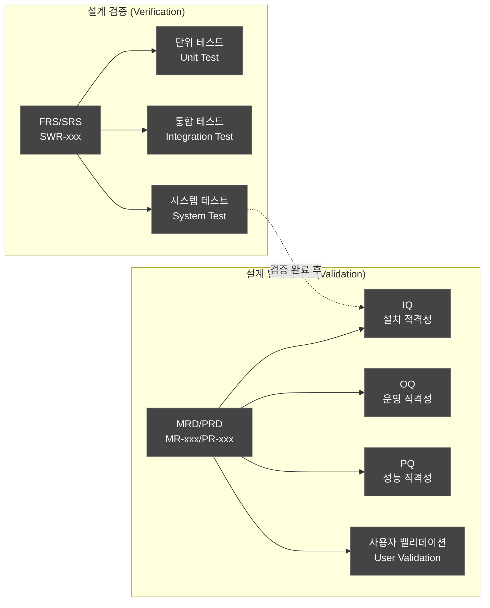
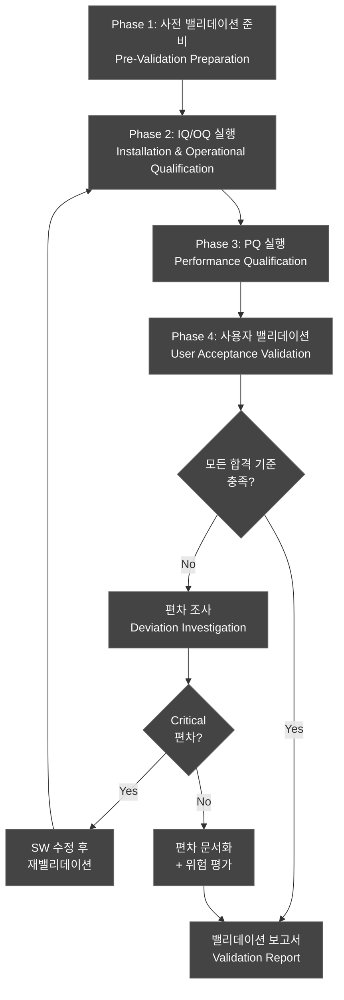
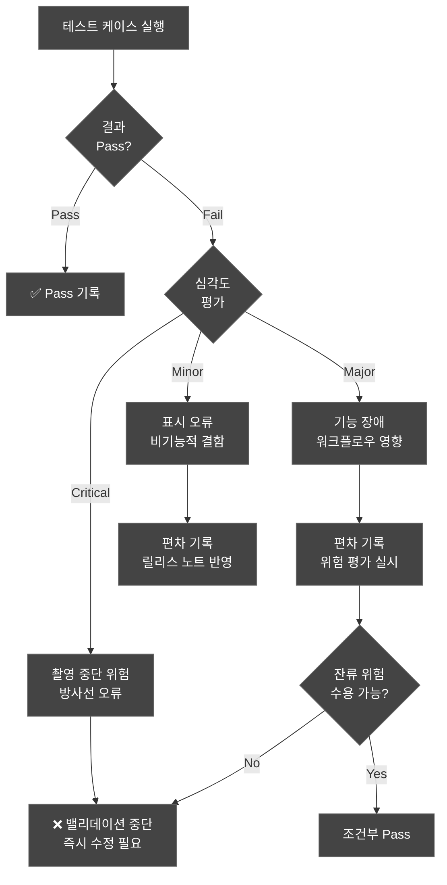
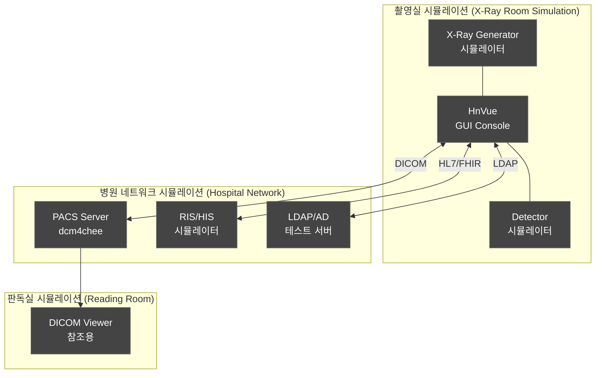
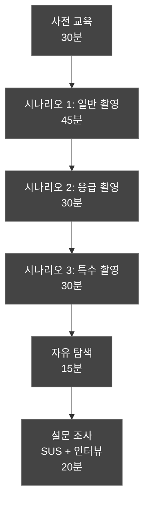
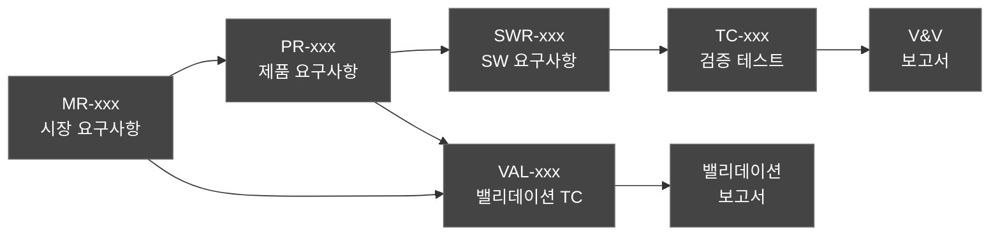
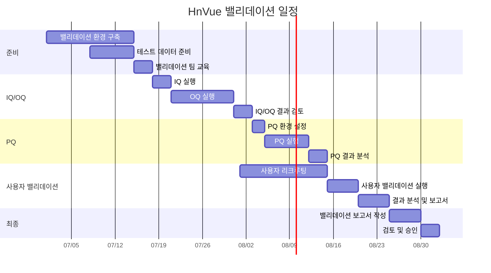

# 소프트웨어 밸리데이션 계획서 (Software Validation Plan)
## HnVue Console SW

---

## 문서 메타데이터 (Document Metadata)

| 항목 | 내용 |
|------|------|
| **문서 ID** | VAL-XRAY-GUI-001 |
| **문서명** | HnVue Console SW 소프트웨어 밸리데이션 계획서 |
| **버전** | v1.0 |
| **작성일** | 2026-03-18 |
| **작성자** | SW V&V Team |
| **검토자** | QA 팀장, 임상 자문위원 |
| **승인자** | 의료기기 RA/QA 책임자 |
| **상태** | 승인됨 (Approved) |
| **기준 규격** | FDA 21 CFR 820.30(g), IEC 62304 §5.7, IEC 62366-1:2015+AMD1:2020 |

### 개정 이력 (Revision History)

| 버전 | 날짜 | 변경 내용 | 작성자 |
|------|------|----------|--------|
| v1.0 | 2026-03-18 | 최초 작성 — V&V Master Plan §8 기반 상세 밸리데이션 계획 | SW V&V Team |

---

## 목차 (Table of Contents)

1. 목적 및 범위 (Purpose and Scope)
2. 참조 문서 (Reference Documents)
3. 밸리데이션 전략 (Validation Strategy)
4. 밸리데이션 환경 (Validation Environment)
5. IQ/OQ/PQ 접근법 (Qualification Approach)
6. 밸리데이션 테스트 케이스 (Validation Test Cases)
7. 사용자 밸리데이션 프로토콜 (User Validation Protocol)
8. 합격 기준 (Acceptance Criteria)
9. 밸리데이션 보고서 구조 (Validation Report Structure)
10. 추적성 매트릭스 (Traceability Matrix)
11. 일정 및 마일스톤 (Schedule and Milestones)

부록 A: 밸리데이션 체크리스트  
부록 B: 사용자 동의서 양식  
부록 C: 임상 시뮬레이션 시나리오

---

## 1. 목적 및 범위 (Purpose and Scope)

### 1.1 목적 (Purpose)

본 문서는 HnVue Console SW에 대한 **설계 밸리데이션 (Design Validation)** 활동의 상세 계획을 수립한다. V&V 마스터 플랜 (VVP-XRAY-GUI-001) §8의 밸리데이션 프레임워크를 구체적으로 이행하기 위한 실행 계획서이다.

**설계 밸리데이션의 핵심 질문**: "올바른 소프트웨어를 구축했는가? (Did we build the right software?)"

FDA 21 CFR 820.30(g)에 따라 설계 밸리데이션은 다음을 확인한다:
- 최종 출시 소프트웨어가 **의도된 사용 목적 (Intended Use)**에 부합하는지 검증
- **사용자 요구사항 (User Needs, MR-xxx)**이 실제 사용 조건에서 충족되는지 확인
- **안전성 관련 기능**이 임상 환경에서 올바르게 작동하는지 실증

### 1.2 범위 (Scope)

**적용 대상**: HnVue Console SW Phase 1 (M1–M12)

| 구분 | 내용 |
|------|------|
| **밸리데이션 대상** | 릴리스 후보 빌드 (Release Candidate Build) |
| **환경** | 시뮬레이션된 임상 환경 (Simulated Clinical Environment) |
| **참여자** | 방사선사 5명, 영상의학과 전문의 2명, 시스템 관리자 2명 |
| **기간** | Phase 1 M10–M11 (밸리데이션 실행 4주) |

### 1.3 밸리데이션 vs 검증 구분 (Validation vs Verification)

---

## 2. 참조 문서 (Reference Documents)

| 문서 ID | 문서명 | 버전 | 관계 |
|---------|--------|------|------|
| VVP-XRAY-GUI-001 | V&V 마스터 플랜 | v1.0 | 상위 계획 |
| MRD-XRAY-GUI-001 | 시장 요구사항 문서 (MRD) | v2.0 | 밸리데이션 기준 (MR-xxx) |
| PRD-XRAY-GUI-001 | 제품 요구사항 문서 (PRD) | v3.0 | 설계 입력 (PR-xxx) |
| FRS-XRAY-GUI-001 | 기능 요구사항 명세서 (FRS) | v1.0 | SWR→TC 추적성 |
| STP-XRAY-GUI-001 | 시스템 테스트 계획서 | v1.0 | 검증 결과 참조 |
| RMP-XRAY-GUI-001 | 위험 관리 계획서 | v1.0 | 안전성 밸리데이션 |
| UEF-XRAY-GUI-001 | 사용적합성 공학 파일 | v1.0 | 사용성 밸리데이션 |

---

## 3. 밸리데이션 전략 (Validation Strategy)

### 3.1 전략 개요 (Strategy Overview)

본 밸리데이션은 **4단계 접근법**을 적용한다:

### 3.2 밸리데이션 수준 정의

| 수준 | 대상 | 방법 | 판정 기준 |
|------|------|------|----------|
| **IQ (Installation Qualification)** | SW 설치 및 구성 | 체크리스트 기반 확인 | 100% 항목 충족 |
| **OQ (Operational Qualification)** | 기능별 운영 확인 | 기능 테스트 실행 | 100% Critical TC Pass |
| **PQ (Performance Qualification)** | 실사용 조건 성능 | 임상 시뮬레이션 | 성능 기준 충족 |
| **UAV (User Acceptance Validation)** | 사용자 수용성 | 사용자 테스트 | SUS ≥ 78, 과업 성공률 ≥ 95% |

### 3.3 밸리데이션 결정 트리 (Decision Tree)

---

## 4. 밸리데이션 환경 (Validation Environment)

### 4.1 시뮬레이션 임상 환경 구성

### 4.2 환경 구성 상세

| 구성요소 | 사양 | 비고 |
|----------|------|------|
| **Console PC** | Intel i7-12700, 32GB RAM, RTX 3060, 2× 27" 의료용 모니터 | 실제 배포 사양 동일 |
| **OS** | Windows 10 IoT Enterprise LTSC 2021 | 동일 빌드 |
| **X-Ray Simulator** | Generator Protocol Emulator v2.1 | 실제 발생기 프로토콜 에뮬레이션 |
| **PACS** | dcm4chee-arc 5.x + 테스트 영상 1,000건 | DICOM C-STORE/C-FIND/C-MOVE |
| **RIS Simulator** | HL7 v2.x / FHIR R4 메시지 생성기 | Worklist, Patient Demo |
| **Network** | 기가비트 이더넷, VLAN 격리 | 병원 네트워크 모사 |
| **테스트 데이터** | 익명화된 DICOM 영상, 환자 데모 데이터 | IRB 불필요 (시뮬레이션) |

### 4.3 테스트 데이터 세트

| 데이터 ID | 유형 | 수량 | 용도 |
|-----------|------|------|------|
| TD-001 | 표준 흉부 X-Ray | 200건 | 일반 워크플로우 |
| TD-002 | 소아 X-Ray | 50건 | 특수 프로토콜 |
| TD-003 | 고해상도 사지 | 100건 | 영상 처리 성능 |
| TD-004 | Multi-frame 영상 | 50건 | DICOM 호환성 |
| TD-005 | 대용량 영상 (>50MB) | 20건 | 성능 스트레스 |
| TD-006 | 손상된 DICOM | 30건 | 에러 핸들링 |
| TD-007 | Worklist 환자 | 500명 | RIS 연동 |

---

## 5. IQ/OQ/PQ 접근법 (Qualification Approach)

### 5.1 IQ — 설치 적격성 (Installation Qualification)

**목적**: 소프트웨어가 지정된 환경에 올바르게 설치되고 구성되었음을 확인

| IQ 항목 | 확인 내용 | 방법 | 합격 기준 |
|---------|----------|------|----------|
| IQ-001 | 설치 파일 해시값 (SHA-256) | 자동 비교 | 빌드 서버 해시와 일치 |
| IQ-002 | .NET 6.0 Runtime 버전 | 버전 명령 | 6.0.x LTS 확인 |
| IQ-003 | 필수 DLL/라이브러리 | 파일 존재 확인 | SBOM 전 항목 존재 |
| IQ-004 | 레지스트리/구성 파일 | 설정값 확인 | 기본 구성 일치 |
| IQ-005 | 데이터베이스 스키마 | 스키마 비교 | DDL 일치 |
| IQ-006 | DICOM 서비스 포트 (104/11112) | 포트 리스닝 확인 | 정상 LISTEN |
| IQ-007 | 로그 디렉토리/권한 | 파일 시스템 확인 | 쓰기 권한 정상 |
| IQ-008 | 디지털 서명 | 코드 서명 확인 | 유효한 서명 |

### 5.2 OQ — 운영 적격성 (Operational Qualification)

**목적**: 각 기능이 규격 범위 내에서 정상 동작함을 확인

| 도메인 | OQ 항목 수 | 주요 확인 내용 |
|--------|-----------|---------------|
| PM (환자 관리) | 8 | 환자 등록, 검색, Worklist 연동 |
| WF (촬영 워크플로우) | 12 | 촬영 순서, AEC, 프로토콜 선택 |
| IP (영상 표시) | 10 | DICOM 렌더링, 윈도잉, 측정 |
| DM (선량 관리) | 6 | DAP 표시, RDSR 생성, 경고 |
| DC (DICOM/통신) | 8 | C-STORE, C-FIND, MPPS, SR |
| SA (시스템 관리) | 6 | 사용자 관리, 백업, 감사 로그 |
| CS (사이버보안) | 5 | 인증, 암호화, 세션 관리 |
| **합계** | **55** | |

### 5.3 PQ — 성능 적격성 (Performance Qualification)

**목적**: 실사용 조건에서 성능 기준을 충족함을 확인

| PQ 항목 | 성능 기준 | 측정 방법 |
|---------|----------|----------|
| PQ-001 | 영상 표시 ≤ 2초 (표준 CR) | 타이머 측정 |
| PQ-002 | Worklist 조회 ≤ 3초 (500건) | 자동 계측 |
| PQ-003 | DICOM 전송 ≥ 50 Mbps | 네트워크 모니터 |
| PQ-004 | 동시 사용자 5명 응답 ≤ 5초 | 부하 테스트 |
| PQ-005 | 연속 운영 72시간 메모리 안정 | 리소스 모니터 |
| PQ-006 | 촬영 사이클 ≤ 30초 (Ready→Capture→Display) | 시나리오 타이머 |
| PQ-007 | 장애 복구 ≤ 60초 | 장애 주입 테스트 |
| PQ-008 | DICOM 영상 무결성 100% | 해시 비교 |

---

## 6. 밸리데이션 테스트 케이스 (Validation Test Cases)

### 6.1 테스트 케이스 ID 체계

`VAL-{Domain}-{Seq:3}`  
예: VAL-PM-001 (환자 관리 밸리데이션 TC #001)

### 6.2 환자 관리 (PM) 밸리데이션

| TC ID | 테스트 명 | 관련 MR | 관련 PR | 방법 | 합격 기준 |
|-------|----------|---------|---------|------|----------|
| VAL-PM-001 | 환자 등록 워크플로우 | MR-001 | PR-001 | 임상 시뮬레이션 | 등록 완료 ≤ 30초, 데이터 정확 |
| VAL-PM-002 | 환자 검색 (이름/ID) | MR-002 | PR-002 | 사용자 테스트 | 검색 ≤ 2초, 결과 정확 |
| VAL-PM-003 | Worklist 환자 선택 | MR-003 | PR-003 | 임상 시뮬레이션 | Worklist 표시 ≤ 3초, 선택 정확 |
| VAL-PM-004 | 환자 정보 수정 | MR-004 | PR-004 | 사용자 테스트 | 수정 반영 확인, 감사 기록 생성 |
| VAL-PM-005 | 응급 환자 등록 | MR-005 | PR-005 | 시나리오 테스트 | 최소 정보로 즉시 촬영 가능 |

### 6.3 촬영 워크플로우 (WF) 밸리데이션

| TC ID | 테스트 명 | 관련 MR | 관련 PR | 방법 | 합격 기준 |
|-------|----------|---------|---------|------|----------|
| VAL-WF-001 | 표준 촬영 전체 워크플로우 | MR-010 | PR-010 | 임상 시뮬레이션 | 환자선택→촬영→전송 완료 |
| VAL-WF-002 | 프로토콜 선택 및 적용 | MR-011 | PR-011 | 사용자 테스트 | 해부학적 부위별 정확한 프로토콜 |
| VAL-WF-003 | AEC 파라미터 자동 설정 | MR-012 | PR-012 | 기능 테스트 | 환자 체형별 자동 조정 |
| VAL-WF-004 | 촬영 순서 관리 | MR-013 | PR-013 | 시나리오 테스트 | 다중 촬영 순서 정확 |
| VAL-WF-005 | 재촬영 워크플로우 | MR-014 | PR-014 | 임상 시뮬레이션 | 재촬영 사유 기록, 선량 누적 |
| VAL-WF-006 | 소아 촬영 프로토콜 | MR-015 | PR-015 | 특수 시나리오 | 소아 전용 파라미터 적용 |
| VAL-WF-007 | 이동형 촬영 워크플로우 | MR-016 | PR-016 | 시나리오 테스트 | 이동형 장비 연동 정상 |

### 6.4 영상 표시/처리 (IP) 밸리데이션

| TC ID | 테스트 명 | 관련 MR | 관련 PR | 방법 | 합격 기준 |
|-------|----------|---------|---------|------|----------|
| VAL-IP-001 | 영상 표시 품질 | MR-020 | PR-020 | 전문가 평가 | DICOM GSDF 준수 |
| VAL-IP-002 | 윈도잉 (W/L) 조절 | MR-021 | PR-021 | 사용자 테스트 | 실시간 반응, 프리셋 정확 |
| VAL-IP-003 | 확대/축소/팬 | MR-022 | PR-022 | 사용자 테스트 | 부드러운 조작, 해상도 유지 |
| VAL-IP-004 | 영상 회전/반전 | MR-023 | PR-023 | 기능 테스트 | DICOM 태그 정합성 유지 |
| VAL-IP-005 | 거리/각도 측정 | MR-024 | PR-024 | 전문가 평가 | 보정 기준 ±2% 이내 |
| VAL-IP-006 | 주석 (Annotation) | MR-025 | PR-025 | 사용자 테스트 | 주석 저장/로드 정확 |
| VAL-IP-007 | 영상 처리 필터 | MR-026 | PR-026 | 전문가 평가 | 임상적 적합성 확인 |
| VAL-IP-008 | 다중 영상 비교 | MR-027 | PR-027 | 사용자 테스트 | 2×2, 사전/사후 비교 |

### 6.5 선량 관리 (DM) 밸리데이션

| TC ID | 테스트 명 | 관련 MR | 관련 PR | 방법 | 합격 기준 |
|-------|----------|---------|---------|------|----------|
| VAL-DM-001 | DAP 실시간 표시 | MR-040 | PR-040 | 기능 테스트 | 발생기 값과 일치 |
| VAL-DM-002 | 누적 선량 계산 | MR-041 | PR-041 | 시나리오 테스트 | 다중 촬영 누적 정확 |
| VAL-DM-003 | DRL 초과 경고 | MR-042 | PR-042 | 임계값 테스트 | DRL 90% 시 경고, 100% 시 알림 |
| VAL-DM-004 | RDSR 생성 및 전송 | MR-043 | PR-043 | DICOM 검증 | RDSR 구조 정합, PACS 전송 |
| VAL-DM-005 | 선량 이력 리포트 | MR-044 | PR-044 | 보고서 검증 | 환자별/기간별 정확한 통계 |

### 6.6 DICOM/통신 (DC) 밸리데이션

| TC ID | 테스트 명 | 관련 MR | 관련 PR | 방법 | 합격 기준 |
|-------|----------|---------|---------|------|----------|
| VAL-DC-001 | DICOM C-STORE 전송 | MR-050 | PR-050 | 프로토콜 테스트 | 100% 전송 성공, 영상 무결성 |
| VAL-DC-002 | DICOM C-FIND 쿼리 | MR-051 | PR-051 | 기능 테스트 | 쿼리 결과 정확 |
| VAL-DC-003 | DICOM MPPS 상태 보고 | MR-052 | PR-052 | 프로토콜 테스트 | In Progress→Completed 정상 |
| VAL-DC-004 | HL7/FHIR Worklist 연동 | MR-053 | PR-053 | 통합 테스트 | 환자 정보 정합 |

### 6.7 시스템 관리 (SA) 밸리데이션

| TC ID | 테스트 명 | 관련 MR | 관련 PR | 방법 | 합격 기준 |
|-------|----------|---------|---------|------|----------|
| VAL-SA-001 | 사용자 역할 기반 접근 | MR-060 | PR-060 | 시나리오 테스트 | 역할별 권한 정확 |
| VAL-SA-002 | 감사 추적 기록 | MR-061 | PR-061 | 로그 검증 | 모든 핵심 활동 기록 |
| VAL-SA-003 | 데이터 백업/복원 | MR-062 | PR-062 | 시나리오 테스트 | 100% 데이터 복원 |
| VAL-SA-004 | 시스템 구성 관리 | MR-063 | PR-063 | 기능 테스트 | 설정 변경/저장 정확 |

### 6.8 사이버보안 (CS) 밸리데이션

| TC ID | 테스트 명 | 관련 MR | 관련 PR | 방법 | 합격 기준 |
|-------|----------|---------|---------|------|----------|
| VAL-CS-001 | 인증 기능 밸리데이션 | MR-070 | PR-070 | 보안 테스트 | 무단 접근 차단 100% |
| VAL-CS-002 | 데이터 암호화 확인 | MR-071 | PR-071 | 패킷 분석 | 전송/저장 시 AES-256 |
| VAL-CS-003 | 세션 타임아웃 | MR-072 | PR-072 | 시나리오 테스트 | 설정 시간 후 자동 잠금 |

### 6.9 밸리데이션 TC 요약

| 도메인 | TC 수 | Critical | Major | Minor |
|--------|-------|----------|-------|-------|
| PM (환자 관리) | 5 | 2 | 2 | 1 |
| WF (촬영 워크플로우) | 7 | 4 | 2 | 1 |
| IP (영상 표시) | 8 | 3 | 3 | 2 |
| DM (선량 관리) | 5 | 3 | 1 | 1 |
| DC (DICOM/통신) | 4 | 2 | 1 | 1 |
| SA (시스템 관리) | 4 | 1 | 2 | 1 |
| CS (사이버보안) | 3 | 2 | 1 | 0 |
| **합계** | **36** | **17** | **12** | **7** |

---

## 7. 사용자 밸리데이션 프로토콜 (User Validation Protocol)

### 7.1 참여자 구성 (Participant Composition)

| 역할 | 인원 | 경력 요건 | 밸리데이션 참여 범위 |
|------|------|----------|-------------------|
| 방사선사 (Radiologic Technologist) | 5명 | 임상 경력 3년 이상 | WF, IP, DM, PM 도메인 |
| 영상의학과 전문의 (Radiologist) | 2명 | 전문의 자격 | IP 영상 품질 평가 |
| 시스템 관리자 (System Admin) | 2명 | IT 경력 2년 이상 | SA, CS, DC 도메인 |

### 7.2 사용자 밸리데이션 세션 구성

### 7.3 임상 시뮬레이션 시나리오

| 시나리오 | 설명 | 평가 항목 | 소요 시간 |
|----------|------|----------|----------|
| S1: 일반 흉부 촬영 | Worklist→환자선택→PA/LAT 촬영→PACS 전송 | 과업 완료율, 소요 시간, 오류 수 | 10분 |
| S2: 응급 환자 촬영 | 미등록 환자 즉시 촬영→사후 환자 매칭 | 응급 워크플로우 효율성 | 8분 |
| S3: 소아 촬영 | 소아 프로토콜 선택→저선량 파라미터 확인 | 안전성 기능 검증 | 10분 |
| S4: 재촬영 판단 | 품질 불량 영상 평가→재촬영 결정→선량 누적 확인 | 의사결정 지원 기능 | 8분 |
| S5: 대량 Worklist | 100명 이상 환자 목록에서 대상 환자 검색 | 검색 효율, 응답 시간 | 5분 |
| S6: PACS 전송 실패 복구 | 네트워크 단절 중 촬영→복구 후 자동 재전송 | 장애 복구 능력 | 10분 |
| S7: 다중 촬영 관리 | 동일 환자 5회 연속 촬영→선량 보고서 | 워크플로우 연속성 | 12분 |
| S8: 시스템 관리 | 사용자 계정 생성→권한 설정→감사 로그 확인 | 관리 기능 사용성 | 10분 |

### 7.4 사용성 측정 지표

| 지표 | 측정 방법 | 합격 기준 |
|------|----------|----------|
| **과업 성공률 (Task Success Rate)** | 성공 과업 / 전체 과업 × 100 | ≥ 95% |
| **치명적 오류율 (Critical Error Rate)** | 안전 관련 오류 발생 건수 | 0건 (Zero Tolerance) |
| **과업 소요 시간 (Task Time)** | 각 시나리오별 초 단위 측정 | 기준 시간 이내 |
| **SUS 점수 (System Usability Scale)** | 10문항 설문 | ≥ 78 (Good) |
| **사용자 만족도 (User Satisfaction)** | 5점 Likert 척도 | ≥ 4.0/5.0 |

---

## 8. 합격 기준 (Acceptance Criteria)

### 8.1 전체 밸리데이션 합격 기준

| 기준 | 조건 | 비고 |
|------|------|------|
| **Critical TC Pass Rate** | 100% (17/17) | Zero Tolerance |
| **Major TC Pass Rate** | ≥ 95% (≥12/12) | 1건 이하 편차 허용 |
| **Minor TC Pass Rate** | ≥ 90% (≥7/7) | 편차 시 문서화 |
| **IQ 항목 합격률** | 100% (8/8) | 전 항목 필수 |
| **OQ 항목 합격률** | 100% Critical | 전 항목 필수 |
| **PQ 성능 기준** | 100% 충족 | 정량 기준 |
| **사용자 SUS 점수** | ≥ 78 | Good 등급 이상 |
| **치명적 사용 오류** | 0건 | Zero Tolerance |
| **잔류 편차** | 모든 편차 위험 평가 완료 | 수용 가능 수준 |

### 8.2 도메인별 합격 기준

| 도메인 | 특수 기준 |
|--------|----------|
| WF (촬영 워크플로우) | 촬영 사이클 ≤ 30초, 프로토콜 적용 정확도 100% |
| IP (영상 표시) | GSDF 적합성 Pass, 측정 정확도 ±2% |
| DM (선량 관리) | DRL 경고 100% 정확, RDSR 100% 생성 |
| CS (사이버보안) | 인증 우회 0건, 암호화 100% 적용 |

---

## 9. 밸리데이션 보고서 구조 (Validation Report Structure)

밸리데이션 완료 후 **설계 밸리데이션 보고서 (Design Validation Report, DVR)**를 작성하며, 구조는 다음과 같다:

| 섹션 | 내용 |
|------|------|
| 1. 요약 (Executive Summary) | 밸리데이션 결과 요약, 합격/불합격 판정 |
| 2. 밸리데이션 범위 | 실행된 TC, 참여자, 환경 |
| 3. IQ/OQ/PQ 결과 | 각 적격성 단계별 결과 |
| 4. 사용자 밸리데이션 결과 | 과업 성공률, SUS, 인터뷰 요약 |
| 5. 편차 목록 | 발견된 편차, 위험 평가, 조치 |
| 6. 추적성 확인 | MR→VAL-TC 추적성 완결성 |
| 7. 결론 및 권고 | 출시 가부 판정 |
| 부록 | 원시 데이터, 사용자 동의서, 사진/스크린샷 |

---

## 10. 추적성 매트릭스 (Traceability Matrix)

### 10.1 추적성 체인

### 10.2 밸리데이션 추적성 매트릭스 (요약)

| MR | PR | VAL-TC | IQ/OQ/PQ | 합격 기준 |
|----|-----|--------|----------|----------|
| MR-001–006 | PR-001–006 | VAL-PM-001–005 | OQ/PQ | 환자 관리 정확성 |
| MR-010–018 | PR-010–018 | VAL-WF-001–007 | OQ/PQ | 촬영 워크플로우 완결성 |
| MR-020–037 | PR-020–037 | VAL-IP-001–008 | OQ/PQ | 영상 품질/처리 정확성 |
| MR-040–046 | PR-040–046 | VAL-DM-001–005 | OQ/PQ | 선량 관리 정확성 |
| MR-050–056 | PR-050–056 | VAL-DC-001–004 | OQ/PQ | DICOM 호환성 |
| MR-060–067 | PR-060–067 | VAL-SA-001–004 | IQ/OQ | 시스템 관리 기능 |
| MR-070–076 | PR-070–076 | VAL-CS-001–003 | OQ | 보안 기능 |

---

## 11. 일정 및 마일스톤 (Schedule and Milestones)

### 11.1 밸리데이션 일정

### 11.2 마일스톤

| 마일스톤 | 목표일 | 산출물 |
|----------|--------|--------|
| M-VAL-1: 환경 준비 완료 | 2026-07-17 | 환경 적격성 확인 문서 |
| M-VAL-2: IQ/OQ 완료 | 2026-08-02 | IQ/OQ 결과 보고서 |
| M-VAL-3: PQ 완료 | 2026-08-14 | PQ 결과 보고서 |
| M-VAL-4: 사용자 밸리데이션 완료 | 2026-08-24 | 사용성 평가 보고서 |
| M-VAL-5: 최종 보고서 승인 | 2026-09-01 | 설계 밸리데이션 보고서 (DVR) |

---

## 부록 A: 밸리데이션 체크리스트 (Validation Checklist)

| # | 확인 항목 | 확인 방법 | 결과 | 비고 |
|---|----------|----------|------|------|
| 1 | 밸리데이션 계획서 승인 완료 | 서명 확인 | ☐ | |
| 2 | 밸리데이션 환경 IQ 완료 | IQ 보고서 | ☐ | |
| 3 | 테스트 데이터 준비 완료 | 데이터 목록 확인 | ☐ | |
| 4 | 참여자 교육 완료 | 교육 기록 | ☐ | |
| 5 | 모든 선행 검증 (V) 완료 | V&V 결과 보고서 | ☐ | |
| 6 | 위험 관리 활동 완료 | RMR 확인 | ☐ | |
| 7 | OQ 전 항목 Pass | OQ 결과 | ☐ | |
| 8 | PQ 성능 기준 충족 | PQ 결과 | ☐ | |
| 9 | 사용자 밸리데이션 SUS ≥ 78 | SUS 점수 | ☐ | |
| 10 | 치명적 사용 오류 0건 | 사용성 보고서 | ☐ | |
| 11 | 모든 편차 위험 평가 완료 | 편차 목록 | ☐ | |
| 12 | 밸리데이션 보고서 승인 | 서명 확인 | ☐ | |

---

## 부록 B: SUS (System Usability Scale) 설문

| # | 문항 (한국어) | 1 | 2 | 3 | 4 | 5 |
|---|-------------|---|---|---|---|---|
| 1 | 이 시스템을 자주 사용하고 싶다 | ☐ | ☐ | ☐ | ☐ | ☐ |
| 2 | 이 시스템이 불필요하게 복잡하다고 느낀다 | ☐ | ☐ | ☐ | ☐ | ☐ |
| 3 | 이 시스템은 사용하기 쉽다고 생각한다 | ☐ | ☐ | ☐ | ☐ | ☐ |
| 4 | 이 시스템 사용을 위해 기술 지원이 필요하다 | ☐ | ☐ | ☐ | ☐ | ☐ |
| 5 | 이 시스템의 다양한 기능이 잘 통합되어 있다 | ☐ | ☐ | ☐ | ☐ | ☐ |
| 6 | 이 시스템에 일관성이 부족하다고 느낀다 | ☐ | ☐ | ☐ | ☐ | ☐ |
| 7 | 대부분의 사람들이 이 시스템을 빠르게 배울 수 있다 | ☐ | ☐ | ☐ | ☐ | ☐ |
| 8 | 이 시스템은 사용하기 매우 번거롭다 | ☐ | ☐ | ☐ | ☐ | ☐ |
| 9 | 이 시스템을 사용하는 데 자신감이 있다 | ☐ | ☐ | ☐ | ☐ | ☐ |
| 10 | 이 시스템을 사용하기 전에 많은 것을 배워야 했다 | ☐ | ☐ | ☐ | ☐ | ☐ |

**SUS 점수 계산**: (홀수 문항: 점수-1, 짝수 문항: 5-점수) × 2.5 = 총점 (0–100)

---

## 부록 C: 편차 보고서 양식 (Deviation Report Template)

| 항목 | 내용 |
|------|------|
| **편차 ID** | DEV-VAL-xxx |
| **발견일** | YYYY-MM-DD |
| **관련 TC** | VAL-xx-xxx |
| **심각도** | Critical / Major / Minor |
| **설명** | |
| **예상 결과** | |
| **실제 결과** | |
| **근본 원인** | |
| **위험 평가** | HAZ-xxx 참조, 잔류 위험 수준 |
| **시정 조치** | |
| **재검증 필요 여부** | Yes / No |
| **승인** | |

---

*문서 끝 (End of Document)*
