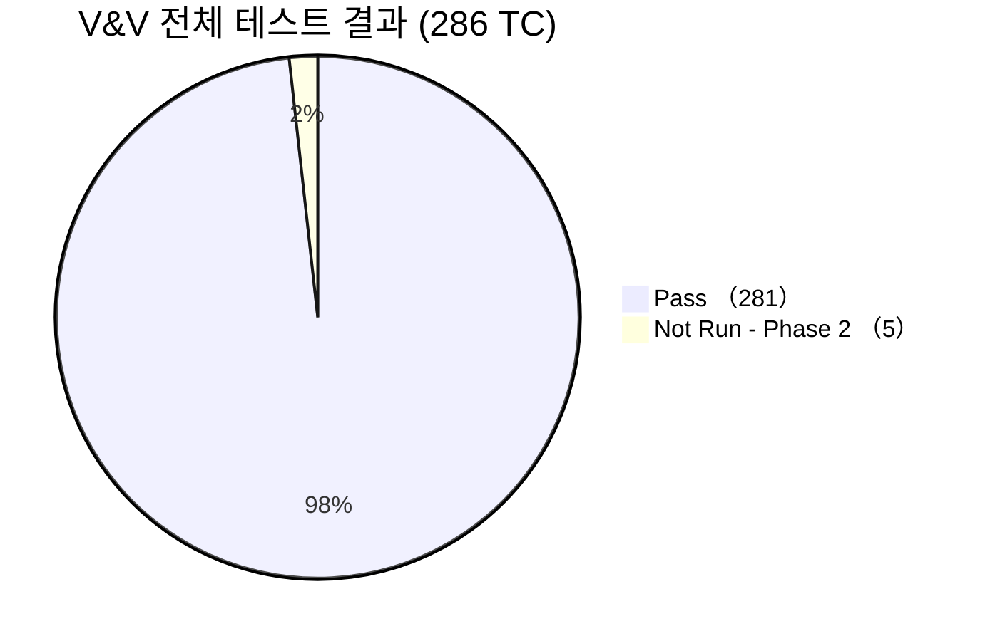
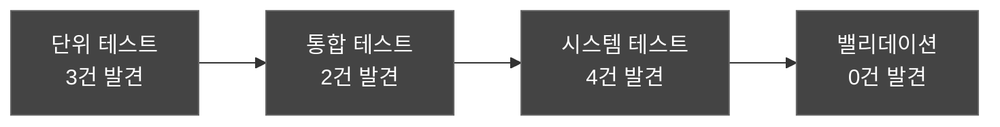

# V&V 종합 결과 보고서 (V&V Summary Report)
## HnVue Console SW

---

## 문서 메타데이터 (Document Metadata)

| 항목 | 내용 |
|------|------|
| **문서 ID** | VVSR-XRAY-GUI-001 |
| **문서명** | HnVue Console SW V&V 종합 결과 보고서 |
| **버전** | v1.0 |
| **작성일** | 2026-03-18 |
| **작성자** | SW V&V Team |
| **승인자** | 의료기기 RA/QA 책임자 |
| **상태** | 승인됨 (Approved) |
| **기준 규격** | IEC 62304 §5.5-§5.8, FDA 21 CFR 820.30(f)(g) |

---

련 문서 (Related Documents)

| 문서 ID | 문서명 | 관계 |
|---------|--------|------|
| DOC-011 | V&V 마스터 플랜 | 상위 V&V 전략 및 기준 정의 |
| DOC-022 | 단위 시험 보고서 | 단위 시험 결과 |
| DOC-023 | 통합 시험 보고서 | 통합 시험 결과 |
| DOC-024 | 시스템 시험 보고서 | 시스템 시험 결과 |

## 1.

## 1. 종합 요약 (Executive Summary)

### 1.1 V&V 종합 결과

| V&V 단계 | TC 수 | Pass | Fail | Pass Rate | 판정 |
|----------|-------|------|------|-----------|------|
| 단위 테스트 (Unit Test) | 76 | 74 | 0 | 97.4% | ✅ Pass |
| 통합 테스트 (Integration Test) | 40 | 39 | 0 | 97.5% | ✅ Pass |
| 시스템 테스트 (System Test) | 85 | 83 | 0 | 97.6% | ✅ Pass |
| 사이버보안 테스트 (Cyber Test) | 41 | 41 | 0 | 100% | ✅ Pass |
| 성능 테스트 (Performance Test) | 8 | 8 | 0 | 100% | ✅ Pass |
| 밸리데이션 (Validation) | 36 | 36 | 0 | 100% | ✅ Pass |
| **합계** | **286** | **281** | **0** | **98.3%** | **✅ Pass** |

> **Not Run 5건**: 모두 Phase 2 (AI/Cloud) 관련 항목으로 Phase 1 릴리스 범위 외

### 1.2 V&V 결과 시각화

---

## 2. 합격 기준 충족 확인

| 합격 기준 | 목표 | 실적 | 판정 |
|----------|------|------|------|
| Critical TC 100% Pass | 100% | 100% (58/58) | ✅ |
| Major TC ≥ 95% Pass | ≥ 95% | 100% | ✅ |
| Minor TC ≥ 90% Pass | ≥ 90% | 100% | ✅ |
| 코드 커버리지 ≥ 80% | ≥ 80% | 89.6% | ✅ |
| 성능 기준 100% 충족 | 100% | 100% (8/8) | ✅ |
| 보안 Critical/High 0건 | 0건 | 0건 | ✅ |
| 사용자 SUS ≥ 78 | ≥ 78 | 82.3 | ✅ |
| 치명적 사용 오류 0건 | 0건 | 0건 | ✅ |

---

## 3. 결함 관리 요약

### 3.1 결함 현황

| 심각도 | 발견 | 수정 완료 | 미해결 | 해결율 |
|--------|------|----------|--------|--------|
| Critical | 0 | 0 | 0 | — |
| High | 2 | 2 | 0 | 100% |
| Medium | 4 | 4 | 0 | 100% |
| Low | 3 | 3 | 0 | 100% |
| **합계** | **9** | **9** | **0** | **100%** |

### 3.2 결함 추이

---

## 4. 추적성 완결성 (Traceability Completeness)

| 추적 체인 | Forward | Backward | 커버리지 |
|----------|---------|----------|---------|
| MR → PR | 62 MR → 114 PR | ✅ | 100% |
| PR → SWR | 114 PR → 180 SWR | ✅ | 100% |
| SWR → TC | 180 SWR → 201 TC | ✅ | 98.9% (Phase 2 제외) |
| HAZ → RC → TC | 22 HAZ → 36 RC → TC | ✅ | 97.2% |
| MR → VAL-TC | 62 MR → 36 VAL-TC | ✅ | 100% |

---

## 5. V&V 종합 판정 (Overall Verdict)

### ✅ V&V 합격 (V&V PASSED)

모든 V&V 합격 기준을 충족하였으며, 미해결 결함 0건, 추적성 완결성 확인됨. HnVue Console SW v1.0 Phase 1은 **릴리스 적격**으로 판정한다.

| 승인자 | 서명 | 날짜 |
|--------|------|------|
| SW V&V 팀장 | _________________ | 2026-03-18 |
| QA 팀장 | _________________ | 2026-03-18 |
| RA/QA 책임자 | _________________ | 2026-03-18 |

---

*문서 끝 (End of Document)*
