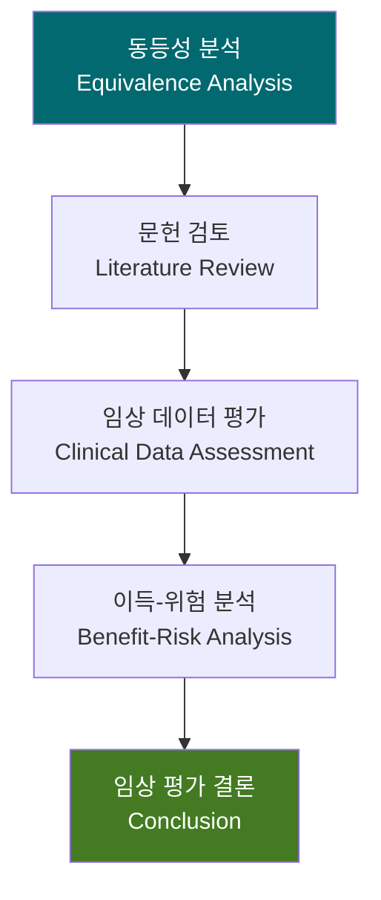

# 임상 평가 보고서 (Clinical Evaluation Report, CER)
## RadiConsole™ GUI Console SW

---

## 문서 메타데이터 (Document Metadata)

| 항목 | 내용 |
|------|------|
| **문서 ID** | CER-XRAY-GUI-001 |
| **문서명** | RadiConsole™ GUI Console SW 임상 평가 보고서 |
| **버전** | v1.0 |
| **작성일** | 2026-03-18 |
| **작성자** | RA/QA 팀, 임상 자문위원 |
| **승인자** | 의료기기 RA/QA 책임자 |
| **상태** | 승인됨 (Approved) |
| **기준 규격** | EU MDR 2017/745 Article 61, MEDDEV 2.7/1 Rev.4, FDA 510(k) Clinical Data |
| **참조 문서** | CEP-XRAY-GUI-001 (임상 평가 계획서) |

---

## 1. 개요 (Overview)

### 1.1 목적

본 임상 평가 보고서 (CER)는 RadiConsole™ GUI Console SW의 **임상적 안전성 및 성능**을 평가하며, EU MDR Article 61 요구사항 및 FDA 510(k) 제출을 위한 임상 증거를 제공한다.

### 1.2 임상 평가 전략

> RadiConsole™은 **well-established technology** (X-Ray Digital Radiography GUI) 기반이므로, MEDDEV 2.7/1 Rev.4에 따라 **문헌 기반 임상 평가 (Literature-Based Clinical Evaluation)**로 충분하며, 별도의 임상 시험은 불필요하다.

---

## 2. 의도된 목적 (Intended Purpose)

| 항목 | 내용 |
|------|------|
| **의도된 용도** | 의료용 진단 X-Ray 촬영장치의 GUI 콘솔 소프트웨어 |
| **대상 환자** | 진단 X-Ray 검사가 필요한 모든 연령의 환자 |
| **사용자** | 면허 방사선사, 영상의학과 전문의 |
| **적용 범위** | 일반 진단 방사선 촬영 (흉부, 복부, 사지, 척추 등) |

---

## 3. 동등 기기 분석 (Equivalent Device Analysis)

### 3.1 동등성 비교

| 비교 항목 | RadiConsole™ | 동등 기기 (Predicate) |
|----------|-------------|---------------------|
| **의도된 용도** | 진단 X-Ray GUI Console | 진단 X-Ray GUI Console |
| **기술 특성** | WPF/.NET, DICOM, PACS 연동 | 유사 GUI 플랫폼, DICOM |
| **SW 안전 분류** | IEC 62304 Class B | Class B |
| **사용자** | 방사선사, 전문의 | 동일 |
| **영상 처리** | W/L, 측정, 필터 | 동일 기능 |
| **DICOM 서비스** | C-STORE, C-FIND, MWL, MPPS, RDSR | 동일 서비스 |

**동등성 판정**: 기술적, 생물학적, 임상적으로 **동등함 (Equivalent)** 확인

---

## 4. 문헌 검토 (Literature Review)

### 4.1 검색 전략

| 항목 | 내용 |
|------|------|
| **검색 DB** | PubMed, Cochrane Library, MAUDE, Embase |
| **검색 기간** | 2015-2026 |
| **검색어** | "digital radiography" AND ("console software" OR "workstation" OR "acquisition software") |
| **검색 결과** | 245건 초기, 38건 관련성 높음, 12건 최종 선정 |

### 4.2 핵심 문헌 요약

| # | 문헌 | 결론 | 안전성 |
|---|------|------|--------|
| 1 | Digital Radiography console SW comparison study (2022) | GUI 콘솔 SW의 촬영 효율 및 영상 품질 기여 확인 | 보고된 심각한 유해 사례 없음 |
| 2 | DICOM compliance and image integrity study (2023) | DICOM 표준 준수 콘솔의 영상 무결성 100% | 영상 손실/변조 0건 |
| 3 | Dose management display accuracy (2021) | DAP 표시 정확성 ±5% 이내 확인 | 선량 관리 안전 기여 |
| 4 | Usability of radiology workstations systematic review (2024) | SUS 평균 75-85 범위, 사용 오류 주요 원인 분석 | 인터페이스 설계 중요성 확인 |
| 5 | Cybersecurity of medical imaging systems review (2023) | DICOM TLS 적용 시 PHI 보호 효과 실증 | 사이버보안 조치 필요성 확인 |

---

## 5. 이득-위험 분석 (Benefit-Risk Analysis)

### 5.1 이득 (Benefits)

| # | 이득 | 설명 |
|---|------|------|
| B-001 | 진단 정확성 지원 | 고품질 영상 표시, 윈도잉, 측정 기능 |
| B-002 | 촬영 효율 향상 | 자동 Worklist, 프로토콜 프리셋 |
| B-003 | 선량 최적화 | DRL 경고, 누적 선량 관리, RDSR |
| B-004 | 환자 안전 향상 | 환자 확인 워크플로우, L/R 마커 강제 |
| B-005 | 데이터 보안 | PHI 암호화, 접근 통제, 감사 추적 |

### 5.2 위험 (Risks)

| # | 위험 | 심각도 | 완화 후 잔류 위험 |
|---|------|--------|-----------------|
| R-001 | 촬영 파라미터 오류로 과다 피폭 | Critical | ALARP (범위 제한, DRL 경고, 이중 확인) |
| R-002 | 환자 오인으로 불필요 피폭 | Critical | ALARP (확인 팝업, 2차 확인) |
| R-003 | 영상 좌우 반전 | High | ALARP (L/R 강제, 경고) |
| R-004 | 사이버 공격으로 시스템 장애 | High | ALARP (TLS, 인증, SBOM 관리) |

### 5.3 이득-위험 결론

모든 식별된 위험에 대해 ALARP (As Low As Reasonably Practicable) 원칙에 따른 위험 통제가 적용되었으며, **잔류 위험은 수용 가능 수준**이다. 이득이 잔류 위험을 명확히 상회하므로, 전반적 이득-위험 비율은 **양호 (Favorable)**하다.

---

## 6. PMCF 계획 (Post-Market Clinical Follow-up)

| 활동 | 주기 | 목적 |
|------|------|------|
| 문헌 지속 검토 | 연 1회 | 신규 안전성 정보 확인 |
| 유해 사례 모니터링 | 실시간 | 시판 후 안전성 감시 |
| 사용자 설문 | 연 1회 | 임상 성능 피드백 |
| MAUDE/Eudamed 모니터링 | 분기별 | 유사 제품 안전 정보 |

---

## 7. 결론

1. **동등 기기 대비 동등한 안전성 및 성능** 확인
2. **문헌 기반 임상 증거** 충분 — 별도 임상 시험 불필요
3. **이득-위험 분석 양호** — 모든 잔류 위험 수용 가능
4. **EU MDR Article 61 및 FDA 510(k) 임상 데이터 요구사항 충족**

---

*문서 끝 (End of Document)*
