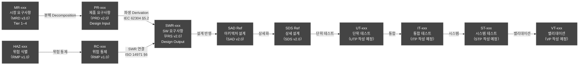
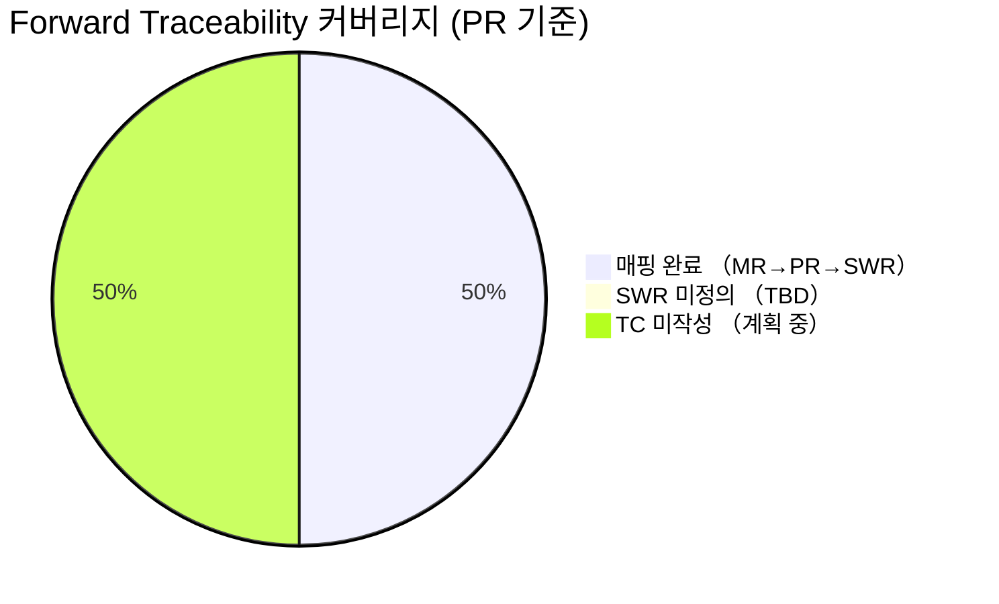
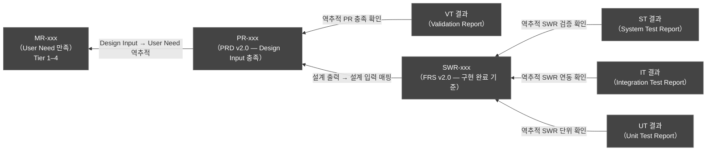
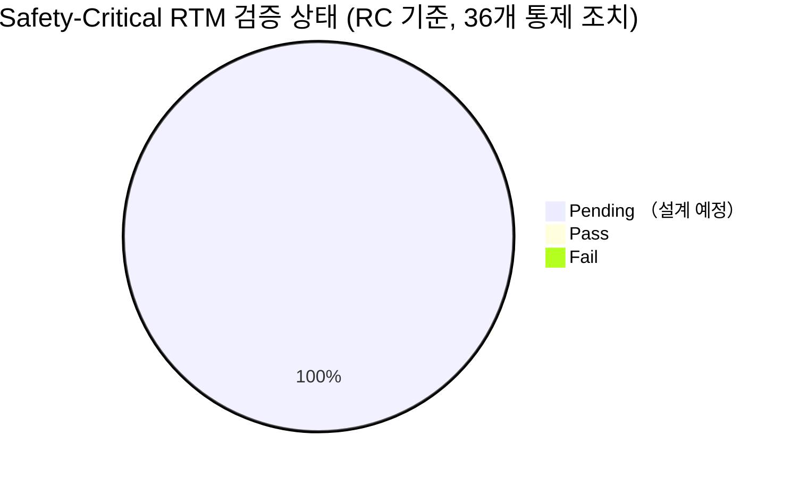
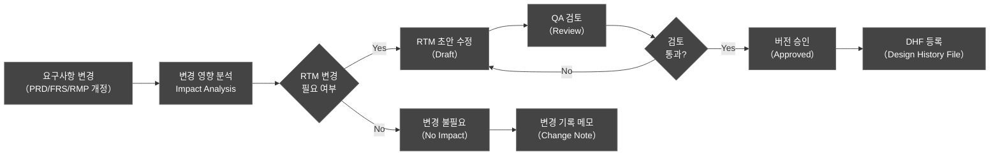

# HnVue Console SW
# Requirements Traceability Matrix (RTM)
# 요구사항 추적성 매트릭스

---

| 항목 | 내용 |
|------|------|
| **문서 ID** | RTM-XRAY-GUI-001 |
| **버전** | v2.4 |
| **작성일** | 2026-04-02 |
| **개정일** | 2026-04-14 |

| **작성자** | RA팀 |
| **검토자** | SW Dev Lead |
| **승인자** | PM |
| **상태** | Approved |
| **분류** | 내부 기밀 (Confidential) |
| **기준 규격** | FDA 21 CFR 820.30, IEC 62304:2006+A1:2015, ISO 14971:2019, ISO 13485:2016 |
| **상위 문서** | PRD-XRAY-GUI-001 v2.0 (PRD), FRS-XRAY-GUI-001 v2.0 (FRS), RMP-XRAY-GUI-001 v1.0 (RMP) |

---

## 개정 이력 (Revision History)

| 버전 | 날짜 | 작성자 | 변경 내용 |
|------|------|--------|-----------|
| v1.0 | 2026-03-18 | 전략마케팅본부 | 초안 작성 — PRD v2.0, FRS v2.0, RMP v1.0 기반 전체 RTM 수립 |
| v2.0 | 2026-04-02 | 전략마케팅본부 | MRD v3.0 4-Tier 체계 반영 (P0/P1/P2 → Tier 1/2/3/4 전면 교체), MR Tier 컬럼 추가, MR-072 (CD/DVD Burning) 행 추가 (PR-WF-019 연결), 보완 3건 반영 (MR-037 인시던트 대응 PR-CS-077, MR-039 업데이트 메커니즘 PR-CS-076/PR-SA-067, MR-050 STRIDE 위협 모델링 PR-NF-RG-060), 참조 문서 버전 업데이트 (MRD v3.0, PRD v2.0, FRS v2.0) |
| v2.1 | 2026-04-11 | RA팀 | S04 R1: SWR-CS-080 PHI AES-256-GCM 암호화 TC 매핑 추가 (부록 B). TC-SEC-PHI-001~010 테스트 케이스 정의. Team A SPEC-INFRA-002 완료 전 PARTIAL 상태. |
| v2.2 | 2026-04-14 | RA팀 | S07 R1: Detector SDK 통합 TC 매핑 추가 (부록 C). SWR-DET-010 (Detector 설정/어댑터), SWR-DT-060 (HME Detector 어댑터), SWR-DT-061 (HME Detector 설정) xUnit Trait 기반 TC 정의. SBOM v3.0/SOUP v2.1 동기화. |
| v2.3 | 2026-04-14 | RA팀 | S07 R5: CDBurning 및 DICOM TC 매핑 추가 (부록 D). SWR-CD-010/020/030 (CDBurning 서비스/IMAPI/Repository), SWR-DICOM-010/020 (DICOM FileIO/Service) xUnit Trait 기반 TC 정의. |
| v2.4 | 2026-04-14 | RA팀 | S08 R1: StudylistView UI 동기화 확인. IStudylistViewModel 인터페이스 추가 (Coordinator)에 따른 UI 계층 변경사항 반영. SRS/FRS 문서 동기화 확인 (별도 SWR 추가 불필요 - UI 설계 구현사항). |

---

## 승인란

| 역할 | 성명 | 서명 | 일자 |
|------|------|------|------|
| 작성자 (RA팀) | RA팀 | [서명됨] | 2026-04-14 |
| 검토자 (SW Dev Lead) | SW Dev Lead | [서명됨] | 2026-04-14 |
| 승인자 (PM) | PM | [서명됨] | 2026-04-14 |

---

## 목차

1. [목적 및 범위](#1-목적-및-범위)
2. [RTM 구조 정의](#2-rtm-구조-정의)
3. [추적성 체인 개요](#3-추적성-체인-개요)
4. [전체 RTM 매트릭스](#4-전체-rtm-매트릭스)
   - [4.1 환자 관리 (PM)](#41-환자-관리-patient-management)
   - [4.2 촬영 워크플로우 (WF)](#42-촬영-워크플로우-acquisition-workflow)
   - [4.3 영상 표시/처리 (IP)](#43-영상-표시처리-image-display--processing)
   - [4.4 선량 관리 (DM)](#44-선량-관리-dose-management)
   - [4.5 DICOM/통신 (DC)](#45-dicom통신-dicomcommunication)
   - [4.6 시스템 관리 (SA)](#46-시스템-관리-system-administration)
   - [4.7 사이버보안 (CS)](#47-사이버보안-cybersecurity)
   - [4.8 비기능 요구사항 (NF)](#48-비기능-요구사항-non-functional)
5. [RTM 커버리지 분석](#5-rtm-커버리지-분석)
6. [Safety-Critical RTM](#6-safety-critical-rtm)
7. [RTM 유지관리 계획](#7-rtm-유지관리-계획)

---

## 1. 목적 및 범위

### 1.1 목적 (Purpose)

본 문서는 FDA 21 CFR 820.30 Design Controls 요건에 따라 HnVue Console SW의 **양방향 추적성 매트릭스 (Bidirectional Requirements Traceability Matrix)** 를 정의한다.

**양방향 추적성 증명:**

- **Forward Traceability (순방향 추적성)**: 시장 요구사항 (MR) → 제품 요구사항 (PR) → 소프트웨어 요구사항 (SWR) → 설계 (SAD/SDS) → 테스트 케이스 (TC) → 검증/밸리데이션 (V&V)
- **Backward Traceability (역방향 추적성)**: V&V 결과 → TC → SWR → PR → MR로의 역추적을 통해 모든 테스트 결과가 요구사항에 기인함을 증명

**규제 준수 근거:**

| 규제/표준 | 조항 | RTM 연관성 |
|-----------|------|-----------|
| FDA 21 CFR 820.30(c) | Design Input | PR-xxx가 Design Input으로 문서화됨 |
| FDA 21 CFR 820.30(d) | Design Output | SWR-xxx, SAD, SDS가 Design Output으로 문서화됨 |
| FDA 21 CFR 820.30(f) | Design Verification | SWR → TC 매핑으로 Verification 근거 확립 |
| FDA 21 CFR 820.30(g) | Design Validation | PR → VT 매핑으로 Validation 근거 확립 |
| IEC 62304 §5.2 | SW Requirements Analysis | SWR-xxx가 각 PR에서 분해됨 |
| IEC 62304 §5.7 | SW Integration & Testing | IT ID를 통해 통합 테스트 추적 |
| ISO 14971 §6 | Risk Control Measures | HAZ/RC → SWR 연결로 안전 통제 추적 |

### 1.2 범위 (Scope)

본 RTM은 다음을 포함한다:

- **기능 요구사항 도메인**: PM (환자 관리), WF (촬영 워크플로우), IP (영상 표시/처리), DM (선량 관리), DC (DICOM/통신), SA (시스템 관리), CS (사이버보안)
- **비기능 요구사항 도메인**: PF (성능), RL (신뢰성), UX (사용성), CP (호환성), SC (보안), MT (유지보수성), RG (규제 준수)
- **Phase 1 핵심 요구사항 우선 포함** (Phase 2 AI 기능 제외)

### 1.3 참조 문서 (Reference Documents)

| 문서 ID | 문서명 | 버전 |
|---------|--------|------|
| MRD-XRAY-GUI-001 | Market Requirements Document | v3.0 |
| PRD-XRAY-GUI-001 | Product Requirements Document | v2.0 |
| FRS-XRAY-GUI-001 | Functional Requirements Specification | v2.0 |
| RMP-XRAY-GUI-001 | Risk Management Plan & FMEA | v1.0 |
| SAD-XRAY-GUI-001 | Software Architecture Document | v2.0 |
| SDS-XRAY-GUI-001 | Software Detailed Design Spec | v2.0 |
| UTP-XRAY-GUI-001 | Unit Test Plan | 작성 예정 |
| ITP-XRAY-GUI-001 | Integration Test Plan | 작성 예정 |
| STP-XRAY-GUI-001 | System Test Plan | 작성 예정 |
| VP-XRAY-GUI-001 | Validation Plan | 작성 예정 |

---

## 2. RTM 구조 정의

### 2.1 컬럼 정의 (Column Definitions)

| 컬럼 | 설명 | 출처 문서 | 비고 |
|------|------|----------|------|
| **MR ID** | 시장 요구사항 ID (Market Requirement) | MRD-XRAY-GUI-001 v3.0 | 역추적 기준점 |
| **MR Tier** | MR 우선순위 Tier (1/2/3/4) | MRD-XRAY-GUI-001 v3.0 | v2.0 신규 추가; Tier 1=인허가 필수, Tier 2=판매 필수, Tier 3=차별화, Tier 4=보류 |
| **PR ID** | 제품 요구사항 ID (Product Requirement) | PRD-XRAY-GUI-001 v2.0 | FDA Design Input |
| **PR 요구사항명** | PR의 기능/요구사항 명칭 | PRD v2.0 | — |
| **Tier** | 우선순위 Tier (MRD v3.0 기준) | PRD v2.0 | Tier 1=Phase 1 필수(인허가), Tier 2=Phase 1 필수(판매), Tier 3=Phase 2+, Tier 4=Phase 3+ 또는 보류 |
| **Phase** | 구현 목표 Phase | PRD v2.0 | 1/1.5/2 |
| **SWR ID** | 소프트웨어 요구사항 ID (Software Requirement) | FRS-XRAY-GUI-001 v2.0 | IEC 62304 §5.2 Design Output |
| **HAZ ID** | 관련 위험 ID (Hazard) | RMP-XRAY-GUI-001 v1.0 | ISO 14971 위험 식별 |
| **RC ID** | 위험 통제 조치 ID (Risk Control) | RMP-XRAY-GUI-001 v1.0 | ISO 14971 §6 |
| **SAD Ref** | 소프트웨어 아키텍처 설계 참조 | SAD-XRAY-GUI-001 v2.0 | — |
| **SDS Ref** | 소프트웨어 상세 설계 참조 | SDS-XRAY-GUI-001 v2.0 | — |
| **UT ID** | 단위 테스트 케이스 ID | Unit Test Plan (작성 예정) | IEC 62304 §5.5 |
| **IT ID** | 통합 테스트 케이스 ID | Integration Test Plan (작성 예정) | IEC 62304 §5.6 |
| **ST ID** | 시스템 테스트 케이스 ID | System Test Plan (작성 예정) | FDA 21 CFR 820.30(f) |
| **VT ID** | 밸리데이션 테스트 케이스 ID | Validation Plan (작성 예정) | FDA 21 CFR 820.30(g) |
| **QA TC ID** | QA 테스트 케이스 ID | QA Plan (작성 예정) | ISO 13485 |
| **검증 수준** | T=Test / I=Inspection / A=Analysis / D=Demonstration | PRD v2.0 | — |
| **검증 상태** | Pass / Fail / Pending | V&V Report | 현재 전체 Pending |

### 2.2 Tier 분류 체계 (v2.0 신규 — MRD v3.0 기준)

> **v2.0 변경**: v1.0의 P0/P1/P2 우선순위 체계는 MRD v3.0의 4-Tier 체계로 전면 교체됩니다.

| Tier | 의미 | 기준 | Phase 배정 |
|------|------|------|-----------|
| **Tier 1** | 없으면 인허가 불가 | MFDS 2등급/FDA 510(k)/IEC 62304 필수 | Phase 1 필수 |
| **Tier 2** | 없으면 팔 수 없다 | feel-DRCS 기본 기능 동등 + 고객 최소 기대 | Phase 1 필수 |
| **Tier 3** | 있으면 좋고 | EConsole1 FDA K231225에 미포함, 경쟁 차별화 | Phase 2+ |
| **Tier 4** | 비현실적/과도 | 2명 조직 비현실적, 비즈니스 모델 불일치 | Phase 3+ 또는 영구 보류 |

### 2.3 HAZ ID 분류 체계

| HAZ 분류 | 위험 범주 | 설명 |
|----------|----------|------|
| HAZ-RAD-xxx | 방사선 피폭 위험 | 환자/방사선사 방사선 과피폭, 불필요 피폭 |
| HAZ-SW-xxx | 소프트웨어 오류 | 환자 혼동, 영상 오류, SW 충돌 |
| HAZ-DATA-xxx | 데이터 무결성 | DICOM 손상, 개인정보 유출, DB 오류 |
| HAZ-SEC-xxx | 사이버보안 | 무단 접근, 랜섬웨어, 세션 탈취 |
| HAZ-UI-xxx | 사용성 오류 | 프로토콜 오선택, 경보 오인식 |
| HAZ-NET-xxx | 네트워크 통신 | Generator 통신 단절, MWL 동기화 실패 |

---

## 3. 추적성 체인 개요

### 3.1 전체 추적성 체인 (End-to-End Traceability Chain)



### 3.2 Forward/Backward 추적성 시각화

```mermaid
flowchart TB
    subgraph FWD["▶ Forward Traceability （순방향 추적성）"]
        direction LR
        F1["MR-001\n환자 관리\n（Tier 2）"] --> F2["PR-PM-001\n환자 수동 등록"]
        F2 --> F3["SWR-PM-001–004\nUI/유효성검사/중복/저장"]
        F3 --> F4["UT-PM-001–004\n단위 테스트"]
        F4 --> F5["IT-PM-001–004\n통합 테스트"]
        F5 --> F6["ST-PM-xxx\n시스템 테스트"]
        F6 --> F7["VT-PM-xxx\n밸리데이션"]
    end

    subgraph BWD["◀ Backward Traceability （역방향 추적성）"]
        direction RL
        B7["VT 결과 Pass"] --> B6["ST 테스트 통과"]
        B6 --> B5["IT 통과"]
        B5 --> B4["UT 통과"]
        B4 --> B3["SWR-PM-001 구현 완료"]
        B3 --> B2["PR-PM-001 충족 증명"]
        B2 --> B1["MR-001 만족 확인"]
    end

    subgraph RISK["⚠ Risk Traceability （위험 추적성）"]
        direction LR
        R1["HAZ-DATA\n환자 데이터 혼동"] --> R2["RC-008\n환자 ID 이중 확인"]
        R2 --> R3["SWR-PM-010\n환자 데이터 로드"]
        R3 --> R4["TC-PM-001\n안전 테스트"]
    end

    classDef default fill:#444,stroke:#666,color:#fff
```



### 3.3 ID 체계 참조 (ID Schema Reference)

| 계층 | ID 접두사 | 예시 | 문서 |
|------|----------|------|------|
| 시장 요구사항 | MR-xxx | MR-001 | MRD v3.0 |
| 제품 요구사항 | PR-[도메인]-xxx | PR-PM-001, PR-WF-010 | PRD v2.0 |
| 비기능 제품 요구사항 | PR-NF-[분류]-xxx | PR-NF-PF-001 | PRD v2.0 |
| SW 요구사항 | SWR-[도메인]-xxx | SWR-PM-001, SWR-WF-010 | FRS v2.0 |
| 위험 | HAZ-[분류]-xxx | HAZ-RAD-001, HAZ-SW-001 | RMP v1.0 |
| 위험 통제 | RC-xxx | RC-001, RC-022 | RMP v1.0 |
| 단위 테스트 | UT-[도메인]-xxx | UT-PM-001 | UTP (TBD) |
| 통합 테스트 | IT-[도메인]-xxx | IT-PM-001 | ITP (TBD) |
| 시스템 테스트 | ST-[도메인]-xxx | ST-PM-001 | STP (TBD) |
| 밸리데이션 테스트 | VT-[도메인]-xxx | VT-PM-001 | VP (TBD) |

---

## 4. 전체 RTM 매트릭스

> **범례**:
> - SAD Ref, SDS Ref 컬럼: 참조 매핑 완료 (SAD v2.0, SDS v2.0). UT ID, IT ID, ST ID, VT ID, QA TC ID 컬럼의 **TBD**: 해당 테스트 계획 작성 시 기입 예정
> - **검증 상태**: 현재 단계에서는 전체 **Pending** (개발/테스트 미착수)
> - **Tier**: MRD v3.0 4-Tier 분류 체계 적용 (Tier 1=인허가 필수, Tier 2=판매 필수, Tier 3=차별화, Tier 4=보류)

### 4.1 환자 관리 (Patient Management)

| # | MR ID | MR Tier | PR ID | PR 요구사항명 | Tier | Phase | SWR ID | HAZ ID | RC ID | SAD Ref | SDS Ref | UT ID | IT ID | ST ID | VT ID | QA TC ID | 검증 수준 | 검증 상태 |
|---|-------|---------|-------|------------|------|-------|--------|--------|-------|---------|---------|-------|-------|-------|-------|----------|---------|---------|
| 1 | MR-001 | Tier 2 | PR-PM-001 | 환자 수동 등록 | Tier 2 | 1 | SWR-PM-001, SWR-PM-002, SWR-PM-003, SWR-PM-004 | HAZ-DATA-002, HAZ-DATA-004 | RC-022 | SAD-PM-100 | SDS §3.1 | UT-PM-001–004 | IT-PM-001–004 | ST-PM-001 | VT-PM-001 | QA-PM-001 | T, I | Pending |
| 2 | MR-001 | Tier 2 | PR-PM-002 | 환자 정보 조회·수정 | Tier 2 | 1 | SWR-PM-010, SWR-PM-011, SWR-PM-012, SWR-PM-013 | HAZ-DATA-002, HAZ-SEC-001 | RC-020, RC-023 | SAD-PM-100 | SDS §3.1 | UT-PM-010–013 | IT-PM-010–013 | ST-PM-002 | VT-PM-002 | QA-PM-002 | T, I | Pending |
| 3 | MR-001 | Tier 2 | PR-PM-003 | DICOM MWL 자동 불러오기 | Tier 2 | 1 | SWR-PM-020, SWR-PM-021, SWR-PM-022, SWR-PM-023, SWR-PM-024 | HAZ-DATA-001, HAZ-NET-002 | RC-018, RC-036 | SAD-PM-100 | SDS §3.1 | UT-PM-020–024 | IT-PM-020–024 | ST-PM-003 | VT-PM-003 | QA-PM-003 | T, A | Pending |
| 4 | MR-001 | Tier 2 | PR-PM-004 | 응급 환자 빠른 등록 | Tier 2 | 1 | SWR-PM-030, SWR-PM-031, SWR-PM-032, SWR-PM-033 | HAZ-RAD-001, HAZ-DATA-002 | RC-001, RC-008 | SAD-PM-100 | SDS §3.1 | UT-PM-030–033 | IT-PM-030–033 | ST-PM-004 | VT-PM-004 | QA-PM-004 | T, D | Pending |
| 5 | MR-001 | Tier 2 | PR-PM-005 | 환자 검색 | Tier 2 | 1 | SWR-PM-040, SWR-PM-041, SWR-PM-042, SWR-PM-043 | — | — | SAD-PM-100 | SDS §3.1 | UT-PM-040–043 | IT-PM-041 | ST-PM-005 | VT-PM-005 | QA-PM-005 | T, A | Pending |
| 6 | MR-001 | Tier 2 | PR-PM-006 | 환자 삭제 (GDPR/개인정보) | Tier 2 | 1 | SWR-PM-050, SWR-PM-051, SWR-PM-052, SWR-PM-053 | HAZ-DATA-002, HAZ-SEC-001 | RC-019, RC-020 | SAD-PM-100 | SDS §3.1 | UT-PM-050–053 | IT-PM-052 | ST-PM-006 | — | QA-PM-006 | T, I | Pending |

### 4.2 촬영 워크플로우 (Acquisition Workflow)

| # | MR ID | MR Tier | PR ID | PR 요구사항명 | Tier | Phase | SWR ID | HAZ ID | RC ID | SAD Ref | SDS Ref | UT ID | IT ID | ST ID | VT ID | QA TC ID | 검증 수준 | 검증 상태 |
|---|-------|---------|-------|------------|------|-------|--------|--------|-------|---------|---------|-------|-------|-------|-------|----------|---------|---------|
| 7 | MR-002 | Tier 2 | PR-WF-010 | APR 프로토콜 관리 | Tier 2 | 1 | SWR-WF-010, SWR-WF-011, SWR-WF-012 | HAZ-RAD-001, HAZ-RAD-003 | RC-001, RC-006 | SAD-WF-200 | SDS §3.2 | UT-WF-010–012 | IT-WF-010–012 | ST-WF-001 | VT-WF-001 | QA-WF-001 | T, D | Pending |
| 8 | MR-002 | Tier 2 | PR-WF-011 | 촬영 순서 설정·변경 | Tier 2 | 1 | SWR-WF-013, SWR-WF-014 | HAZ-DATA-001 | RC-018 | SAD-WF-200 | SDS §3.2 | UT-WF-013–014 | IT-WF-014 | ST-WF-002 | VT-WF-002 | QA-WF-002 | T, I | Pending |
| 9 | MR-002 | Tier 2 | PR-WF-012 | 촬영 조건 설정 | Tier 2 | 1 | SWR-WF-015, SWR-WF-016, SWR-WF-017 | HAZ-RAD-001, HAZ-RAD-004 | RC-001, RC-002, RC-003, RC-007 | SAD-WF-200 | SDS §3.2 | UT-WF-015–017 | IT-WF-016–017 | ST-WF-003 | VT-WF-003 | QA-WF-003 | T, A | Pending |
| 10 | MR-002 | Tier 2 | PR-WF-013 | Generator 통신 및 제어 | Tier 2 | 1 | SWR-WF-018, SWR-WF-019, SWR-WF-020 | HAZ-RAD-001, HAZ-RAD-002, HAZ-SW-004, HAZ-NET-001 | RC-001, RC-004, RC-015, RC-035 | SAD-WF-200 | SDS §3.2 | UT-WF-018–020 | IT-WF-019 | ST-WF-004 | VT-WF-004 | QA-WF-004 | T, A | Pending |
| 11 | MR-002 | Tier 2 | PR-WF-014 | Detector 상태 모니터링 | Tier 2 | 1 | SWR-WF-021, SWR-WF-022 | HAZ-RAD-001, HAZ-SW-004 | RC-004, RC-015, RC-016 | SAD-WF-200 | SDS §3.2 | UT-WF-021–022 | IT-WF-021 | ST-WF-005 | VT-WF-005 | QA-WF-005 | T, D | Pending |
| 12 | MR-002 | Tier 2 | PR-WF-015 | 촬영 실행 및 영상 수신 | Tier 2 | 1 | SWR-WF-023, SWR-WF-024, SWR-WF-025 | HAZ-RAD-001, HAZ-RAD-002, HAZ-SW-004 | RC-002, RC-004, RC-005, RC-015 | SAD-WF-200 | SDS §3.2 | UT-WF-023–025 | IT-WF-023–024 | ST-WF-006 | VT-WF-006 | QA-WF-006 | T, A | Pending |
| 13 | MR-002 | Tier 2 | PR-WF-016 | Emergency/Trauma 워크플로우 | Tier 2 | 1 | SWR-WF-026, SWR-WF-027 | HAZ-RAD-001, HAZ-UI-003 | RC-002, RC-033, RC-034 | SAD-WF-200 | SDS §3.2 | UT-WF-026–027 | IT-WF-027 | ST-WF-007 | VT-WF-007 | QA-WF-007 | T, D | Pending |
| 14 | MR-002 | Tier 2 | PR-WF-017 | Multi-study 지원 | Tier 2 | 1 | SWR-WF-028, SWR-WF-029 | HAZ-DATA-001, HAZ-DATA-004 | RC-018, RC-022 | SAD-WF-200 | SDS §3.2 | UT-WF-028–029 | IT-WF-028–029 | ST-WF-008 | — | QA-WF-008 | T, I | Pending |
| 15 | MR-002 | Tier 2 | PR-WF-018 | Suspend/Resume Exam | Tier 2 | 1 | SWR-WF-030, SWR-WF-031 | HAZ-DATA-001, HAZ-SW-004 | RC-015, RC-016, RC-018 | SAD-WF-200 | SDS §3.2 | UT-WF-030–031 | IT-WF-030–031 | ST-WF-009 | — | QA-WF-009 | T, D | Pending |
| 16 | MR-072 | Tier 2 | PR-WF-019 | CD/DVD Burning with DICOM Viewer | Tier 2 | 1 | SWR-WF-032, SWR-WF-033, SWR-WF-034 | HAZ-DATA-001 | RC-018 | SAD-CD-1000 | SDS §3.10 | UT-WF-032–034 | IT-WF-032 | ST-WF-010 | VT-WF-010 | QA-WF-010 | T, D | Pending |

> **[v2.0 신규 — MR-072]** PR-WF-019 CD/DVD Burning with DICOM Viewer: MRD v3.0 MR-072 (Tier 2) 신규 추가. DICOMDIR 구조 + 내장 DICOM 뷰어 + ISO 이미지 생성. SWR-WF-032–034 (FRS v2.0 §5.2 신규 정의). TC ID는 테스트 계획 수립 시 확정.

### 4.3 영상 표시/처리 (Image Display & Processing)

| # | MR ID | MR Tier | PR ID | PR 요구사항명 | Tier | Phase | SWR ID | HAZ ID | RC ID | SAD Ref | SDS Ref | UT ID | IT ID | ST ID | VT ID | QA TC ID | 검증 수준 | 검증 상태 |
|---|-------|---------|-------|------------|------|-------|--------|--------|-------|---------|---------|-------|-------|-------|-------|----------|---------|---------|
| 17 | MR-003 | Tier 2 | PR-IP-020 | 실시간 영상 표시 | Tier 2 | 1 | SWR-IP-020, SWR-IP-021 | HAZ-RAD-001, HAZ-SW-002 | RC-011, RC-012 | SAD-IP-300 | SDS §3.3 | UT-IP-020–021 | IT-IP-020 | ST-IP-001 | VT-IP-001 | QA-IP-001 | T, A | Pending |
| 18 | MR-003 | Tier 2 | PR-IP-021 | Window/Level 조정 | Tier 2 | 1 | SWR-IP-022, SWR-IP-023 | — | — | SAD-IP-300 | SDS §3.3 | UT-IP-022–023 | — | ST-IP-002 | VT-IP-002 | QA-IP-002 | T, D | Pending |
| 19 | MR-003 | Tier 2 | PR-IP-022 | Zoom | Tier 2 | 1 | SWR-IP-024, SWR-IP-025 | — | — | SAD-IP-300 | SDS §3.3 | UT-IP-024–025 | — | ST-IP-003 | VT-IP-003 | QA-IP-003 | T, D | Pending |
| 20 | MR-003 | Tier 2 | PR-IP-023 | Pan | Tier 2 | 1 | SWR-IP-026 | — | — | SAD-IP-300 | SDS §3.3 | UT-IP-026 | — | ST-IP-004 | VT-IP-004 | QA-IP-004 | T, D | Pending |
| 21 | MR-003 | Tier 2 | PR-IP-024 | Rotation | Tier 2 | 1 | SWR-IP-027, SWR-IP-028 | — | — | SAD-IP-300 | SDS §3.3 | UT-IP-027–028 | — | ST-IP-005 | VT-IP-005 | QA-IP-005 | T, D | Pending |
| 22 | MR-003 | Tier 2 | PR-IP-025 | Image Stitching | Tier 3 | 1.5 | SWR-IP-029, SWR-IP-030, SWR-IP-031 | — | — | SAD-IP-300 | SDS §3.3 | UT-IP-029–031 | IT-IP-029 | ST-IP-006 | — | QA-IP-006 | T, A | Pending |
| 23 | MR-003 | Tier 2 | PR-IP-026 | 거리 측정 | Tier 2 | 1 | SWR-IP-032, SWR-IP-033 | HAZ-SW-002 | RC-011 | SAD-IP-300 | SDS §3.3 | UT-IP-032–033 | IT-IP-033 | ST-IP-007 | VT-IP-007 | QA-IP-007 | T, A | Pending |
| 24 | MR-003 | Tier 2 | PR-IP-027 | 각도 측정 | Tier 2 | 1 | SWR-IP-034 | — | — | SAD-IP-300 | SDS §3.3 | UT-IP-034 | — | ST-IP-008 | — | QA-IP-008 | T, A | Pending |
| 25 | MR-003 | Tier 2 | PR-IP-028 | 면적 측정 | Tier 2 | 1 | SWR-IP-035, SWR-IP-036 | — | — | SAD-IP-300 | SDS §3.3 | UT-IP-035–036 | — | ST-IP-009 | — | QA-IP-009 | T, A | Pending |
| 26 | MR-003 | Tier 2 | PR-IP-029 | Annotation | Tier 2 | 1 | SWR-IP-037, SWR-IP-038 | HAZ-DATA-001 | RC-018 | SAD-IP-300 | SDS §3.3 | UT-IP-037–038 | IT-IP-033 | ST-IP-010 | — | QA-IP-010 | T, I | Pending |
| 27 | MR-003 | Tier 2 | PR-IP-030 | Gain/Offset 보정 | Tier 2 | 1 | SWR-IP-039, SWR-IP-040 | HAZ-RAD-001, HAZ-SW-002 | RC-006, RC-011 | SAD-IP-300 | SDS §3.3 | UT-IP-039–040 | IT-IP-020 | ST-IP-011 | VT-IP-011 | QA-IP-011 | T, A | Pending |
| 28 | MR-003 | Tier 2 | PR-IP-031 | 노이즈 감소 (Noise Reduction) | Tier 2 | 1 | SWR-IP-041, SWR-IP-042 | HAZ-RAD-001 | RC-007 | SAD-IP-300 | SDS §3.3 | UT-IP-041–042 | — | ST-IP-012 | VT-IP-012 | QA-IP-012 | T, A | Pending |
| 29 | MR-003 | Tier 2 | PR-IP-032 | Edge Enhancement | Tier 2 | 1 | SWR-IP-043, SWR-IP-044 | — | — | SAD-IP-300 | SDS §3.3 | UT-IP-043–044 | — | ST-IP-013 | VT-IP-013 | QA-IP-013 | T, D | Pending |
| 30 | MR-003 | Tier 3 | PR-IP-033 | Scatter Correction | Tier 3 | 1.5 | SWR-IP-045, SWR-IP-046 | HAZ-RAD-001 | RC-007 | SAD-IP-300 | SDS §3.3 | UT-IP-045–046 | — | ST-IP-014 | — | QA-IP-014 | T, A | Pending |
| 31 | MR-003 | Tier 2 | PR-IP-034 | Auto-trimming/Cropping | Tier 2 | 1 | SWR-IP-047, SWR-IP-048 | — | — | SAD-IP-300 | SDS §3.3 | UT-IP-047–048 | — | ST-IP-015 | VT-IP-015 | QA-IP-015 | T, A | Pending |
| 32 | MR-003 | Tier 2 | PR-IP-035 | Black Mask (Automatic Shutters) | Tier 2 | 1 | SWR-IP-049 | — | — | SAD-IP-300 | SDS §3.3 | UT-IP-049 | — | ST-IP-016 | — | QA-IP-016 | T, D | Pending |
| 33 | MR-003 | Tier 2 | PR-IP-036 | Contrast Optimization | Tier 2 | 1 | SWR-IP-050, SWR-IP-051 | — | — | SAD-IP-300 | SDS §3.3 | UT-IP-050–051 | — | ST-IP-017 | VT-IP-017 | QA-IP-017 | T, D | Pending |
| 34 | MR-003 | Tier 2 | PR-IP-037 | Brightness Control | Tier 2 | 1 | SWR-IP-052 | — | — | SAD-IP-300 | SDS §3.3 | UT-IP-052 | — | ST-IP-018 | — | QA-IP-018 | T, D | Pending |

### 4.4 선량 관리 (Dose Management)

| # | MR ID | MR Tier | PR ID | PR 요구사항명 | Tier | Phase | SWR ID | HAZ ID | RC ID | SAD Ref | SDS Ref | UT ID | IT ID | ST ID | VT ID | QA TC ID | 검증 수준 | 검증 상태 |
|---|-------|---------|-------|------------|------|-------|--------|--------|-------|---------|---------|-------|-------|-------|-------|----------|---------|---------|
| 35 | MR-004 | Tier 2 | PR-DM-040 | DAP 표시·기록 | Tier 2 | 1 | SWR-DM-040, SWR-DM-041 | HAZ-RAD-001, HAZ-SW-003 | RC-013, RC-014 | SAD-DM-400 | SDS §3.4 | UT-DM-040–041 | IT-DM-040 | ST-DM-001 | VT-DM-001 | QA-DM-001 | T, A | Pending |
| 36 | MR-004 | Tier 2 | PR-DM-041 | ESD 계산 | Tier 2 | 1 | SWR-DM-042, SWR-DM-043 | HAZ-RAD-001, HAZ-SW-003 | RC-013 | SAD-DM-400 | SDS §3.4 | UT-DM-042–043 | — | ST-DM-002 | VT-DM-002 | QA-DM-002 | T, A | Pending |
| 37 | MR-004 | Tier 2 | PR-DM-042 | RDSR 생성 | Tier 2 | 1 | SWR-DM-044, SWR-DM-045, SWR-DM-046 | HAZ-RAD-001, HAZ-DATA-001 | RC-013, RC-018 | SAD-DM-400 | SDS §3.4 | UT-DM-044–046 | IT-DM-044 | ST-DM-003 | VT-DM-003 | QA-DM-003 | T, I | Pending |
| 38 | MR-004 | Tier 2 | PR-DM-043 | Exposure Index 모니터링 | Tier 2 | 1 | SWR-DM-047, SWR-DM-048 | HAZ-RAD-001, HAZ-RAD-004 | RC-007 | SAD-DM-400 | SDS §3.4 | UT-DM-047–048 | — | ST-DM-004 | VT-DM-004 | QA-DM-004 | T, A | Pending |
| 39 | MR-004 | Tier 2 | PR-DM-044 | DRL 비교 | Tier 2 | 1 | SWR-DM-049, SWR-DM-050 | HAZ-RAD-001, HAZ-RAD-004 | RC-007 | SAD-DM-400 | SDS §3.4 | UT-DM-049–050 | — | ST-DM-005 | VT-DM-005 | QA-DM-005 | T, A | Pending |
| 40 | MR-004 | Tier 2 | PR-DM-045 | 전자 X-ray 로그북 | Tier 2 | 1 | SWR-DM-051, SWR-DM-052 | HAZ-RAD-001, HAZ-DATA-002 | RC-019, RC-020 | SAD-DM-400 | SDS §3.4 | UT-DM-051–052 | IT-DM-051 | ST-DM-006 | VT-DM-006 | QA-DM-006 | T, I | Pending |
| 41 | MR-004 | Tier 3 | PR-DM-046 | Reject Analysis | Tier 3 | 1.5 | SWR-DM-053, SWR-DM-054, SWR-DM-055 | HAZ-RAD-001 | RC-007 | SAD-DM-400 | SDS §3.4 | UT-DM-053–055 | — | ST-DM-007 | — | QA-DM-007 | T, A | Pending |

### 4.5 DICOM/통신 (DICOM/Communication)

| # | MR ID | MR Tier | PR ID | PR 요구사항명 | Tier | Phase | SWR ID | HAZ ID | RC ID | SAD Ref | SDS Ref | UT ID | IT ID | ST ID | VT ID | QA TC ID | 검증 수준 | 검증 상태 |
|---|-------|---------|-------|------------|------|-------|--------|--------|-------|---------|---------|-------|-------|-------|-------|----------|---------|---------|
| 42 | MR-005 | Tier 1 | PR-DC-050 | Storage SCU (C-STORE) | Tier 1 | 1 | SWR-DC-050, SWR-DC-051, SWR-DC-052 | HAZ-DATA-001, HAZ-DATA-003 | RC-018, RC-021 | SAD-DC-500 | SDS §3.5 | UT-DC-050–052 | IT-DC-050 | ST-DC-001 | VT-DC-001 | QA-DC-001 | T, A | Pending |
| 43 | MR-005 | Tier 1 | PR-DC-051 | MWL SCU | Tier 1 | 1 | SWR-DC-053, SWR-DC-054 | HAZ-DATA-001, HAZ-NET-002 | RC-018, RC-036 | SAD-DC-500 | SDS §3.5 | UT-DC-053–054 | IT-DC-053 | ST-DC-002 | VT-DC-002 | QA-DC-002 | T, A | Pending |
| 44 | MR-005 | Tier 1 | PR-DC-052 | MPPS SCU | Tier 1 | 1 | SWR-DC-055, SWR-DC-056 | HAZ-DATA-001 | RC-018 | SAD-DC-500 | SDS §3.5 | UT-DC-055–056 | IT-DC-055 | ST-DC-003 | VT-DC-003 | QA-DC-003 | T, A | Pending |
| 45 | MR-005 | Tier 1 | PR-DC-053 | Storage Commitment SCU | Tier 1 | 1 | SWR-DC-057, SWR-DC-058 | HAZ-DATA-001, HAZ-DATA-003 | RC-018, RC-021 | SAD-DC-500 | SDS §3.5 | UT-DC-057–058 | IT-DC-057 | ST-DC-004 | VT-DC-004 | QA-DC-004 | T, I | Pending |
| 46 | MR-005 | Tier 2 | PR-DC-054 | Print SCU | Tier 2 | 1 | SWR-DC-059, SWR-DC-060 | — | — | SAD-DC-500 | SDS §3.5 | UT-DC-059–060 | IT-DC-059 | ST-DC-005 | — | QA-DC-005 | T, D | Pending |
| 47 | MR-005 | Tier 2 | PR-DC-055 | Query/Retrieve SCU | Tier 2 | 1 | SWR-DC-061, SWR-DC-062 | — | — | SAD-DC-500 | SDS §3.5 | UT-DC-061–062 | IT-DC-061 | ST-DC-006 | — | QA-DC-006 | T, D | Pending |
| 48 | MR-005 | Tier 1 | PR-DC-056 | DICOM TLS | Tier 1 | 1 | SWR-DC-063, SWR-DC-064 | HAZ-SEC-001, HAZ-DATA-002 | RC-019, RC-023 | SAD-DC-500 | SDS §3.5 | UT-DC-063–064 | IT-DC-063 | ST-DC-007 | VT-DC-007 | QA-DC-007 | T, I | Pending |

### 4.6 시스템 관리 (System Administration)

| # | MR ID | MR Tier | PR ID | PR 요구사항명 | Tier | Phase | SWR ID | HAZ ID | RC ID | SAD Ref | SDS Ref | UT ID | IT ID | ST ID | VT ID | QA TC ID | 검증 수준 | 검증 상태 |
|---|-------|---------|-------|------------|------|-------|--------|--------|-------|---------|---------|-------|-------|-------|-------|----------|---------|---------|
| 49 | MR-033 | Tier 1 | PR-SA-060 | 사용자 관리 (RBAC) | Tier 1 | 1 | SWR-SA-060, SWR-SA-061, SWR-SA-062 | HAZ-SEC-001, HAZ-DATA-002 | RC-020, RC-023, RC-024 | SAD-SA-600 | SDS §3.7 | UT-SA-060–062 | IT-SA-060 | ST-SA-001 | VT-SA-001 | QA-SA-001 | T, I | Pending |
| 50 | MR-006 | Tier 2 | PR-SA-061 | Organ Program/Exam Set 편집기 | Tier 2 | 1 | SWR-SA-063, SWR-SA-064 | HAZ-RAD-001, HAZ-RAD-003 | RC-001, RC-006 | SAD-SA-600 | SDS §3.6 | UT-SA-063–064 | IT-SA-063 | ST-SA-002 | VT-SA-002 | QA-SA-002 | T, D | Pending |
| 51 | MR-006 | Tier 2 | PR-SA-062 | 시스템 설정 | Tier 2 | 1 | SWR-SA-065, SWR-SA-066 | HAZ-DATA-001 | RC-018 | SAD-SA-600 | SDS §3.6 | UT-SA-065–066 | IT-SA-065 | ST-SA-003 | VT-SA-003 | QA-SA-003 | T, D | Pending |
| 52 | MR-006 | Tier 2 | PR-SA-063 | 캘리브레이션 UI | Tier 2 | 1 | SWR-SA-067, SWR-SA-068, SWR-SA-069 | HAZ-RAD-001, HAZ-SW-002 | RC-006, RC-011 | SAD-SA-600 | SDS §3.6 | UT-SA-067–069 | IT-SA-067 | ST-SA-004 | VT-SA-004 | QA-SA-004 | T, A | Pending |
| 53 | MR-006 | Tier 2 | PR-SA-064 | Defect Pixel Map 관리 | Tier 2 | 1 | SWR-SA-070, SWR-SA-071 | HAZ-RAD-001, HAZ-SW-002 | RC-011 | SAD-SA-600 | SDS §3.6 | UT-SA-070–071 | — | ST-SA-005 | — | QA-SA-005 | T, A | Pending |
| 54 | MR-006 | Tier 1 | PR-SA-065 | Audit Trail | Tier 1 | 1 | SWR-SA-072, SWR-SA-073 | HAZ-SEC-001, HAZ-DATA-002 | RC-020, RC-023 | SAD-SA-600 | SDS §3.6 | UT-SA-072–073 | IT-SA-072 | ST-SA-006 | VT-SA-006 | QA-SA-006 | T, I | Pending |
| 55 | MR-006 | Tier 2 | PR-SA-066 | 로깅 시스템 | Tier 2 | 1 | SWR-SA-074, SWR-SA-075 | HAZ-SW-004 | RC-015, RC-016 | SAD-SA-600 | SDS §3.6 | UT-SA-074–075 | IT-SA-074 | ST-SA-007 | — | QA-SA-007 | T, I | Pending |
| 56 | MR-039 | Tier 1 | PR-SA-067 | SW 업데이트 관리 | Tier 1 | 1 | SWR-SA-076, SWR-SA-077 | HAZ-SEC-002, HAZ-SEC-003 | RC-025, RC-027 | SAD-UPD-1200 | SDS §3.12 | UT-SA-076–077 | IT-SA-076 | ST-SA-008 | VT-SA-008 | QA-SA-008 | T, I | Pending |

> **[v2.0 변경 — MR-039]** PR-SA-067 SW 업데이트 관리: MR-006 → MR-039 (보완 반영). MRD v3.0 MR-039 (Tier 1) 업데이트 메커니즘 요건에 따라 MR ID 및 Tier 업데이트. 서명된 업데이트 패키지 검증, 롤백 지원, 업데이트 무결성 검증 (FDA 524B(b)(2)) 포함.

### 4.7 사이버보안 (Cybersecurity)

| # | MR ID | MR Tier | PR ID | PR 요구사항명 | Tier | Phase | SWR ID | HAZ ID | RC ID | SAD Ref | SDS Ref | UT ID | IT ID | ST ID | VT ID | QA TC ID | 검증 수준 | 검증 상태 |
|---|-------|---------|-------|------------|------|-------|--------|--------|-------|---------|---------|-------|-------|-------|-------|----------|---------|---------|
| 57 | MR-007 | Tier 1 | PR-CS-070 | 로컬 사용자 인증 | Tier 1 | 1 | SWR-CS-070, SWR-CS-071, SWR-CS-072 | HAZ-SEC-001, HAZ-SEC-004 | RC-023, RC-028 | SAD-CS-700 | SDS §3.7 | UT-CS-070–072 | IT-CS-070 | ST-CS-001 | VT-CS-001 | QA-CS-001 | T, I | Pending |
| 58 | MR-007 | Tier 3 | PR-CS-071 | Domain 인증 (SSO) | Tier 3 | 1.5 | SWR-CS-073, SWR-CS-074 | HAZ-SEC-001, HAZ-SEC-004 | RC-023, RC-028 | SAD-CS-700 | SDS §3.7 | UT-CS-073–074 | IT-CS-073 | ST-CS-002 | — | QA-CS-002 | T, D | Pending |
| 59 | MR-007 | Tier 1 | PR-CS-072 | 세션 관리 | Tier 1 | 1 | SWR-CS-075, SWR-CS-076, SWR-CS-077 | HAZ-SEC-004, HAZ-RAD-001 | RC-028, RC-002 | SAD-CS-700 | SDS §3.7 | UT-CS-075–077 | IT-CS-075 | ST-CS-003 | VT-CS-003 | QA-CS-003 | T, D | Pending |
| 60 | MR-007 | Tier 1 | PR-CS-073 | DICOM TLS 암호화 | Tier 1 | 1 | SWR-CS-078, SWR-CS-079 | HAZ-SEC-001, HAZ-DATA-002 | RC-019, RC-023 | SAD-CS-700 | SDS §3.7 | UT-CS-078–079 | IT-CS-078 | ST-CS-004 | VT-CS-004 | QA-CS-004 | T, I | Pending |
| 61 | MR-007 | Tier 1 | PR-CS-074 | PHI 보호 | Tier 1 | 1 | SWR-CS-080, SWR-CS-081 | HAZ-SEC-001, HAZ-DATA-002 | RC-019, RC-020 | SAD-CS-700 | SDS §3.7 | UT-CS-080–081 | IT-CS-080 | ST-CS-005 | VT-CS-005 | QA-CS-005 | T, I | Pending |
| 62 | MR-007 | Tier 1 | PR-CS-075 | SBOM 관리 | Tier 1 | 1 | SWR-CS-082, SWR-CS-083 | HAZ-SEC-002, HAZ-SEC-003 | RC-025, RC-027 | SAD-CS-700 | SDS §3.7 | UT-CS-082–083 | IT-CS-082 | ST-CS-006 | VT-CS-006 | QA-CS-006 | T, I | Pending |
| 63 | MR-039 | Tier 1 | PR-CS-076 | Secure Boot / SW 무결성 + 업데이트 메커니즘 | Tier 1 | 1 | SWR-CS-084, SWR-CS-085 | HAZ-SEC-002, HAZ-SEC-003 | RC-025, RC-027 | SAD-UPD-1200, SAD-CS-700 | SDS §3.12, §3.7 | UT-CS-084–085 | IT-CS-084 | ST-CS-007 | VT-CS-007 | QA-CS-007 | T, I | Pending |
| 64 | MR-037 | Tier 1 | PR-CS-077 | CVD + 보안 인시던트 대응 | Tier 1 | 1 | SWR-CS-086, SWR-CS-087 | HAZ-SEC-001, HAZ-SEC-004 | RC-023, RC-028 | SAD-INC-1100 | SDS §3.11 | UT-CS-086–087 | IT-CS-086 | ST-CS-008 | VT-CS-008 | QA-CS-008 | I, A | Pending |

> **[v2.0 신규 — MR-039]** PR-CS-076 Secure Boot / SW 무결성 + 업데이트 메커니즘: MRD v3.0 MR-039 (Tier 1) 보완 반영. 코드 서명 검증 + 서명된 업데이트 패키지 + 롤백 지원 (FDA 524B(b)(2)).
>
> **[v2.0 신규 — MR-037]** PR-CS-077 CVD + 보안 인시던트 대응: MRD v3.0 MR-037 (Tier 1) 보완 반영. CVD (Coordinated Vulnerability Disclosure) 프로세스 + security@ 전용 채널 + 인시던트 대응/복구 계획. IEC 81001-5-1 Clause 8 요구사항 충족. SWR-CS-086–087 (FRS v2.0 §5.7 신규 정의).

### 4.8 비기능 요구사항 (Non-Functional)

| # | MR ID | MR Tier | PR ID | PR 요구사항명 | 카테고리 | Tier | Phase | SWR ID | HAZ ID | RC ID | SAD Ref | SDS Ref | ST ID | VT ID | QA TC ID | 검증 수준 | 검증 상태 |
|---|-------|---------|-------|------------|---------|------|-------|--------|--------|-------|---------|---------|-------|-------|----------|---------|---------|
| 65 | MR-002, MR-003 | Tier 2 | PR-NF-PF-001 | 영상 표시 지연 ≤1,000ms | 성능 | Tier 2 | 1 | SWR-NF-PF-001 | HAZ-RAD-001 | RC-007 | All modules | SDS §5 | ST-NF-PF-001 | VT-NF-PF-001 | QA-NF-PF-001 | T, A | Pending |
| 66 | MR-001 | Tier 2 | PR-NF-PF-002 | 환자 검색 응답 ≤500ms | 성능 | Tier 2 | 1 | SWR-NF-PF-002 | — | — | All modules | SDS §5 | ST-NF-PF-002 | — | QA-NF-PF-002 | T, A | Pending |
| 67 | MR-005 | Tier 1 | PR-NF-PF-003 | DICOM 전송 속도 ≥100Mbps | 성능 | Tier 1 | 1 | SWR-NF-PF-003 | HAZ-DATA-001 | RC-018 | All modules | SDS §5 | ST-NF-PF-003 | — | QA-NF-PF-003 | T, A | Pending |
| 68 | MR-002, MR-003 | Tier 2 | PR-NF-PF-004 | GUI 응답 시간 ≤200ms | 성능 | Tier 2 | 1 | SWR-NF-PF-004 | — | — | All modules | SDS §5 | ST-NF-PF-004 | VT-NF-PF-004 | QA-NF-PF-004 | T, A | Pending |
| 69 | MR-006 | Tier 2 | PR-NF-PF-005 | 시스템 부팅 시간 ≤60초 | 성능 | Tier 2 | 1 | SWR-NF-PF-005 | — | — | All modules | SDS §5 | ST-NF-PF-005 | — | QA-NF-PF-005 | T | Pending |
| 70 | MR-002 | Tier 2 | PR-NF-RL-010 | 시스템 가용성 ≥99.9% | 신뢰성 | Tier 2 | 1 | SWR-NF-RL-010 | HAZ-SW-004 | RC-015, RC-016 | SAD-DB-900, SAD-WF-200 | SDS §3.9, §3.2 | ST-NF-RL-010 | VT-NF-RL-010 | QA-NF-RL-010 | T, A | Pending |
| 71 | MR-002 | Tier 2 | PR-NF-RL-011 | MTBF ≥10,000시간 | 신뢰성 | Tier 2 | 1 | SWR-NF-RL-011 | HAZ-SW-004 | RC-015 | SAD-DB-900, SAD-WF-200 | SDS §3.9, §3.2 | ST-NF-RL-011 | — | QA-NF-RL-011 | A | Pending |
| 72 | MR-002, MR-005 | Tier 2 | PR-NF-RL-012 | 데이터 무결성 0건 손실 | 신뢰성 | Tier 2 | 1 | SWR-NF-RL-012 | HAZ-DATA-001, HAZ-DATA-003 | RC-018, RC-021 | SAD-DB-900, SAD-WF-200 | SDS §3.9, §3.2 | ST-NF-RL-012 | VT-NF-RL-012 | QA-NF-RL-012 | T, A | Pending |
| 73 | MR-002 | Tier 2 | PR-NF-RL-013 | 자동 복구 ≤30초 | 신뢰성 | Tier 2 | 1 | SWR-NF-RL-013 | HAZ-SW-004, HAZ-SW-005 | RC-015, RC-017 | SAD-DB-900, SAD-WF-200 | SDS §3.9, §3.2 | ST-NF-RL-013 | — | QA-NF-RL-013 | T, D | Pending |
| 74 | MR-001, MR-002 | Tier 2 | PR-NF-UX-020 | 교육 시간 ≤4시간 | 사용성 | Tier 2 | 1 | SWR-NF-UX-020 | — | — | SAD-UI-800 | SDS §3.8 | ST-NF-UX-020 | VT-NF-UX-020 | QA-NF-UX-020 | D, A | Pending |
| 75 | MR-002 | Tier 2 | PR-NF-UX-021 | 표준 검사 클릭 수 ≤5회 | 사용성 | Tier 2 | 1 | SWR-NF-UX-021 | HAZ-RAD-001 | RC-029, RC-030 | SAD-UI-800 | SDS §3.8 | ST-NF-UX-021 | VT-NF-UX-021 | QA-NF-UX-021 | T, D | Pending |
| 76 | MR-002 | Tier 2 | PR-NF-UX-022 | 터치스크린 최적화 ≥44px | 사용성 | Tier 2 | 1 | SWR-NF-UX-022 | HAZ-UI-001 | RC-029 | SAD-UI-800 | SDS §3.8 | ST-NF-UX-022 | — | QA-NF-UX-022 | I | Pending |
| 77 | MR-001, MR-002 | Tier 2 | PR-NF-UX-024 | SUS 점수 ≥70점 | 사용성 | Tier 2 | 1 | SWR-NF-UX-024 | — | — | SAD-UI-800 | SDS §3.8 | ST-NF-UX-024 | VT-NF-UX-024 | QA-NF-UX-024 | D, A | Pending |
| 78 | MR-006 | Tier 2 | PR-NF-CP-030 | OS 호환성 Win10/11 | 호환성 | Tier 2 | 1 | SWR-NF-CP-030 | HAZ-SW-004 | RC-015 | All modules | SDS §5 | ST-NF-CP-030 | — | QA-NF-CP-030 | T, I | Pending |
| 79 | MR-002 | Tier 2 | PR-NF-CP-031 | Multi-vendor Detector ≥3개 | 호환성 | Tier 2 | 1 | SWR-NF-CP-031 | HAZ-RAD-001 | RC-001 | All modules | SDS §5 | ST-NF-CP-031 | VT-NF-CP-031 | QA-NF-CP-031 | T, D | Pending |
| 80 | MR-007, MR-037, MR-039 | Tier 1 | PR-NF-SC-040 | FDA 524B / HIPAA 준수 | 보안 | Tier 1 | 1 | SWR-NF-SC-040 | HAZ-SEC-001 | RC-023, RC-024 | SAD-CS-700 | SDS §3.7 | ST-NF-SC-040 | VT-NF-SC-040 | QA-NF-SC-040 | I, A | Pending |
| 81 | MR-007 | Tier 1 | PR-NF-SC-041 | TLS 1.2 이상 | 보안 | Tier 1 | 1 | SWR-NF-SC-041 | HAZ-SEC-001, HAZ-DATA-002 | RC-019 | SAD-CS-700 | SDS §3.7 | ST-NF-SC-041 | VT-NF-SC-041 | QA-NF-SC-041 | T, I | Pending |
| 82 | MR-007 | Tier 1 | PR-NF-SC-042 | 비밀번호 정책 | 보안 | Tier 1 | 1 | SWR-NF-SC-042 | HAZ-SEC-001 | RC-023 | SAD-CS-700 | SDS §3.7 | ST-NF-SC-042 | — | QA-NF-SC-042 | T, I | Pending |
| 83 | MR-006 | Tier 2 | PR-NF-MT-050 | 모듈식 아키텍처 | 유지보수성 | Tier 2 | 1 | SWR-NF-MT-050 | HAZ-SW-004 | RC-015 | SAD-SA-600 | SDS §3.6 | ST-NF-MT-050 | — | QA-NF-MT-050 | I, A | Pending |
| 84 | MR-050 | Tier 1 | PR-NF-MT-051 | 코드 커버리지 ≥80% | 유지보수성 | Tier 1 | 1 | SWR-NF-MT-051 | HAZ-SW-004 | RC-015 | SAD-SA-600 | SDS §3.6 | ST-NF-MT-051 | — | QA-NF-MT-051 | T, A | Pending |
| 85 | MR-050 | Tier 1 | PR-NF-RG-060 | IEC 62304 Class B 적합성 + STRIDE 위협 모델링 | 규제 준수 | Tier 1 | 1 | SWR-NF-RG-060 | HAZ-SW-004 | RC-015, RC-016 | All modules | SDS §6 | ST-NF-RG-060 | VT-NF-RG-060 | QA-NF-RG-060 | I, A | Pending |
| 86 | MR-001, MR-002 | Tier 1 | PR-NF-RG-061 | ISO 14971 HAZ 매핑 | 규제 준수 | Tier 1 | 1 | SWR-NF-RG-061 | HAZ-RAD-001, HAZ-SW-001 | RC-001, RC-008 | All modules | SDS §6 | ST-NF-RG-061 | VT-NF-RG-061 | QA-NF-RG-061 | I, A | Pending |
| 87 | MR-001 | Tier 1 | PR-NF-RG-062 | IEC 62366 Usability | 규제 준수 | Tier 1 | 1 | SWR-NF-RG-062 | HAZ-RAD-001 | RC-029, RC-030 | All modules | SDS §6 | ST-NF-RG-062 | VT-NF-RG-062 | QA-NF-RG-062 | D, A | Pending |
| 88 | MR-007 | Tier 1 | PR-NF-RG-063 | FDA 21 CFR 820.30 | 규제 준수 | Tier 1 | 1 | SWR-NF-RG-063 | HAZ-SW-004 | RC-015 | All modules | SDS §6 | ST-NF-RG-063 | VT-NF-RG-063 | QA-NF-RG-063 | I, A | Pending |
| 89 | MR-004 | Tier 1 | PR-NF-RG-064 | DICOM Conformance | 규제 준수 | Tier 1 | 1 | SWR-NF-RG-064 | HAZ-DATA-001 | RC-018 | All modules | SDS §6 | ST-NF-RG-064 | VT-NF-RG-064 | QA-NF-RG-064 | I | Pending |
| 90 | MR-007 | Tier 1 | PR-NF-RG-065 | FDA 510(k) RTM 완전성 | 규제 준수 | Tier 1 | 1 | SWR-NF-RG-065 | — | — | All modules | SDS §6 | ST-NF-RG-065 | VT-NF-RG-065 | QA-NF-RG-065 | I, A | Pending |

> **[v2.0 변경 — MR-050]** PR-NF-RG-060: MRD v3.0 MR-050 (Tier 1) 보완 반영. PR 요구사항명에 "STRIDE 위협 모델링" 추가. IEC 62304 Class B 전 산출물 완비 + STRIDE 기반 위협 모델링 수행 및 문서화 (IEC 81001-5-1 Clause 5.2). SWR-NF-RG-060 내용 FRS v2.0에서 보강.

---

## 5. RTM 커버리지 분석

### 5.1 Forward Traceability 커버리지

**MR → PR → SWR → TC 체인 완성도**



> **참고**: 현재 단계 (PRD v2.0 + FRS v2.0 완성) 기준으로 MR→PR→SWR 체인은 100% 수립됨.  
> v2.0에서 MR-072 (PR-WF-019), MR-037 (PR-CS-077), MR-039 (PR-CS-076/PR-SA-067), MR-050 (PR-NF-RG-060) 보완 반영으로 총 PR 수 90개로 증가.

| 추적성 단계 | 총 항목 수 | 매핑 완료 | 커버리지 |
|-----------|----------|---------|---------| 
| MR → PR (기능) | 8개 MR 그룹 | 8개 완료 | **100%** |
| PR → SWR | 90개 PR (기능 + 비기능) | 90개 완료 | **100%** |
| PR → HAZ (위험 매핑) | 90개 PR | 66개 매핑 | **73%** (위험 없는 항목 포함) |
| SWR → UT | 90개 PR 그룹 | 0개 (작성 예정) | **0% (Pending)** |
| SWR → ST | 90개 PR 그룹 | 0개 (작성 예정) | **0% (Pending)** |
| PR → VT | Tier 1/2 우선순위 | 0개 (작성 예정) | **0% (Pending)** |

**도메인별 PR 수 분포 (v2.0 업데이트):**

| 도메인 | PR 수 | Tier 1 | Tier 2 | Phase 1 | Phase 1.5 | v2.0 변경 |
|--------|-------|--------|--------|---------|-----------|----------|
| PM (환자 관리) | 6 | 0 | 6 | 6 | — | — |
| WF (촬영 워크플로우) | 10 | 0 | 10 | 10 | — | +1 (PR-WF-019, MR-072) |
| IP (영상 표시/처리) | 18 | 0 | 14/4 | 16 | 2 | — |
| DM (선량 관리) | 7 | 0 | 6 | 6 | 1 | — |
| DC (DICOM/통신) | 7 | 4 | 3 | 7 | — | — |
| SA (시스템 관리) | 8 | 2 | 6 | 8 | — | MR-039 반영 |
| CS (사이버보안) | 8 | 7 | 1 | 7 | 1 | +2 (PR-CS-076, PR-CS-077) |
| **기능 소계** | **64** | **13** | **46/5** | — | — | — |
| NF-PF (성능) | 5 | 1 | 4 | 5 | — | — |
| NF-RL (신뢰성) | 4 | 0 | 4 | 4 | — | — |
| NF-UX (사용성) | 4 | 0 | 4 | 4 | — | — |
| NF-CP (호환성) | 2 | 0 | 2 | 2 | — | — |
| NF-SC (보안) | 3 | 3 | 0 | 3 | — | MR-037/039 반영 |
| NF-MT (유지보수성) | 2 | 1 | 1 | 2 | — | MR-050 반영 |
| NF-RG (규제 준수) | 6 | 6 | 0 | 6 | — | MR-050 STRIDE 반영 |
| **비기능 소계** | **26** | **11** | **15** | — | — | — |
| **전체 합계** | **90** | **24** | **61/5** | — | — | — |

### 5.2 Backward Traceability 커버리지

**TC → SWR → PR → MR 역추적 체계**



### 5.3 Gap Analysis (매핑 누락 항목 식별)

| Gap 유형 | 해당 항목 | 현황 | 조치 계획 |
|---------|---------|------|---------| 
| **SAD/SDS 참조 매핑 완료** | 전체 90개 PR | SAD Ref / SDS Ref 컬럼 매핑 완료 | SAD/SDS 문서 본문 작성은 Phase 1 설계 단계에서 완성 |
| **테스트 케이스 미작성** | 전체 90개 PR | UTP/ITP/STP/VP 작성 예정 | Phase 1 V&V 계획 수립 중 |
| **HAZ 미매핑 PR** | PR-IP-021–024, PR-IP-027–028, PR-IP-031–032 등 | 위험 없음 또는 간접 위험 | 위험 재검토 후 확정 |
| **Phase 1.5 VT 부재** | PR-IP-025, PR-IP-033, PR-DM-046, PR-CS-071 등 | Phase 1.5 밸리데이션 계획 미수립 | Phase 1.5 착수 시 VT 추가 |
| **PR-WF-019 TC 미정의** | PR-WF-019 (CD/DVD Burning) | v2.0 신규 추가 항목 | 테스트 계획 수립 시 확정 |
| **PR-CS-077 TC 미정의** | PR-CS-077 (CVD + 인시던트 대응) | v2.0 신규 추가 항목 | Inspection/Analysis 기반 |

---

## 6. Safety-Critical RTM

### 6.1 HAZ → RC → SWR → Safety TC 매핑

> **Safety-Critical 요구사항**: ISO 14971 기준 Unacceptable Risk (수용 불가) 또는 ALARP 등급으로 분류된 위험에 대한 통제 조치 요구사항의 전체 추적성.

| HAZ ID | 위험 설명 | 초기 위험 등급 | RC ID | 위험 통제 조치 | 관련 SWR | 관련 PR | Safety TC ID | 검증 상태 |
|--------|---------|------------|-------|------------|---------|--------|------------|---------|
| **HAZ-RAD-001** | 방사선 과피폭 — kVp/mAs 오전송 | S4/P3 🔴 수용 불가 | RC-001 | kVp/mAs 허용 범위 인터록 | SWR-WF-012 (→SWR-WF-016) | PR-WF-012 | TC-SAF-001 | Pending |
| **HAZ-RAD-001** | 방사선 과피폭 — kVp/mAs 오전송 | S4/P3 🔴 수용 불가 | RC-002 | 촬영 전 파라미터 확인 다이얼로그 | SWR-WF-015 | PR-WF-012 | TC-SAF-002 | Pending |
| **HAZ-RAD-001** | 방사선 과피폭 — kVp/mAs 오전송 | S4/P3 🔴 수용 불가 | RC-003 | 선량 최대값 경고 오버레이 | SWR-UI-030 | PR-DM-043, PR-DM-044 | TC-DOC-001 | Pending |
| **HAZ-RAD-002** | AEC 제어 실패 — 연속 노출 | S5/P2 🔴 수용 불가 | RC-004 | AEC 신호 미수신 시 자동 촬영 중단 | SWR-WF-020 (→SWR-WF-019) | PR-WF-013 | TC-SAF-010 | Pending |
| **HAZ-RAD-002** | AEC 제어 실패 — 연속 노출 | S5/P2 🔴 수용 불가 | RC-005 | AEC 응답 타임아웃 (500ms) 노출 종료 | SWR-WF-021 (→SWR-WF-019) | PR-WF-014 | TC-SAF-011 | Pending |
| **HAZ-RAD-003** | 프로토콜 DB 손상 — 고선량 설정 | S4/P2 🟡 ALARP | RC-006 | 프로토콜 DB CRC-32 무결성 검증 | SWR-SA-005 (→SWR-SA-069) | PR-SA-063 | TC-INT-001 | Pending |
| **HAZ-RAD-004** | 선량 경고 미표시 | S3/P3 🟡 ALARP | RC-007 | DRL 기반 선량 경고 팝업 | SWR-DM-008 (→SWR-DM-049, 050) | PR-DM-044 | TC-SAF-020 | Pending |
| **HAZ-SW-001** | Wrong Patient — 환자 데이터 혼동 | S4/P3 🔴 수용 불가 | RC-008 | 환자 ID 이중 확인 필수화 | SWR-PM-010 (→SWR-PM-020–024) | PR-PM-003 | TC-PM-001 | Pending |
| **HAZ-SW-001** | Wrong Patient — 환자 데이터 혼동 | S4/P3 🔴 수용 불가 | RC-009 | MWL 수신 3중 매칭 검증 | SWR-DC-015 (→SWR-PM-024) | PR-PM-003 | TC-DC-001 | Pending |
| **HAZ-SW-001** | Wrong Patient — 환자 데이터 혼동 | S4/P3 🔴 수용 불가 | RC-010 | 환자 ID 불일치 시 촬영 차단 | SWR-UI-025 (→SWR-WF-023) | PR-WF-015 | TC-UI-001 | Pending |
| **HAZ-SW-002** | 영상 처리 오류 — 좌우 반전 | S3/P3 🟡 ALARP | RC-011 | 히스토그램 이상 감지 + 원본 보존 | SWR-IP-020 | PR-IP-020, PR-IP-030 | TC-IP-001 | Pending |
| **HAZ-SW-002** | 영상 처리 오류 — 좌우 반전 | S3/P3 🟡 ALARP | RC-012 | Orientation Marker 자동 삽입 | SWR-IP-025 (→SWR-IP-027) | PR-IP-024 | TC-IP-005 | Pending |
| **HAZ-SW-003** | DAP 값 표시 오류 | S3/P3 🟡 ALARP | RC-013 | 단위 변환 표준화 + 단위 테스트 100% | SWR-DM-003 (→SWR-DM-040–043) | PR-DM-040, PR-DM-041 | TC-DM-001 | Pending |
| **HAZ-SW-003** | DAP 값 표시 오류 | S3/P3 🟡 ALARP | RC-014 | 범위 초과 시 N/A 표시 + 경고 로그 | SWR-DM-005 (→SWR-DM-040, 041) | PR-DM-040 | TC-DM-002 | Pending |
| **HAZ-SW-004** | SW 충돌 중 촬영 중단 불가 | S5/P2 🔴 수용 불가 | RC-015 | Watchdog Timer + Generator 긴급 정지 | SWR-WF-030 (→SWR-WF-019) | PR-WF-013, PR-WF-015 | TC-SAF-030 | Pending |
| **HAZ-SW-004** | SW 충돌 중 촬영 중단 불가 | S5/P2 🔴 수용 불가 | RC-016 | HW 독립 인터록 (별도 MCU) | SWR-WF-031 (→SWR-WF-019) | PR-WF-013 | TC-SAF-031 | Pending |
| **HAZ-SW-005** | 재부팅 후 파라미터 오류 | S3/P2 🟡 ALARP | RC-017 | 재부팅 시 최소 안전 기본값 초기화 | SWR-SA-010 (→SWR-SA-065) | PR-SA-062 | TC-SA-001 | Pending |
| **HAZ-DATA-001** | DICOM 전송 중 데이터 손실/변조 | S3/P2 🟡 ALARP | RC-018 | DICOM CRC + 태그 무결성 검증 | SWR-DC-010 (→SWR-DC-050–058) | PR-DC-050, PR-DC-053 | TC-DC-005 | Pending |
| **HAZ-DATA-002** | 환자 개인정보 유출 | S2/P3 🟡 ALARP | RC-019 | TLS 1.3 이상 암호화 필수 | SWR-CS-005 (→SWR-CS-078–079) | PR-CS-073, PR-DC-056 | TC-CS-001 | Pending |
| **HAZ-DATA-002** | 환자 개인정보 유출 | S2/P3 🟡 ALARP | RC-020 | RBAC 역할 기반 접근 제어 | SWR-CS-010 (→SWR-SA-060–062) | PR-SA-060, PR-CS-074 | TC-CS-002 | Pending |
| **HAZ-DATA-003** | 영상 스토리지 데이터 손상 | S3/P2 🟡 ALARP | RC-021 | 이중화 스토리지 + 주기적 무결성 검사 | SWR-SA-015 (→SWR-SA-066) | PR-SA-066 | TC-SA-005 | Pending |
| **HAZ-DATA-004** | DB 트랜잭션 오류 — 데이터 중복/삭제 | S3/P2 🟡 ALARP | RC-022 | ACID 트랜잭션 + Lock + 롤백 | SWR-PM-020 (→SWR-PM-004, 052) | PR-PM-001, PR-PM-006 | TC-PM-010 | Pending |
| **HAZ-SEC-001** | 무단 접근 — 파라미터 변조 | S4/P2 🟡 ALARP | RC-023 | MFA + Audit Trail 필수화 | SWR-CS-015 (→SWR-SA-072–073, SWR-CS-070–072) | PR-CS-070, PR-SA-065 | TC-CS-010 | Pending |
| **HAZ-SEC-001** | 무단 접근 — 파라미터 변조 | S4/P2 🟡 ALARP | RC-024 | 비정상 변경 패턴 감지 + 알림 | SWR-CS-020 (→SWR-SA-073) | PR-SA-065 | TC-CS-011 | Pending |
| **HAZ-SEC-002** | 랜섬웨어로 시스템 불능 | S4/P2 🟡 ALARP | RC-025 | Application Allowlisting | SWR-CS-025 (→SWR-CS-076) | PR-CS-075, PR-CS-076 | TC-CS-020 | Pending |
| **HAZ-SEC-002** | 랜섬웨어로 시스템 불능 | S4/P2 🟡 ALARP | RC-026 | 네트워크 분리 + USB 포트 정책 | SWR-CS-030 (→SWR-CS-076) | PR-CS-076 | TC-CS-021 | Pending |
| **HAZ-SEC-003** | SW 업데이트 패키지 변조 | S4/P1 🟡 ALARP | RC-027 | RSA-2048 디지털 서명 검증 | SWR-CS-035 (→SWR-SA-076–077) | PR-SA-067, PR-CS-076 | TC-CS-025 | Pending |
| **HAZ-SEC-004** | 세션 탈취 — 원격 제어 | S4/P2 🟡 ALARP | RC-028 | 세션 토큰 30분 타임아웃 자동 로그아웃 | SWR-CS-040 (→SWR-CS-075–077) | PR-CS-072 | TC-CS-030 | Pending |
| **HAZ-UI-001** | UI 오류 — 잘못된 촬영 부위 선택 | S3/P3 🟡 ALARP | RC-029 | 신체 다이어그램 + 텍스트 UI | SWR-UI-010 (→SWR-WF-011) | PR-WF-011 | TC-UI-010 | Pending |
| **HAZ-UI-001** | UI 오류 — 잘못된 촬영 부위 선택 | S3/P3 🟡 ALARP | RC-030 | 촬영 전 선택 요약 확인 화면 | SWR-UI-015 (→SWR-WF-017) | PR-WF-012 | TC-UI-011 | Pending |
| **HAZ-UI-002** | 경보/알림 오인식 (Alarm Fatigue) | S3/P4 🔴 수용 불가 | RC-031 | 경보 우선순위 3등급 분류 (Critical/Warning/Info) | SWR-UI-040 (→SWR-WF-022) | PR-WF-014 | TC-UI-020 | Pending |
| **HAZ-UI-002** | 경보/알림 오인식 (Alarm Fatigue) | S3/P4 🔴 수용 불가 | RC-032 | Critical 경보 ACK 없이 해제 불가 | SWR-UI-041 (→SWR-WF-022) | PR-WF-014 | TC-UI-021 | Pending |
| **HAZ-UI-003** | 소아/비만 기본 성인 프로토콜 적용 | S4/P3 🔴 수용 불가 | RC-033 | 소아/비만 특수 프로토콜 자동 제안 | SWR-WF-040 (→SWR-WF-011) | PR-WF-010, PR-WF-016 | TC-WF-001 | Pending |
| **HAZ-UI-003** | 소아/비만 기본 성인 프로토콜 적용 | S4/P3 🔴 수용 불가 | RC-034 | 소아 감수성 경고 배너 상시 표시 | SWR-UI-045 (→SWR-WF-014) | PR-WF-016 | TC-UI-030 | Pending |
| **HAZ-NET-001** | Generator 제어 통신 단절 | S3/P3 🟡 ALARP | RC-035 | Generator Heartbeat 모니터링 (1초 주기) | SWR-WF-050 (→SWR-WF-021) | PR-WF-013, PR-WF-014 | TC-NET-001 | Pending |
| **HAZ-NET-002** | MWL 동기화 실패 — 잘못된 오더 | S4/P2 🟡 ALARP | RC-036 | MWL 데이터 스키마 검증 + 중복 감지 | SWR-DC-020 (→SWR-PM-020–024) | PR-PM-003, PR-DC-051 | TC-DC-010 | Pending |

### 6.2 위험 통제 조치 검증 상태 요약



| 위험 등급 | HAZ 수 | RC 수 | SWR 연결 | TC 작성 | 검증 상태 |
|---------|-------|-------|---------|--------|---------|
| 🔴 수용 불가 (Unacceptable) | 7개 | 16개 | 16개 | 16개 (작성 예정) | Pending |
| 🟡 ALARP | 13개 | 20개 | 20개 | 20개 (작성 예정) | Pending |
| 🟢 수용 가능 | 0개 별도 TC | — | — | — | — |
| **합계** | **20개** | **36개** | **36개** | **36개 (TBD)** | **Pending** |

### 6.3 Safety-Critical SWR 식별 목록

FRS v2.0에서 `Safety-related` 유형으로 분류된 SWR 목록 (HAZ 연결 필수):

| 도메인 | Safety-related SWR | 연결 HAZ | 연결 RC |
|--------|-------------------|---------|--------|
| PM | SWR-PM-003, SWR-PM-004, SWR-PM-011, SWR-PM-012, SWR-PM-030–033, SWR-PM-050–053 | HAZ-DATA, HAZ-SEC | RC-019–022 |
| WF | SWR-WF-010–012, SWR-WF-015–027, SWR-WF-029–031 | HAZ-RAD, HAZ-SW, HAZ-NET | RC-001–005, RC-015–016, RC-035 |
| IP | SWR-IP-020, SWR-IP-032 | HAZ-SW-002, HAZ-SW-003 | RC-011–012 |
| DM | SWR-DM-040–050 | HAZ-RAD, HAZ-SW-003 | RC-007, RC-013–014 |
| DC | SWR-DC-050–058, SWR-DC-063–064 | HAZ-DATA, HAZ-SEC | RC-018–019 |
| SA | SWR-SA-060–062, SWR-SA-072–073 | HAZ-SEC, HAZ-DATA | RC-020, RC-023–024 |
| CS | SWR-CS-070–087 | HAZ-SEC, HAZ-DATA-002 | RC-019–020, RC-023–028 |

---

## 7. RTM 유지관리 계획

### 7.1 RTM 업데이트 트리거 (Update Triggers)

RTM은 다음 이벤트 발생 시 반드시 업데이트되어야 한다:

| 트리거 이벤트 | 업데이트 범위 | 담당자 | 기간 |
|-------------|------------|-------|------|
| PRD 요구사항 추가/변경/삭제 | 해당 PR 행 전체 업데이트 | 제품 관리팀 | 변경 후 5 영업일 이내 |
| FRS SWR 추가/변경/삭제 | SWR ID 컬럼 업데이트 | SW 개발팀 | 변경 후 5 영업일 이내 |
| RMP 위험 식별 또는 RC 수정 | HAZ/RC 컬럼 업데이트 | QA/RA팀 | 변경 후 3 영업일 이내 |
| SAD/SDS 설계 산출물 작성 완료 | SAD Ref / SDS Ref 업데이트 | SW 개발팀 | 문서 승인 후 즉시 |
| 테스트 케이스 추가 | UT/IT/ST/VT/QA TC ID 업데이트 | QA팀 | 테스트 계획 승인 후 즉시 |
| 테스트 실행 결과 | 검증 상태 (Pass/Fail/Pending) 업데이트 | QA팀 | 테스트 완료 후 즉시 |
| 규제 심사 피드백 | 해당 항목 수정 + 개정 이력 기록 | RA팀 | 즉시 |

### 7.2 RTM 버전 관리 정책



| 버전 | 변경 내용 | 승인 기준 |
|------|---------|---------| 
| v1.0 Draft | 최초 RTM 수립 (PRD v2.0 + FRS v2.0 기반) | QA 팀장 승인 |
| v2.0 | **현재**: Tier 1/2/3/4 체계 전면 반영, MR-072/MR-037/MR-039/MR-050 보완 반영 | 프로젝트 리더 승인 |
| v2.x | SAD/SDS 참조 추가 | SW 아키텍트 + QA 검토 |
| v3.0 | 전체 TC 매핑 완료 (테스트 계획 확정) | 프로젝트 리더 승인 |
| v4.0 | 검증 결과 반영 (Pass/Fail 업데이트) | 규제 담당자 최종 승인 |

### 7.3 RTM 완전성 점검 체크리스트 (Completeness Checklist)

FDA 21 CFR 820.30 및 IEC 62304 요건에 따른 RTM 완전성 기준:

| 항목 | 기준 | 현재 상태 | 목표 단계 |
|-----|------|---------|---------| 
| 모든 MR에 최소 1개 PR 매핑 | 100% | ✅ 완료 | — |
| 모든 PR에 최소 1개 SWR 매핑 | 100% | ✅ 완료 | — |
| Safety-related SWR에 HAZ 매핑 | 100% | ✅ 완료 | — |
| 모든 HAZ에 최소 1개 RC 매핑 | 100% | ✅ 완료 (RMP) | — |
| MR Tier 컬럼 완전성 (v2.0 신규) | 100% | ✅ 완료 | — |
| MR-072 PR-WF-019 추적성 (v2.0 신규) | 100% | ✅ 완료 | — |
| 모든 Tier 1/2 PR에 ST ID 매핑 | 100% | ⏳ TBD | Phase 1 테스트 계획 |
| 모든 Tier 1/2 PR에 VT ID 매핑 | 100% | ⏳ TBD | Phase 1 밸리데이션 계획 |
| 모든 Safety TC에 검증 결과 | 100% | ⏳ TBD | Phase 1 V&V 완료 후 |
| 검증 상태 전체 Pass | 100% | ⏳ Pending | 510(k) 제출 전 |
| SAD/SDS 참조 완전성 | 100% | ✅ 완료 (참조 매핑) | SAD/SDS 문서 본문은 설계 단계 완료 후 |
| RTM ↔ DHF 연결성 확인 | 100% | ⏳ TBD | 최종 심사 전 |

### 7.4 도구 및 프로세스 (Tools & Process)

| 구분 | 도구/방법 | 설명 |
|-----|---------|------|
| RTM 관리 도구 | Markdown (단기) → JAMA Connect 또는 ReqIF (장기) | 초기에는 버전 관리 Git 기반 Markdown 유지 |
| ID 자동화 | Python 스크립트 (ID 일관성 검증) | PR ↔ SWR ↔ HAZ 매핑 자동 교차 검증 |
| 변경 이력 | Git 커밋 이력 + 문서 개정 이력 테이블 | 모든 변경 사항 추적 |
| 주기적 검토 | 월 1회 RTM 커버리지 리뷰 미팅 | QA + 전략마케팅본부 + RA파트 참석 |
| DHF 통합 | RTM 최신 버전을 DHF에 등록 | FDA 심사 시 즉시 제출 가능 상태 유지 |

### 7.5 향후 Phase별 RTM 확장 계획

| Phase | 주요 RTM 업데이트 내용 |
|-------|-------------------|
| **현재 (PRD v2.0 + FRS v2.0 완성)** | MR → PR → SWR 체인 확립 (v2.0 본 문서); Tier 1/2/3/4 체계 반영 완료 |
| **Phase 1 설계 단계** | SAD/SDS Ref 컬럼 채우기; 설계 아키텍처 → SWR 매핑 추가 |
| **Phase 1 테스트 계획 수립** | UT/IT/ST/VT/QA TC ID 전체 매핑; 테스트 케이스 상세 연결 |
| **Phase 1 V&V 실행** | 검증 상태 (Pass/Fail) 업데이트; 불합격 항목 추적 관리 |
| **510(k) 제출 준비** | 전체 커버리지 100% 확인; Gap 0건 달성; 최종 버전 승인 |
| **Phase 2 (AI 기능)** | PR-AI-xxx, SWR-AI-xxx 행 추가; Phase 2 별도 RTM 섹션 또는 신규 문서 |

---

## 부록 A. ID 상호 참조 인덱스 (Cross-Reference Index)

### A.1 MR → PR 매핑 요약 (v2.0 업데이트)

| MR ID | MR 내용 | MR Tier | 파생 PR 수 | PR ID 범위 |
|-------|--------|---------|----------|----------|
| MR-001 | 환자 관리 | Tier 2 | 6개 | PR-PM-001–006 |
| MR-002 | 촬영 워크플로우 | Tier 2 | 9개 | PR-WF-010–018 |
| MR-003 | 영상 표시/처리 | Tier 2 | 18개 | PR-IP-020–037 |
| MR-004 | 선량 관리 | Tier 2 | 7개 | PR-DM-040–046 |
| MR-005 | DICOM/통신 | Tier 1 | 7개 | PR-DC-050–056 |
| MR-006 | 시스템 관리 | Tier 2 | 8개 | PR-SA-060–067 |
| MR-007 | 사이버보안 | Tier 1 | 7개 | PR-CS-070–076 |
| MR-037 | 인시던트 대응 (보완) | Tier 1 | 1개 | PR-CS-077 |
| MR-039 | SW 업데이트 메커니즘 (보완) | Tier 1 | 2개 | PR-SA-067, PR-CS-076 |
| MR-050 | STRIDE 위협 모델링 (보완) | Tier 1 | 1개 | PR-NF-RG-060 |
| MR-072 | CD/DVD Burning (신규) | Tier 2 | 1개 | PR-WF-019 |

### A.2 HAZ 분류별 RC 매핑 요약

| HAZ 분류 | HAZ 수 | 총 RC 수 | 주요 RC |
|---------|-------|---------|--------|
| HAZ-RAD | 4개 | 9개 | RC-001–007 |
| HAZ-SW | 5개 | 7개 | RC-008–017 |
| HAZ-DATA | 4개 | 5개 | RC-018–022 |
| HAZ-SEC | 4개 | 6개 | RC-023–028 |
| HAZ-UI | 3개 | 6개 | RC-029–034 |
| HAZ-NET | 2개 | 2개 | RC-035–036 |
| **합계** | **22개** | **36개** | — |

---

---

## 부록 B. SWR-CS-080 PHI AES-256-GCM 암호화 TC 매핑

> **상태**: PARTIAL — Team A SPEC-INFRA-002 구현 완료 후 실제 xUnit 테스트 메서드명으로 갱신 필요
>
> **배경**: MR-007 (사이버보안, Tier 1) → PR-CS-074 (PHI 보호, Tier 1) → SWR-CS-080 (PHI AES-256-GCM 암호화) 체인.
> Team A의 SPEC-INFRA-002가 AES-256-GCM 기반 PHI 암호화를 구현하며, HnVue.Security 모듈의 xUnit 테스트가 해당 SWR을 검증한다.
>
> **의존성**: Team A SPEC-INFRA-002 완료 후 TC-SEC-PHI-xxx에 실제 xUnit Trait("SWR", "SWR-CS-080") 메서드명 기입.

### B.1 RTM 매핑 체인

```
MR-007 (사이버보안, Tier 1)
  └── PR-CS-074 (PHI 보호)
        └── SWR-CS-080 (환자 건강정보 AES-256-GCM 암호화 저장)
              └── SWR-CS-081 (PHI 복호화 접근 제어)
                    └── TC-SEC-PHI-001 ~ TC-SEC-PHI-010
```

### B.2 SWR-CS-080 정의

| 항목 | 내용 |
|------|------|
| **SWR ID** | SWR-CS-080 |
| **요구사항명** | 환자 건강정보 (PHI) AES-256-GCM 암호화 저장 |
| **상위 PR** | PR-CS-074 (PHI 보호) |
| **상위 MR** | MR-007 (사이버보안, Tier 1) |
| **위험 연결** | HAZ-DATA-002 (환자 개인정보 유출), HAZ-SEC-001 (무단 접근) |
| **위험 통제** | RC-019 (TLS 1.3 이상), RC-020 (RBAC 접근 제어) |
| **SAD 참조** | SAD-CS-700 |
| **SDS 참조** | SDS §3.7 |
| **구현 모듈** | HnVue.Security (Team A) |
| **암호화 표준** | AES-256-GCM (FIPS 140-2 Level 1 준수) |
| **키 파생** | HKDF (HMAC-SHA-256 기반) |
| **라이브러리** | SQLitePCLRaw.bundle_e_sqlcipher 2.1.8 (SQLCipher) |
| **검증 수준** | T (Unit Test), I (Integration Test) |
| **검증 상태** | PARTIAL (Team A SPEC-INFRA-002 완료 대기) |

### B.3 TC-SEC-PHI 테스트 케이스 목록

| TC ID | 테스트 케이스명 | 테스트 유형 | xUnit 메서드 | SWR 연결 | 검증 항목 | 상태 |
|-------|--------------|-----------|------------|---------|---------|------|
| TC-SEC-PHI-001 | AES-256-GCM 암호화/복호화 왕복 | Unit | [PLACEHOLDER] | SWR-CS-080 | 암호화 후 복호화 시 원문 일치 확인 | PENDING |
| TC-SEC-PHI-002 | 변조 태그 감지 (Authentication Tag) | Unit | [PLACEHOLDER] | SWR-CS-080 | GCM 인증 태그 변조 시 AES-GCM 예외 발생 | PENDING |
| TC-SEC-PHI-003 | null/empty PHI 데이터 처리 | Unit | [PLACEHOLDER] | SWR-CS-080 | null 또는 빈 문자열 입력 시 ArgumentException | PENDING |
| TC-SEC-PHI-004 | Nonce 랜덤성 (암호화 호출마다 다른 IV) | Unit | [PLACEHOLDER] | SWR-CS-080 | 동일 평문 2회 암호화 시 서로 다른 암호문 | PENDING |
| TC-SEC-PHI-005 | HKDF 키 파생 정확성 | Unit | [PLACEHOLDER] | SWR-CS-080 | 동일 마스터키+컨텍스트 → 동일 파생키 | PENDING |
| TC-SEC-PHI-006 | 잘못된 키로 복호화 시 실패 | Unit | [PLACEHOLDER] | SWR-CS-080 | 다른 키로 복호화 시 CryptographicException | PENDING |
| TC-SEC-PHI-007 | PHI 필드 암호화 범위 검증 | Unit | [PLACEHOLDER] | SWR-CS-080 | DB 저장 시 PatientName, BirthDate, PatientId 암호화 확인 | PENDING |
| TC-SEC-PHI-008 | SQLCipher 연결 암호화 확인 | Integration | [PLACEHOLDER] | SWR-CS-080 | 일반 SQLite 라이브러리로 DB 파일 읽기 시도 실패 | PENDING |
| TC-SEC-PHI-009 | 암호화 성능 (1000건 기준) | Unit | [PLACEHOLDER] | SWR-CS-080 | 1000건 PHI 암호화 200ms 이내 완료 | PENDING |
| TC-SEC-PHI-010 | 키 로테이션 후 기존 데이터 접근 | Integration | [PLACEHOLDER] | SWR-CS-080, SWR-CS-081 | 키 로테이션 후 이전 암호화 데이터 재복호화 가능 | PENDING |

> **[PLACEHOLDER]** = Team A SPEC-INFRA-002 완료 후 실제 xUnit 메서드명으로 교체.
> 예시: `AesGcmEncryptionService_Encrypt_Decrypt_RoundTrip_Succeeds`

### B.4 SWR-CS-081 관련 TC

| TC ID | 테스트 케이스명 | 테스트 유형 | SWR 연결 | 검증 항목 | 상태 |
|-------|--------------|-----------|---------|---------|------|
| TC-SEC-PHI-011 | RBAC 역할 기반 PHI 복호화 접근 제어 | Integration | SWR-CS-081 | 권한 없는 역할로 PHI 복호화 시도 시 AccessDeniedException | PENDING |
| TC-SEC-PHI-012 | 감사 로그 — PHI 접근 이벤트 기록 | Integration | SWR-CS-081 | PHI 접근(암호화/복호화) 시 Audit Trail에 이벤트 기록 | PENDING |

### B.5 xUnit Trait 어노테이션 가이드

Team A SPEC-INFRA-002 구현 시 다음 Trait 어노테이션을 적용하여 RTM 자동 추적성 확보:

```csharp
[Fact]
[Trait("SWR", "SWR-CS-080")]
[Trait("TC", "TC-SEC-PHI-001")]
public void AesGcmEncryptionService_Encrypt_Decrypt_RoundTrip_Succeeds()
{
    // ... 테스트 구현
}
```

### B.6 갱신 절차

Team A SPEC-INFRA-002 완료 후 다음 절차에 따라 본 부록을 갱신:

1. Team A xUnit 테스트 메서드명 목록 수집 (`[Trait("SWR", "SWR-CS-080")]` 검색)
2. TC-SEC-PHI-001~012의 `[PLACEHOLDER]` 를 실제 메서드명으로 교체
3. 커버리지 결과 반영 (Coverlet 리포트 기반)
4. 검증 상태 PENDING → Pass/Fail 업데이트
5. 본 문서 버전 v2.2로 개정

---

## 부록 C. Detector SDK 통합 TC 매핑 (S06-R2 / S07-R1)

> **상태**: COMPLETE -- xUnit Trait 기반 실제 테스트 메서드 매핑
>
> **배경**: S06-R2에서 Detector SDK 5종 추가 (Team B SPEC-DETECTOR-001). SBOM v3.0, SOUP v2.1 업데이트 완료.
> 본 부록은 HnVue.Detector 모듈의 xUnit 테스트에 적용된 SWR Trait 기반 추적성 매핑을 정의한다.
>
> **SDK 구성 (SBOM-046~050)**:
> - AbyzSdk 0.1.0.0 (자사 CsI FPD) -- .NET managed, Class A
> - AbyzSdk.Imaging 0.1.0.0 (자사 FPD 이미징) -- .NET managed, Class A
> - HME libxd2 2.0 (2G 무선 FPD, 146 exports) -- Native C, Class B
> - HME libxd 1.0 (1G FPD, 100 exports) -- Native C, Class B
> - HME CIB_Mgr 1.0 (CR/DR 노출 제어, 9 exports) -- Native C, Class B

### C.1 SWR-DET-010: Detector 설정 및 어댑터 패턴

| 항목 | 내용 |
|------|------|
| **SWR ID** | SWR-DET-010 |
| **요구사항명** | Detector 설정 및 멀티벤더 어댑터 패턴 |
| **상위 PR** | PR-WF-014 (Detector 상태 모니터링), PR-NF-CP-031 (Multi-vendor Detector) |
| **상위 MR** | MR-002 (촬영 워크플로우, Tier 2), MR-002 (Multi-vendor, Tier 2) |
| **위험 연결** | HAZ-RAD-001 (방사선 과피폭), HAZ-SW-004 (SW 충돌) |
| **위험 통제** | RC-004 (AEC 신호 미수신 시 자동 중단), RC-015 (Watchdog Timer) |
| **SAD 참조** | SAD-DT-500 |
| **SDS 참조** | SDS Section 3.6 |
| **구현 모듈** | HnVue.Detector (Team B) |
| **검증 수준** | T (Unit Test) |
| **검증 상태** | Pass |

### C.2 SWR-DET-010 TC 매핑 (xUnit Trait 기반)

| TC ID | 테스트 케이스명 | 테스트 파일 | SWR 연결 | 검증 항목 | 상태 |
|-------|--------------|-----------|---------|---------|------|
| TC-DET-010-001 | DetectorConfig record 생성 및 속성 검증 | DetectorConfigTests.cs | SWR-DET-010 | DetectorConfig 레코드 타입 속성 (VendorName, Model, ConnectionString, BitsPerPixel 등) 기본값 및 커스텀 값 검증 | Pass |
| TC-DET-010-002 | OwnDetector 어댑터 생성자 및 수명주기 | OwnDetectorAdapterTests.cs | SWR-DET-010 | OwnDetectorAdapter 생성, Dispose, 연결/해제 흐름 검증 | Pass |
| TC-DET-010-003 | OwnDetector 엣지 케이스 | OwnDetectorAdapterEdgeCaseTests.cs | SWR-DET-010 | 생성자 예외 처리, Dispose 반복 호출, CancellationToken, 이벤트 구독 안전성 검증 | Pass |
| TC-DET-010-004 | OwnDetector 설정 검증 | OwnDetectorConfigTests.cs | SWR-DET-010 | OwnDetectorConfig 속성 (CalibrationPath, Port 등) 검증 | Pass |
| TC-DET-010-005 | VendorAdapterTemplate 기본 동작 | VendorAdapterTemplateTests.cs | SWR-DET-010 | 벤더 어댑터 템플릿 생성, Connect/Disconnect/Arm/Abort/GetStatus 흐름 검증 | Pass |
| TC-DET-010-006 | VendorAdapterTemplate 엣지 케이스 | VendorAdapterTemplateEdgeCaseTests.cs | SWR-DET-010 | 벤더 어댑터 예외 처리, Dispose 안전성, 상태 전이 예외 검증 | Pass |
| TC-DET-010-007 | Detector 커버리지 보강 | DetectorCoverageBoostTests.cs | SWR-DET-010 | 커버리지 보강을 위한 추가 단위 테스트 (설정, 어댑터, 시뮬레이터) | Pass |

### C.3 SWR-DT-060: HME Detector 어댑터

| 항목 | 내용 |
|------|------|
| **SWR ID** | SWR-DT-060 |
| **요구사항명** | HME 무선/유선 FPD Detector 어댑터 구현 |
| **상위 PR** | PR-WF-014 (Detector 상태 모니터링), PR-NF-CP-031 (Multi-vendor) |
| **상위 MR** | MR-002 (촬영 워크플로우, Tier 2) |
| **위험 연결** | HAZ-RAD-001, HAZ-SW-004 |
| **위험 통제** | RC-004, RC-015 |
| **SAD 참조** | SAD-DT-500 |
| **SDS 참조** | SDS Section 3.6 |
| **구현 모듈** | HnVue.Detector/ThirdParty/Hme/ |
| **SDK 의존** | HME libxd2 2.0 (SBOM-048), HME libxd 1.0 (SBOM-049), HME CIB_Mgr 1.0 (SBOM-050) |
| **검증 수준** | T (Unit Test) |
| **검증 상태** | Pass |

### C.4 SWR-DT-060 TC 매핑

| TC ID | 테스트 케이스명 | 테스트 파일 | SWR 연결 | 검증 항목 | 상태 |
|-------|--------------|-----------|---------|---------|------|
| TC-DT-060-001 | HmeDetectorAdapter 생성 및 수명주기 | HmeDetectorAdapterTests.cs | SWR-DT-060 | HmeDetectorAdapter 생성, Connect/Disconnect/Arm/Abort/GetStatus 흐름, Native P/Invoke 연동 검증 | Pass |

### C.5 SWR-DT-061: HME Detector 설정

| 항목 | 내용 |
|------|------|
| **SWR ID** | SWR-DT-061 |
| **요구사항명** | HME Detector 설정 구성 (IP, Port, Model, Calibration) |
| **상위 PR** | PR-WF-014 (Detector 상태 모니터링) |
| **상위 MR** | MR-002 (촬영 워크플로우, Tier 2) |
| **위험 연결** | HAZ-RAD-001 |
| **위험 통제** | RC-004 |
| **SAD 참조** | SAD-DT-500 |
| **SDS 참조** | SDS Section 3.6 |
| **구현 모듈** | HnVue.Detector/ThirdParty/Hme/ |
| **검증 수준** | T (Unit Test) |
| **검증 상태** | Pass |

### C.6 SWR-DT-061 TC 매핑

| TC ID | 테스트 케이스명 | 테스트 파일 | SWR 연결 | 검증 항목 | 상태 |
|-------|--------------|-----------|---------|---------|------|
| TC-DT-061-001 | HmeDetectorConfig 속성 검증 | HmeDetectorConfigTests.cs | SWR-DT-061 | HmeDetectorConfig 레코드 속성 (VendorName, Model, IpAddress, Port 등) 기본값 및 검증 | Pass |

### C.7 Detector Simulator TC 매핑 (SWR-WF-030 연계)

> **참고**: DetectorSimulator 테스트는 SWR-WF-030 (Suspend/Resume Exam)에 Trait 연결되어 있으나,
> Detector SDK 기능 검증의 핵심 구성요소로 본 부록에서 추적성을 보강한다.

| TC ID | 테스트 케이스명 | 테스트 파일 | SWR 연결 | 검증 항목 | 상태 |
|-------|--------------|-----------|---------|---------|------|
| TC-WF-030-DET-001 | DetectorSimulator 초기 상태 | DetectorSimulatorTests.cs | SWR-WF-030 | 초기 상태 Disconnected 확인 | Pass |
| TC-WF-030-DET-002 | DetectorSimulator 상태 전이 | DetectorSimulatorTests.cs | SWR-WF-030 | Connect/Arm/Disconnect 상태 전이 검증 | Pass |
| TC-WF-030-DET-003 | DetectorSimulator 엣지 케이스 | DetectorSimulatorEdgeCaseTests.cs | SWR-WF-030 | 오류 주입, 타임아웃, 동시성 엣지 케이스 검증 | Pass |

### C.8 Detector SDK 추적성 요약

| SWR ID | TC 수 | 매핑 상태 | xUnit Trait 확인 |
|--------|-------|---------|----------------|
| SWR-DET-010 | 7 | **100% 매핑** | `[Trait("SWR", "SWR-DET-010")]` -- 7개 테스트 클래스 |
| SWR-DT-060 | 1 | **100% 매핑** | `[Trait("SWR", "SWR-DT-060")]` -- HmeDetectorAdapterTests |
| SWR-DT-061 | 1 | **100% 매핑** | `[Trait("SWR", "SWR-DT-061")]` -- HmeDetectorConfigTests |
| SWR-WF-030 (Simulator) | 3 | **100% 매핑** | `[Trait("SWR", "SWR-WF-030")]` -- 2개 테스트 클래스 |
| **합계** | **12** | **100%** | |

---

## 부록 D. CDBurning 및 DICOM TC 매핑 (S07-R5)

> **상태**: COMPLETE -- xUnit Trait 기반 실제 테스트 메서드 매핑
>
> **배경**: S06~S07에서 CDBurning 및 DICOM 모듈 테스트 커버리지 강화. 본 부록은 xUnit 테스트에 적용된 SWR Trait 기반 추적성 매핑을 정의한다.
>
> **S07 전체 SWR Trait 통계**: 98개 고유 SWR ID가 테스트 코드에 Trait으로 매핑됨.

### D.1 CDBurning TC 매핑

#### D.1.1 SWR-CD-010: CD/DVD Burn Service

| 항목 | 내용 |
|------|------|
| **SWR ID** | SWR-CD-010 |
| **요구사항명** | CD/DVD Burning 서비스 |
| **상위 PR** | PR-WF-019 (CD/DVD Burning with DICOM Viewer) |
| **상위 MR** | MR-072 (CD/DVD Burning, Tier 2) |
| **위험 연결** | HAZ-DATA-001 |
| **위험 통제** | RC-018 |
| **SAD 참조** | SAD-CD-1000 |
| **SDS 참조** | SDS Section 3.10 |
| **구현 모듈** | HnVue.CDBurning (Team B) |
| **검증 수준** | T (Unit Test) |
| **검증 상태** | Pass |

#### D.1.2 SWR-CD-010 TC 매핑 (xUnit Trait 기반)

| TC ID | 테스트 케이스명 | 테스트 파일 | SWR 연결 | 검증 항목 | 상태 |
|-------|--------------|-----------|---------|---------|------|
| TC-CD-010-001 | CD/DVD Burn Service 생성 및 수명주기 | CDDVDBurnServiceTests.cs | SWR-CD-010 | CDDVDBurnService DI 주입, BurnSession/StudyRepository 연동, Dispose 흐름 검증 | Pass |

#### D.1.3 SWR-CD-020: IMAPI COM Wrapper

| 항목 | 내용 |
|------|------|
| **SWR ID** | SWR-CD-020 |
| **요구사항명** | IMAPI COM 래퍼 (디스크 삽입/포맷/굽기) |
| **상위 PR** | PR-WF-019 (CD/DVD Burning with DICOM Viewer) |
| **상위 MR** | MR-072 (CD/DVD Burning, Tier 2) |
| **위험 연결** | HAZ-DATA-001 |
| **위험 통제** | RC-018 |
| **구현 모듈** | HnVue.CDBurning (Team B) |
| **검증 수준** | T (Unit Test) |
| **검증 상태** | Pass |

#### D.1.4 SWR-CD-020 TC 매핑

| TC ID | 테스트 케이스명 | 테스트 파일 | SWR 연결 | 검증 항목 | 상태 |
|-------|--------------|-----------|---------|---------|------|
| TC-CD-020-001 | IMAPIComWrapper 초기 상태 및 디스크 작업 | IMAPIComWrapperTests.cs | SWR-CD-020 | IsDiscInserted/IsDiscBlank 초기 상태, WriteAsync/CommitAsync 흐름 검증 | Pass |

#### D.1.5 SWR-CD-030: Study Repository

| 항목 | 내용 |
|------|------|
| **SWR ID** | SWR-CD-030 |
| **요구사항명** | Study Repository (DICOM 굽기용 데이터 접근) |
| **상위 PR** | PR-WF-019 (CD/DVD Burning with DICOM Viewer) |
| **상위 MR** | MR-072 (CD/DVD Burning, Tier 2) |
| **위험 연결** | HAZ-DATA-001 |
| **위험 통제** | RC-018 |
| **구현 모듈** | HnVue.CDBurning (Team B) |
| **검증 수준** | T (Unit Test) |
| **검증 상태** | Pass |

#### D.1.6 SWR-CD-030 TC 매핑

| TC ID | 테스트 케이스명 | 테스트 파일 | SWR 연결 | 검증 항목 | 상태 |
|-------|--------------|-----------|---------|---------|------|
| TC-CD-030-001 | StudyRepository EF Core 기반 조회 | StudyRepositoryTests.cs | SWR-CD-030 | InMemory DB 기반 Study 조회, Patient 연관 데이터 검증 | Pass |

### D.2 DICOM TC 매핑

#### D.2.1 SWR-DICOM-010: DICOM File I/O

| 항목 | 내용 |
|------|------|
| **SWR ID** | SWR-DICOM-010 |
| **요구사항명** | DICOM 파일 읽기/쓰기 |
| **상위 PR** | PR-DC-050 (DICOM Storage SCU) |
| **상위 MR** | MR-005 (DICOM/통신, Tier 1) |
| **위험 연결** | HAZ-DATA-001 |
| **위험 통제** | RC-018 |
| **SAD 참조** | SAD-DC-500 |
| **SDS 참조** | SDS Section 3.5 |
| **구현 모듈** | HnVue.Dicom (Team B) |
| **검증 수준** | T (Unit Test) |
| **검증 상태** | Pass |

#### D.2.2 SWR-DICOM-010 TC 매핑

| TC ID | 테스트 케이스명 | 테스트 파일 | SWR 연결 | 검증 항목 | 상태 |
|-------|--------------|-----------|---------|---------|------|
| TC-DICOM-010-001 | DICOM File I/O 읽기/쓰기 왕복 | DicomFileIOTests.cs | SWR-DICOM-010 | DICOM 파일 생성/저장/로드 왕복 테스트, fo-dicom API 검증 | Pass |

#### D.2.3 SWR-DICOM-020: DICOM Service (SCU/SCP/Network)

| 항목 | 내용 |
|------|------|
| **SWR ID** | SWR-DICOM-020 |
| **요구사항명** | DICOM 서비스 (C-STORE SCU, Network, Callback, Outbox) |
| **상위 PR** | PR-DC-050 (DICOM Storage), PR-DC-051 (Worklist), PR-DC-053 (MPPS) |
| **상위 MR** | MR-005 (DICOM/통신, Tier 1) |
| **위험 연결** | HAZ-DATA-001, HAZ-NET-002 |
| **위험 통제** | RC-018, RC-036 |
| **SAD 참조** | SAD-DC-500 |
| **SDS 참조** | SDS Section 3.5 |
| **구현 모듈** | HnVue.Dicom (Team B) |
| **검증 수준** | T (Unit Test) |
| **검증 상태** | Pass |

#### D.2.4 SWR-DICOM-020 TC 매핑

| TC ID | 테스트 케이스명 | 테스트 파일 | SWR 연결 | 검증 항목 | 상태 |
|-------|--------------|-----------|---------|---------|------|
| TC-DICOM-020-001 | DICOM File I/O 확장 커버리지 | DicomFileIOExtendedTests.cs | SWR-DICOM-020 | fo-dicom Dataset 조작, 태그 접근, 메타데이터 검증 | Pass |
| TC-DICOM-020-002 | DICOM File I/O 커버리지 보강 | DicomFileIOCoverageTests.cs | SWR-DICOM-020 | 파일 시스템 연동, 경로 처리, 예외 상황 검증 | Pass |
| TC-DICOM-020-003 | DICOM Service 콜백 | DicomServiceCallbackTests.cs | SWR-DICOM-020 | C-STORE SCP/SCU 콜백 이벤트 처리 검증 | Pass |
| TC-DICOM-020-004 | DICOM Service 네트워크 | DicomServiceNetworkTests.cs | SWR-DICOM-020 | DICOM 연결 설정/해제, 타임아웃, 재시도 검증 | Pass |
| TC-DICOM-020-005 | DICOM Service 커버리지 | DicomServiceCoverageTests.cs | SWR-DICOM-020 | 서비스 수명주기, 설정, 예외 처리 보강 | Pass |
| TC-DICOM-020-006 | DICOM Outbox 관리 | DicomOutboxTests.cs | SWR-DICOM-020 | 전송 대기열 관리, 재전송, 상태 추적 (10개 테스트 메서드) | Pass |
| TC-DICOM-020-007 | DICOM Store SCU | DicomStoreSCUTests.cs | SWR-DICOM-020 | C-STORE 요청/응답, 연결 설정, 오류 처리 검증 | Pass |

### D.3 CDBurning/DICOM 추적성 요약

| SWR ID | TC 수 | 매핑 상태 | xUnit Trait 확인 |
|--------|-------|---------|----------------|
| SWR-CD-010 | 1 | **100% 매핑** | `[Trait("SWR", "SWR-CD-010")]` -- CDDVDBurnServiceTests |
| SWR-CD-020 | 1 | **100% 매핑** | `[Trait("SWR", "SWR-CD-020")]` -- IMAPIComWrapperTests |
| SWR-CD-030 | 1 | **100% 매핑** | `[Trait("SWR", "SWR-CD-030")]` -- StudyRepositoryTests |
| SWR-DICOM-010 | 1 | **100% 매핑** | `[Trait("SWR", "SWR-DICOM-010")]` -- DicomFileIOTests |
| SWR-DICOM-020 | 7 | **100% 매핑** | `[Trait("SWR", "SWR-DICOM-020")]` -- 7개 테스트 클래스 |
| **합계** | **11** | **100%** | |

### D.4 S07 전체 SWR Trait 매핑 종합

| 부록 | 도메인 | SWR 수 | TC 수 | 매핑 상태 |
|------|--------|-------|-------|---------|
| B | PHI 암호화 (SWR-CS-080/081) | 2 | 12 | PARTIAL (PLACEHOLDER) |
| C | Detector SDK (SWR-DET/DT) | 4 | 12 | **100%** |
| D | CDBurning/DICOM (SWR-CD/DICOM) | 5 | 11 | **100%** |
| 본문 | 전체 도메인 (90개 PR) | 90 | - | MR->PR->SWR **100%**, SWR->TC Pending (계획 중) |

---

> **문서 종료**
>
> 본 RTM은 FDA 21 CFR 820.30 Design Controls에 따라 HnVue Console SW의 Design History File (DHF)의 핵심 구성 요소로 관리되며, 요구사항 변경 시 반드시 업데이트되어야 한다.
>
> | 문서 ID | RTM-XRAY-GUI-001 |
> |---------|-----------------|
> | 버전 | v2.3 (SWR-CD-010/020/030 + SWR-DICOM-010/020 CDBurning/DICOM TC 매핑 추가) |
> | 작성일 | 2026-04-02 / 개정일 2026-04-14 |
> | 검토 예정 | 2026-05-02 (Phase 1 설계 착수 시) |
