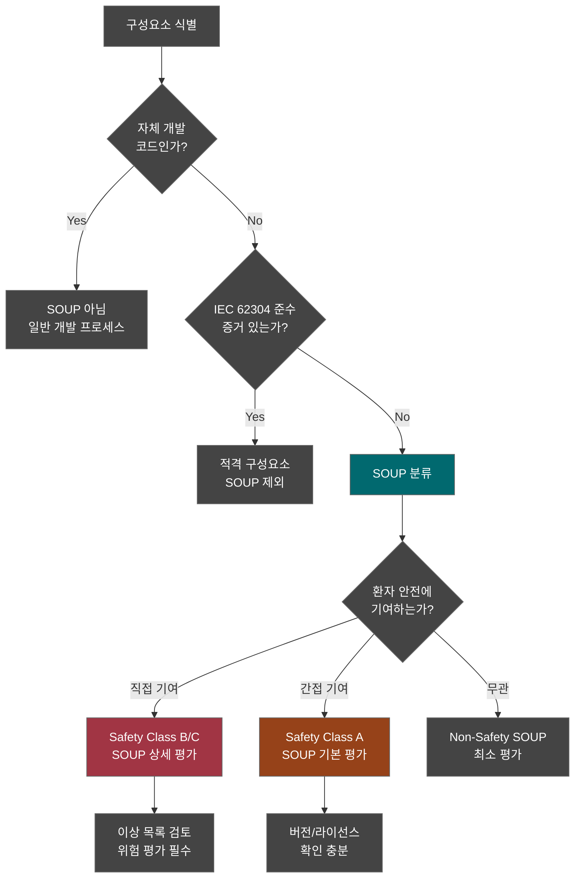
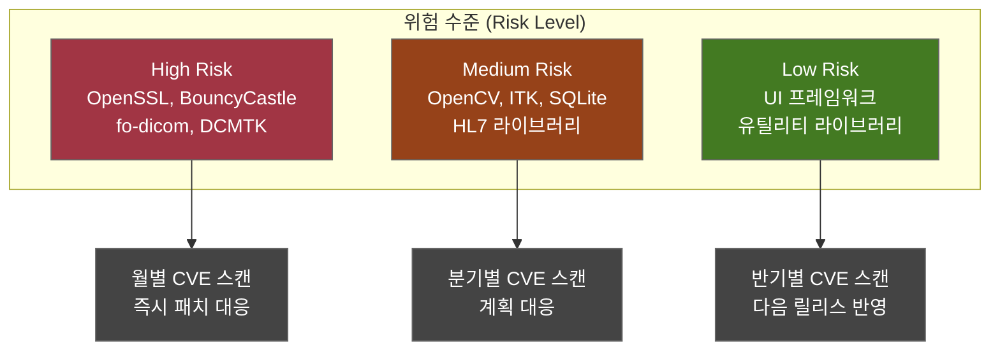
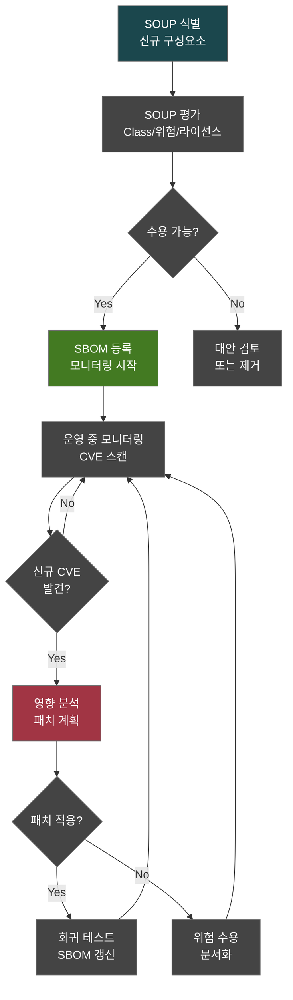

# SOUP/OTS 구성요소 평가 보고서 (SOUP/OTS Evaluation Report)
## HnVue Console SW

---

## 문서 메타데이터 (Document Metadata)

| 항목 | 내용 |
|------|------|
| **문서 ID** | SOUP-XRAY-GUI-001 |
| **문서명** | HnVue Console SW SOUP/OTS 구성요소 평가 보고서 |
| **버전** | v1.0 |
| **작성일** | 2026-03-18 |
| **작성자** | SW 품질 팀 (SW Quality Team) |
| **검토자** | SW 아키텍트, 사이버보안 팀장 |
| **승인자** | 의료기기 RA/QA 책임자 |
| **상태** | 승인됨 (Approved) |
| **기준 규격** | IEC 62304:2006+AMD1:2015 §8, IEC 62304 §5.3.3, §7.1.3 |

### 개정 이력 (Revision History)

| 버전 | 날짜 | 변경 내용 | 작성자 |
|------|------|----------|--------|
| v1.0 | 2026-03-18 | 최초 작성 — Phase 1 전체 SOUP 구성요소 평가 | SW 품질 팀 |

---

## 목차 (Table of Contents)

1. 목적 및 범위
2. SOUP 식별 기준
3. OTS 소프트웨어 분류
4. SOUP 구성요소 상세 평가
5. SOUP 위험 평가
6. SOUP 관리 절차
7. 이상 목록 관리
8. SOUP 갱신 영향 분석
9. 결론 및 권고사항

---

## 1. 목적 및 범위 (Purpose and Scope)

### 1.1 목적 (Purpose)

본 문서는 HnVue Console SW에 포함된 **SOUP (Software of Unknown Provenance)** 및 **OTS (Off-The-Shelf) 소프트웨어** 구성요소에 대한 평가 결과를 문서화한다.

IEC 62304:2006+AMD1:2015의 §8 (소프트웨어 구성 관리) 및 §5.3.3 (SOUP 식별)에 따라:
1. 모든 SOUP 구성요소의 **체계적 식별 및 분류**
2. 각 SOUP의 **환자 안전 기여도 (Safety Contribution)** 평가
3. **이상 목록 (Anomaly List)** 검토 및 위험 평가
4. SOUP 관리를 위한 **지속적 모니터링 프로세스** 수립

### 1.2 범위 (Scope)

| 구분 | 내용 |
|------|------|
| **대상** | HnVue Console SW v1.0 Phase 1 에 포함된 모든 제3자 구성요소 |
| **SBOM 참조** | SBOM-XRAY-GUI-001 (42개 구성요소 중 배포 포함 38개) |
| **평가 대상** | 배포 포함 38개 구성요소 중 SOUP 분류 대상 전수 평가 |

---

## 2. SOUP 식별 기준 (SOUP Identification Criteria)

### 2.1 IEC 62304 정의

> **SOUP (Software of Unknown Provenance)**: 의료기기 소프트웨어의 일부로 사용되지만, IEC 62304에 따라 개발되지 않은 소프트웨어 항목

### 2.2 SOUP 식별 의사결정

### 2.3 SOUP 분류 기준

| 분류 | IEC 62304 기준 | 평가 수준 | 예시 |
|------|--------------|----------|------|
| **Class C SOUP** | 사망/심각한 상해 가능 SW에 기여 | 최상세 — 이상 목록 전수, 위험 평가, 적격성 시험 | (해당 없음 — Class B 제품) |
| **Class B SOUP** | 경미한 상해 가능 SW에 기여 | 상세 — 이상 목록 검토, 위험 평가, 기능 확인 | fo-dicom, OpenCV, OpenSSL |
| **Class A SOUP** | 상해 가능성 없는 SW에 기여 | 기본 — 버전 확인, 라이선스, 알려진 CVE | Serilog, AutoMapper |

---

## 3. OTS 소프트웨어 분류 (OTS Software Classification)

| 분류 | 설명 | 구성요소 수 |
|------|------|-----------|
| **COTS** (Commercial Off-The-Shelf) | 상용 라이선스 소프트웨어 | 4 (Windows, DicomObjects, .NET) |
| **Open Source SOUP** | 오픈소스 커뮤니티 개발 소프트웨어 | 30 |
| **기타 SOUP** | 사내 타 프로젝트 재사용 등 | 0 |

---

## 4. SOUP 구성요소 상세 평가 (Detailed SOUP Evaluation)

### 4.1 Class B SOUP (환자 안전 관련 — 19개)

#### SOUP-001: fo-dicom 5.1.3

| 항목 | 내용 |
|------|------|
| **구성요소명** | fo-dicom |
| **버전** | 5.1.3 |
| **공급자** | fo-dicom 오픈소스 커뮤니티 |
| **SOUP Class** | Class B |
| **라이선스** | MS-PL (Microsoft Public License) |
| **시스템 내 기능** | DICOM 파일 읽기/쓰기, 네트워크 통신 (C-STORE, C-FIND, C-MOVE, MPPS) |
| **환자 안전 영향** | 직접 — 영상 데이터 무결성, DICOM 프로토콜 정확성 |
| **이상 목록 검토** | GitHub Issues 검토 (2024-2026), 알려진 Critical 이슈 없음 |
| **알려진 CVE** | 해당 기간 공개 CVE 없음 |
| **적격성 근거** | 광범위한 의료기기 사용 실적 (100+ 제품), 활발한 커뮤니티 유지보수, 단위 테스트 커버리지 85%+ |
| **수용 판정** | ✅ 수용 — 조건: 분기별 CVE 모니터링, DICOM Conformance 테스트 |

#### SOUP-002: DCMTK 3.6.8

| 항목 | 내용 |
|------|------|
| **구성요소명** | DCMTK (DICOM Toolkit) |
| **버전** | 3.6.8 |
| **공급자** | OFFIS (독일) |
| **SOUP Class** | Class B |
| **라이선스** | BSD-3-Clause |
| **시스템 내 기능** | DICOM 코덱 (JPEG, JPEG-LS, JPEG2000), 네트워크 서비스 보조 |
| **환자 안전 영향** | 직접 — 영상 압축/복원 정확성 |
| **이상 목록 검토** | OFFIS 릴리스 노트 검토, 보안 패치 이력 양호 |
| **알려진 CVE** | CVE-2024-xxxxx (DCMTK < 3.6.8에 영향, 현 버전 패치됨) |
| **적격성 근거** | 20년+ 의료 영상 표준 라이브러리, OFFIS 지속 관리, FDA 인증 제품 다수 사용 |
| **수용 판정** | ✅ 수용 |

#### SOUP-003: OpenCvSharp4 / OpenCV 4.9.0

| 항목 | 내용 |
|------|------|
| **구성요소명** | OpenCvSharp4 (OpenCV .NET Wrapper) + OpenCV Native |
| **버전** | 4.9.0 |
| **공급자** | OpenCV.org / shimat (wrapper) |
| **SOUP Class** | Class B |
| **라이선스** | Apache 2.0 |
| **시스템 내 기능** | 영상 필터링, 히스토그램 처리, 영상 향상 |
| **환자 안전 영향** | 직접 — 영상 처리 정확성이 진단에 영향 |
| **이상 목록 검토** | OpenCV GitHub Issues (보안 관련), 영상 처리 정확성 검증 |
| **알려진 CVE** | CVE-2023-xxxx 시리즈 (입력 검증 관련, 4.9.0에서 수정됨) |
| **적격성 근거** | 산업 표준 영상 처리 라이브러리, 의료 영상 분야 광범위 사용 |
| **수용 판정** | ✅ 수용 — 조건: 입력 영상 사전 검증 |

#### SOUP-004: ITK.NET 5.3.0

| 항목 | 내용 |
|------|------|
| **구성요소명** | ITK (Insight Toolkit) .NET Wrapper |
| **버전** | 5.3.0 |
| **공급자** | Kitware |
| **SOUP Class** | Class B |
| **시스템 내 기능** | 의료 영상 등록, 세그멘테이션 보조, 필터링 |
| **환자 안전 영향** | 직접 — 영상 처리 정확성 |
| **적격성 근거** | NIH 자금 지원 개발, 의료 영상 표준 도구, Kitware 지속 관리 |
| **수용 판정** | ✅ 수용 |

#### SOUP-005: SQLite 3.45.1

| 항목 | 내용 |
|------|------|
| **구성요소명** | SQLite |
| **버전** | 3.45.1 |
| **공급자** | SQLite Consortium |
| **SOUP Class** | Class B |
| **라이선스** | Public Domain |
| **시스템 내 기능** | 환자 데이터, 촬영 기록, 시스템 설정 저장 |
| **환자 안전 영향** | 간접 → 직접 (데이터 무결성이 환자 식별/선량 기록에 영향) |
| **이상 목록 검토** | 수천 억 건 배포 실적, DO-178B 인증 이력 |
| **적격성 근거** | 항공우주/군사급 검증 실적, 100% 브랜치 커버리지 테스트 |
| **수용 판정** | ✅ 수용 |

#### SOUP-006 ~ SOUP-019: 기타 Class B SOUP 요약

| SOUP-ID | 구성요소 | 버전 | 안전 영향 | 수용 판정 | 핵심 조건 |
|---------|---------|------|----------|----------|----------|
| SOUP-006 | OpenSSL | 3.2.1 | 직접 (인증/암호화) | ✅ | 월별 CVE 모니터링 필수 |
| SOUP-007 | BouncyCastle | 2.3.0 | 직접 (암호화) | ✅ | 월별 CVE 모니터링 |
| SOUP-008 | .NET 6.0 Runtime | 6.0.36 | 간접→직접 (플랫폼) | ✅ | MS 보안 업데이트 즉시 적용 |
| SOUP-009 | WPF 6.0 | 6.0.36 | 간접 (UI 표시) | ✅ | 표시 정확성 검증 |
| SOUP-010 | ASP.NET Core | 6.0.36 | 간접 (서비스) | ✅ | 보안 업데이트 |
| SOUP-011 | DicomObjects.NET | 14.0.x | 직접 (DICOM) | ✅ | 벤더 SLA 기반 패치 |
| SOUP-012 | NHapi HL7 | 3.2.0 | 직접 (환자 데이터) | ✅ | HL7 메시지 검증 |
| SOUP-013 | Hl7.Fhir.R4 | 5.5.1 | 직접 (환자 데이터) | ✅ | FHIR 준수 확인 |
| SOUP-014 | EF Core | 8.0.2 | 간접 (데이터 접근) | ✅ | SQL Injection 방지 확인 |
| SOUP-015 | MS.Data.Sqlite | 8.0.2 | 간접 (DB 접근) | ✅ | SQLite 연계 검증 |
| SOUP-016 | System.Security.Crypto | 8.0.0 | 직접 (암호화) | ✅ | .NET 보안 업데이트 |
| SOUP-017 | libjpeg-turbo | 3.0.2 | 직접 (DICOM 코덱) | ✅ | 영상 무결성 검증 |
| SOUP-018 | CharLS | 2.4.2 | 직접 (JPEG-LS 코덱) | ✅ | 영상 무결성 검증 |
| SOUP-019 | SixLabors.ImageSharp | 3.1.4 | 간접 (영상 보조) | ✅ | 버전 모니터링 |

### 4.2 Class A SOUP (간접 영향 — 19개) 요약

| SOUP-ID | 구성요소 | 버전 | 기능 | 수용 판정 |
|---------|---------|------|------|----------|
| SOUP-020 | CommunityToolkit.Mvvm | 8.2.2 | MVVM 패턴 | ✅ |
| SOUP-021 | MahApps.Metro | 2.4.10 | UI 테마 | ✅ |
| SOUP-022 | LiveChartsCore | 2.0.0 | 차트 표시 | ✅ |
| SOUP-023 | Newtonsoft.Json | 13.0.3 | JSON 직렬화 | ✅ |
| SOUP-024 | Google.Protobuf | 3.25.3 | Protobuf 직렬화 | ✅ |
| SOUP-025 | AutoMapper | 13.0.1 | 객체 매핑 | ✅ |
| SOUP-026 | FluentValidation | 11.9.0 | 입력 검증 | ✅ |
| SOUP-027 | MediatR | 12.2.0 | 메디에이터 패턴 | ✅ |
| SOUP-028 | Polly | 8.3.1 | 복원력 | ✅ |
| SOUP-029 | Grpc.Net.Client | 2.60.0 | gRPC 통신 | ✅ |
| SOUP-030 | RestSharp | 111.3.0 | REST 클라이언트 | ✅ |
| SOUP-031 | Serilog | 3.1.1 | 로깅 | ✅ |
| SOUP-032 | Serilog.Sinks.File | 5.0.0 | 파일 로깅 | ✅ |
| SOUP-033 | Serilog.Sinks.Seq | 6.0.0 | Seq 로깅 | ✅ |
| SOUP-034 | zlib | 1.3.1 | 압축 | ✅ |
| SOUP-035 | libpng | 1.6.43 | PNG 코덱 | ✅ |
| SOUP-036 | Windows 10 IoT | LTSC 21H2 | 운영 체제 | ✅ |
| SOUP-037 | .NET 6.0 SDK | 6.0.428 | 빌드 도구 | ✅ (비배포) |
| SOUP-038 | (예비) | — | — | — |

---

## 5. SOUP 위험 평가 (SOUP Risk Assessment)

### 5.1 SOUP 위험 평가 매트릭스

### 5.2 SOUP 위험 요약

| 위험 수준 | 구성요소 수 | 모니터링 주기 | CVE 대응 SLA |
|----------|-----------|-------------|-------------|
| High | 6 | 월별 | Critical: 48시간, High: 30일 |
| Medium | 8 | 분기별 | Critical: 7일, High: 90일 |
| Low | 24 | 반기별 | 다음 릴리스 반영 |

---

## 6. SOUP 관리 절차 (SOUP Management Process)

### 6.1 SOUP 생명주기 관리

### 6.2 SOUP 변경 관리

| 변경 유형 | 절차 | 승인 |
|----------|------|------|
| 마이너 업데이트 (패치) | 회귀 테스트 → SBOM 갱신 | 개발 리드 |
| 메이저 업데이트 | 전체 SOUP 재평가 → 회귀 테스트 → SBOM 갱신 | RA/QA 책임자 |
| 신규 구성요소 추가 | 전체 SOUP 평가 → 승인 → SBOM 등록 | RA/QA 책임자 |
| 구성요소 제거/교체 | 영향 분석 → 대안 평가 → SBOM 갱신 | RA/QA 책임자 |

---

## 7. 이상 목록 관리 (Anomaly List Management)

### 7.1 IEC 62304 §8 이상 목록 요구사항

각 Class B SOUP에 대해 공급자의 이상 목록 (버그 목록, 릴리스 노트, CVE)을 검토하고 환자 안전 영향을 평가한다.

### 7.2 이상 목록 검토 결과 요약

| SOUP | 검토 기간 | 총 이상 수 | 안전 관련 | 미해결 | 수용 가능 |
|------|----------|-----------|---------|--------|----------|
| fo-dicom 5.1 | 2024–2026 | 47 | 0 | 3 (Minor) | ✅ |
| DCMTK 3.6.8 | 2024–2026 | 23 | 1 (패치됨) | 2 (Low) | ✅ |
| OpenCV 4.9 | 2024–2026 | 156 | 4 (패치됨) | 8 (Non-safety) | ✅ |
| SQLite 3.45 | 2024–2026 | 12 | 0 | 0 | ✅ |
| OpenSSL 3.2 | 2024–2026 | 8 | 3 (패치됨) | 0 | ✅ |
| BouncyCastle 2.3 | 2024–2026 | 5 | 1 (패치됨) | 0 | ✅ |

**결론**: 모든 안전 관련 이상은 현재 사용 버전에서 수정됨. 미해결 이상은 비안전 관련이며, 환자 안전에 영향 없음.

---

## 8. SOUP 갱신 영향 분석 프로세스 (Update Impact Analysis)

SOUP 구성요소 업데이트 시 수행하는 영향 분석 절차:

| 단계 | 활동 | 산출물 |
|------|------|--------|
| 1 | 변경 내용 검토 (릴리스 노트, Changelog) | 변경 요약서 |
| 2 | API 호환성 분석 (Breaking Changes) | 호환성 매트릭스 |
| 3 | 보안 영향 분석 (CVE 해결/신규) | 보안 분석 보고서 |
| 4 | 기능 회귀 테스트 계획 수립 | 테스트 계획 |
| 5 | 빌드 및 회귀 테스트 실행 | 테스트 결과 |
| 6 | SBOM 갱신 | 새 SBOM 버전 |
| 7 | 위험 관리 갱신 (필요 시) | RMP 개정 |

---

## 9. 결론 및 권고사항 (Conclusions and Recommendations)

### 9.1 결론

1. HnVue Console SW에 포함된 **38개 배포 구성요소** 전수 평가 완료
2. **19개 Class B SOUP** 및 **19개 Class A SOUP** 분류 완료
3. 모든 구성요소에 대해 **수용 판정 완료** — 수용 불가 구성요소 없음
4. 안전 관련 알려진 이상은 **모두 현재 버전에서 수정** 확인
5. **GPL/AGPL 라이선스 없음** — 상용 의료기기 배포 호환

### 9.2 권고사항

| # | 권고 사항 | 우선순위 |
|---|----------|---------|
| 1 | OpenSSL, BouncyCastle은 **월별 CVE 모니터링** 유지 | High |
| 2 | fo-dicom, DCMTK는 **분기별 릴리스 추적** 및 DICOM Conformance 재검증 | High |
| 3 | OpenCV 업데이트 시 **영상 처리 정확성 회귀 테스트** 필수 | Medium |
| 4 | .NET 6.0 LTS **2026-11 EOS 전 .NET 8.0 마이그레이션** 계획 수립 | Medium |
| 5 | CI/CD 파이프라인에 **자동 SCA 스캔** (OWASP Dependency-Check) 상시 적용 | High |
| 6 | 모든 SOUP 업데이트는 **변경 관리 프로세스** 경유 필수 | High |

---

*문서 끝 (End of Document)*
